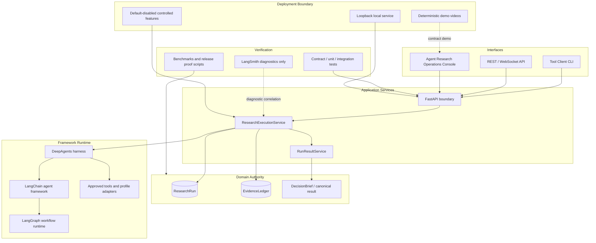

[English](./README.md) | [中文](./README_CN.md)

# Decision Research Agent

Decision Research Agent is a long-running research service that turns
source-backed findings into bounded, reviewable decision artifacts. It uses
LangChain as the agent framework, DeepAgents as the research harness, LangGraph
as the durable workflow runtime, and LangSmith as privacy-first diagnostics.

Terminology contract:

- LangChain = Agent Framework
- DeepAgents = research harness
- LangGraph = durable workflow runtime
- LangSmith = privacy-first tracing/evaluation
- Application DB = business authority

The active repository, runtime configuration, Tool Client, Docker defaults, and
health service identifier use `decision-research-agent`.

## What It Does

- Runs research through canonical `run_id` scoped execution.
- Persists ResearchRun, EvidenceLedger, review, verification, publication, and
  canonical result state in the application database.
- Supports lost-response run identity reconciliation through an optional
  durable `Idempotency-Key` and single-node recovery of committed work before
  Agent invocation, without claiming exactly-once execution.
- Exposes a bounded durable `failure_cause` for failed runs through the
  additive [run status contract](docs/reference/api-contract.md), while
  nonfailed runs report `null` and historical failures report `not_observed`.
- Produces bounded result artifacts through `GET /api/runs/{run_id}/result`.
- Supports Talent Hiring Signal as the first benchmarked research profile.
- Provides controlled durable review and evidence verification workflows behind
  explicit feature flags.

The repository ships backend, API, CLI, tests, docs, operational scripts, and
the React-based Agent Research Operations Console. The console can create a
ResearchRun, observe its lifecycle, and retrieve the canonical result while
showing the existing EvidenceLedger, review, verification, and authority
boundaries. It keeps a static fallback for reliable demos and does not add
backend state or become business authority.

## Engineering Depth

- The service separates interface clients from application-owned ResearchRun,
  EvidenceLedger, review, verification, publication, and result authority.
- `run_id` scopes execution, persistence, telemetry, artifacts, and final
  delivery while `thread_id` remains caller conversation compatibility.
- Terminal run states use fenced finalization so completion, timeout,
  cancellation, and stale writers cannot overwrite frozen Evidence.
- Web, CLI, REST, and demo-console flows consume the same canonical API and
  result contracts instead of maintaining parallel product logic.
- LangGraph and LangSmith remain framework/runtime and diagnostic layers; the
  application database is the business ledger.
- Release evidence is bounded by explicit verification scripts, docs contracts,
  benchmark reports, and feature-flag limits.

## Architecture



Service-owned state remains the authority for business decisions. LangSmith is
used for diagnostics, not as the ResearchRun or EvidenceLedger ledger.

- [Architecture Deep Dive](docs/architecture.md)
- [Demo Console](docs/demo-console.md)
- [Demo videos](https://itao-ai.github.io/my-website/#/projects/decision-research-agent)

The demo videos are deterministic loopback contract demos. They are not live
provider research recordings, not a public production service, and not evidence
of an online multi-user deployment.

## Quick Start

Clone the repository, create a local environment file, install the pinned
runtime, start the backend, check health, then create a run and retrieve its
canonical result.

```bash
git clone https://github.com/iTao-AI/decision-research-agent.git
cd decision-research-agent
cp .env.example .env
python3.11 -m venv .venv
source .venv/bin/activate
pip install --no-deps -r constraints.txt
python api/server.py
```

Health:

```bash
curl --fail --silent http://127.0.0.1:8000/health
```

Expected response:

```json
{"status":"ok","service":"decision-research-agent"}
```

Continue with the complete [Getting Started tutorial](docs/getting-started.md)
for Tool Client readiness, run creation, result retrieval, and troubleshooting.

## Demo Console

The React console starts in deterministic Static Demo mode:

```bash
cd frontend
npm ci
npm run dev -- --host 127.0.0.1
```

Open `http://127.0.0.1:5173`. The optional Live Backend mode requires an exact
CORS origin and a loopback-only backend; follow the
[Demo Console guide](docs/demo-console.md) before enabling it. The current
console does not accept or store API credentials.

Live Backend renders only real service-owned state from the run status and
canonical result contracts. Ambiguous create reconciliation reuses the same
key and byte-equivalent request. After `run_id` is known, observation resume is
GET-only and cannot issue another create. The console does not own review,
verification, publication, or delivery authority.

## Tool Client

```bash
python tools/decision_research_agent_tool.py healthcheck
python tools/decision_research_agent_tool.py doctor

python tools/decision_research_agent_tool.py run \
  --query "Research question" \
  --thread-id "demo-thread" \
  --wait

python tools/decision_research_agent_tool.py run \
  --query "Compare the evidence behind the proposed decision" \
  --wait \
  --result

python tools/decision_research_agent_tool.py result \
  --run-id "$RUN_ID"
```

Use `--wait --result` for the shortest local golden path when the backend is
already running. It starts the run, waits with a bounded client deadline, and
prints only the canonical result payload. A run that requires controlled review
returns a structured recovery error instead of bypassing review.

Configuration:

```dotenv
DECISION_RESEARCH_AGENT_URL=http://127.0.0.1:8000
DECISION_RESEARCH_AGENT_API_KEY=
DECISION_RESEARCH_AGENT_TIMEOUT_SECONDS=10
DECISION_RESEARCH_AGENT_DB_PATH=data/decision_research_agent.db
DECISION_RESEARCH_AGENT_CHECKPOINT_DB_PATH=data/review_checkpoints.db
```

## Core API

- `GET /health`
- `POST /api/runs`
- `GET /api/runs/{run_id}`
- `GET /api/runs/{run_id}/result`
- `GET /api/telemetry/runs/{run_id}`
- `GET /api/token-usage/runs/{run_id}`
- `WebSocket /ws/runs/{run_id}`

Controlled review and evidence verification endpoints are documented in
[API Contract](docs/reference/api-contract.md).

## Controlled Features

### Controlled Durable Review

Durable review is disabled by default:

```dotenv
DECISION_RESEARCH_AGENT_ENABLE_DURABLE_HITL=false
```

### Controlled Evidence Verification

Evidence verification is disabled by default:

```dotenv
DECISION_RESEARCH_AGENT_ENABLE_EVIDENCE_VERIFICATION=false
```

Both features are supported only within the documented single-node SQLite
boundary unless a later rollout expands the deployment model.

## Verification

Current release work keeps verification evidence in PRs and operator reports.
Useful local checks:

```bash
PYTHON_DOTENV_DISABLED=1 python scripts/agent_evaluation_gate.py check
PYTHON_DOTENV_DISABLED=1 python scripts/run_failure_cause_proof.py check
python -m pytest -q
python scripts/check_canonical_identity.py --root .
python tools/decision_research_agent_tool.py doctor
```

## Documentation

- [Documentation Index](docs/README.md)
- [Architecture Deep Dive](docs/architecture.md)
- [Demo Console Design](DESIGN.md)
- [Demo Console Guide](docs/demo-console.md)
- [Demo videos](https://itao-ai.github.io/my-website/#/projects/decision-research-agent)
- [Getting Started](docs/getting-started.md)
- [Contributing](CONTRIBUTING.md)
- [Agent Integration](docs/AGENT_INTEGRATION.md)
- [API Contract](docs/reference/api-contract.md)
- [Data Models](docs/reference/data-models.md)
- [Agent Evaluation Regression Gate](docs/reference/agent-evaluation-regression-gate.md)
- [Durable Run Failure Cause Proof](docs/evidence/run-failure-cause-v1.md)
- [Talent Hiring Signal Benchmark v1](benchmarks/talent-hiring-signal-v1/README.md)
- [v0.1.3 Release Notes](docs/releases/v0.1.3.md)
- [v0.1.2 Release Notes](docs/releases/v0.1.2.md)
- [v0.1.1 Release Notes](docs/releases/v0.1.1.md)
- [v0.1.0 Release Notes](docs/releases/v0.1.0.md)
- [Controlled Review Workflow](docs/operations/controlled-review-workflow.md)
- [Evidence Verification Workflow](docs/operations/evidence-verification-workflow.md)

## Known Boundaries

- Durable failure causes are an additive status-only projection. The canonical
  result endpoint, its `409 run_failed` envelope, and the frozen
  `dra.downstream-consumer.v1` fixture remain unchanged; the bounded proof is
  not a provider diagnosis, billing record, or exactly-once execution claim.
- The v0.1.3 dispatch contract adds application-owned
  `run_dispatches_v1` reconciliation before Agent invocation. The historical
  v0.1.2 identity proof remains unchanged and does not itself prove
  crash-before-schedule recovery; the newer dispatch proof does. Neither proof
  claims exactly-once execution, running recovery, provider/tool side-effect
  exactly-once behavior, multi-instance high availability, or a live-provider
  result.
- The v0.1.1 release surface adds the separately built Agent Research
  Operations Console and deterministic contract gates to the existing
  backend-and-CLI release without changing runtime API, schema, or database
  migration requirements.
- The Agent Research Operations Console defaults to Static Demo mode and can
  create a ResearchRun against a loopback backend through bounded Live Backend
  mode.
- UI delivery must consume the canonical API and result contract without
  reintroducing a parallel runtime.
- Markdown-only delivery: canonical research results are returned as Markdown
  artifacts through the result endpoint.
- Durable review and evidence verification are feature-flagged controlled
  workflows, not public multi-user production features.
- Evidence verification records human decisions and deterministic snapshots; it
  does not perform automatic source retrieval or LLM verification.
- Completed implementation history is retained in Git. Active public-neutral
  project plans remain in the curated Superpowers workspace.

## License

MIT. See [LICENSE](./LICENSE).
