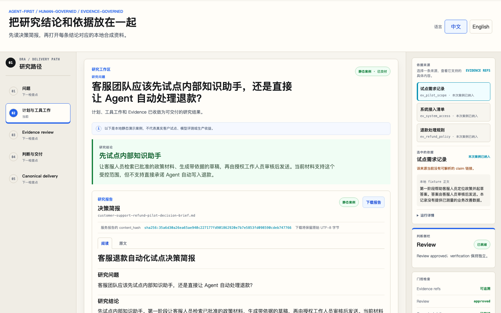
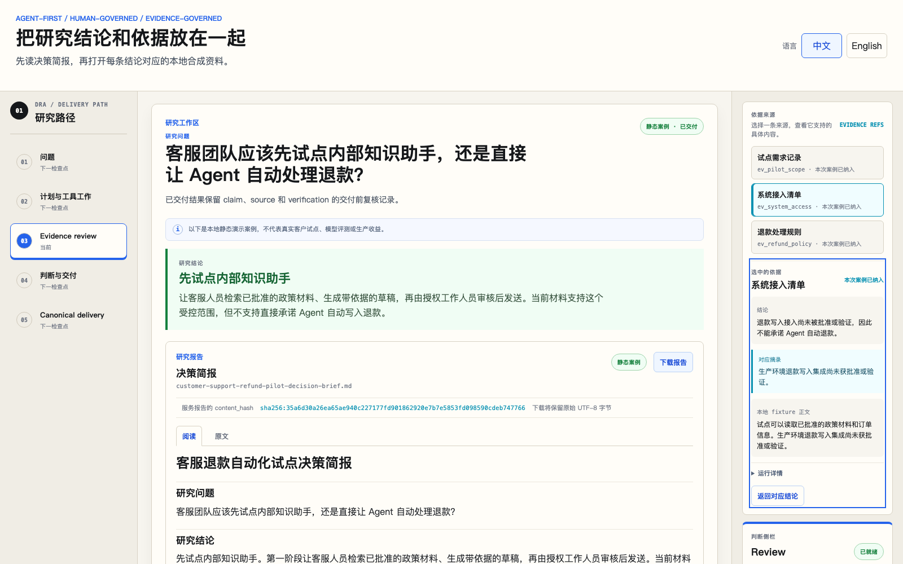
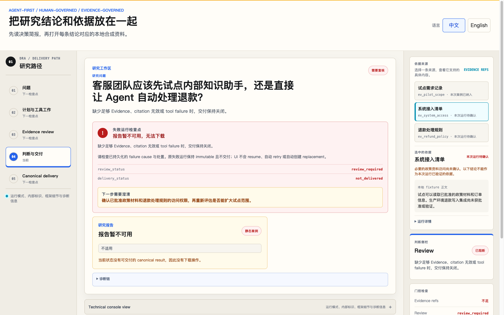
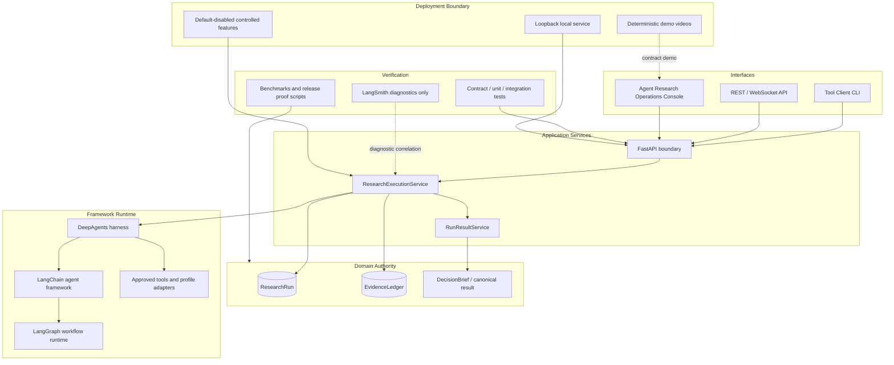

[English](./README.md) | [中文](./README_CN.md)

# Decision Research Agent

Decision Research Agent is a long-running research service that turns
source-backed findings into bounded, reviewable decision artifacts. It uses
LangChain as the agent framework, DeepAgents as the research harness, LangGraph
as the durable workflow runtime, and LangSmith as privacy-first diagnostics.

Terminology contract:

- LangChain = Agent Framework
- DeepAgents = research harness
- LangGraph = durable workflow runtime
- LangSmith = privacy-first tracing/evaluation
- Application DB = business authority

The active repository, runtime configuration, Tool Client, Docker defaults, and
health service identifier use `decision-research-agent`.

## What It Does

Decision Research Agent turns an open research question into source-backed,
reviewable Evidence and a bounded canonical result.

The Agent Research Operations Console makes that path legible without becoming
the business authority. Its Static Demo is deterministic; its optional Live
Backend mode consumes service-owned state through the existing API contract.

## Current Default Branch Status

The showcased Console and blocked-failure diagnosis are current default-branch
additions after stable `v0.1.8`; they are not included in the immutable stable
`v0.1.8` release. This boundary is not a deployment, provider-backed research,
or business-impact claim.

## Research Delivery Flow

1. **Question** — frame one bounded research question and its decision context.
2. **Plan** — make the comparison dimensions and source boundary explicit.
3. **Tool work** — collect source observations and attach run-scoped Evidence refs.
4. **Judgment** — review claims, citations, and verification separately.
5. **Delivery** — return the canonical result only when the service-owned gate allows it.

## Showcase Frames

The three frames below are deterministic, synthetic Static Demo states captured
from the same frontend implementation. They show the normal path, the
claim/source review checkpoint, and a blocked state that remains
`review_required` and `not_delivered`.

The blocked frame makes one bounded diagnostic chain visible: the first
displayed failing lifecycle step is `tool_failed`; the existing durable
failure-cause observation is `execution / execution_error`; and the
service-owned disposition remains `review_required / not_delivered`. The
displayed failing step is not a proven root cause. Inspect the persisted
failure cause and disposition; the failed source remains immutable and not
delivered. Evidence and citation issues still require human review. Any new
execution is caller-initiated as an ordinary new run or, when eligible, an
explicit one-hop replacement. The UI does not resume the failed source, retry
automatically, or create a replacement automatically.







The capture source, viewport, locale, route/state mapping, disclosure, and
SHA-256 values are recorded in the [showcase manifest](docs/assets/console-showcase/manifest.json).

## Engineering Judgments

- **Service-owned facts stay authoritative.** The UI composes a readable
  projection; the application database, API, and canonical result endpoint
  remain the source of business state. See
  [`App.tsx`](frontend/src/App.tsx), the console projection tests, and the
  [demo console contract](tests/unit/test_demo_console_contracts.py).
- **Evidence, citation, and verification are different gates.** A cited claim
  is not automatically verified, and the UI does not turn a visual state into
  a decision. See [`consoleProjection.ts`](frontend/src/consoleProjection.ts)
  and the [showcase contract tests](tests/unit/test_console_showcase_contracts.py).
- **Failure stays visible and non-delivered.** Insufficient Evidence, invalid
  citation, and tool failure remain review-required; the blocked frame cannot
  manufacture a canonical result. See the blocked fixture and
  [`App.test.tsx`](frontend/src/App.test.tsx).

## Quick Start

```bash
git clone https://github.com/iTao-AI/decision-research-agent.git
cd decision-research-agent
cp .env.example .env
python3.11 -m venv .venv
source .venv/bin/activate
pip install --no-deps -r constraints.txt
python api/server.py
```

```bash
curl --fail --silent http://127.0.0.1:8000/health
python tools/decision_research_agent_tool.py doctor
python tools/decision_research_agent_tool.py run \
  --query "Compare the evidence behind the proposed decision" \
  --wait \
  --result
python tools/decision_research_agent_tool.py result \
  --run-id "$RUN_ID"
```

For the deterministic frontend path, run `cd frontend && npm ci && npm run dev
-- --host 127.0.0.1`, then open `http://127.0.0.1:5173`. The detailed
[Getting Started tutorial](docs/getting-started.md) covers readiness,
troubleshooting, and authenticated local runtime boundaries.

## Authority And Runtime

- LangChain is the Agent Framework; DeepAgents is the research harness;
  LangGraph is the durable workflow runtime; LangSmith is privacy-first
  diagnostics; the Application DB is business authority.
- `run_id` scopes execution and persisted delivery while `thread_id` remains a
  caller-compatibility identity.
- The console consumes canonical API and result contracts. It does not add
  backend state, database tables, API paths, credentials, review controls,
  verification authority, public online execution, or a tenant model.
- Live Backend remains loopback-only and the browser does not accept or store
  API credentials. See [Demo Console](docs/demo-console.md) and the
  [API Contract](docs/reference/api-contract.md).

## Engineering Depth

The implementation separates interface clients from application-owned
ResearchRun, EvidenceLedger, review, verification, publication, and result
authority. Terminal states use fenced finalization, while release evidence is
bounded by explicit tests, proof scripts, benchmark reports, and feature-flag
limits.

## Architecture

The [Architecture Deep Dive](docs/architecture.md) maps Interfaces, Application
Services, Domain Authority, Framework Runtime, Verification, and the local
deployment boundary. The [Demo Console Design](DESIGN.md) records the
presentation and non-authority boundaries.

## Evaluation And Release

Evaluation remains provider-free where the repository says so, and every
benchmark or release record keeps its own evidence boundary. Start with the
[evaluation references](docs/reference/agent-evaluation-regression-gate.md),
[evidence index](docs/evidence/README.md), and stable
[v0.1.8 release notes](docs/releases/v0.1.8.md); historical release records are
not rewritten by the showcase.

## Verification

The proportional local checks for this surface are:

```bash
python -m pytest tests/unit/test_console_showcase_contracts.py \
  tests/unit/test_demo_console_contracts.py -q
cd frontend && npm run test && npm run lint && npm run build
cd .. && python scripts/console_showcase_contracts.py check --root .
```

The full CI proof inventory remains documented in the detailed sections and
the [CI workflow](.github/workflows/ci.yml).

## Detailed Capability Reference

- Runs research through canonical `run_id` scoped execution.
- Persists ResearchRun, EvidenceLedger, review, verification, publication, and
  canonical result state in the application database.
- Supports lost-response run identity reconciliation through an optional
  durable `Idempotency-Key` and single-node recovery of committed work before
  Agent invocation, without claiming exactly-once execution.
- Exposes a bounded durable `failure_cause` for failed runs through the
  additive [run status contract](docs/reference/api-contract.md), while
  nonfailed runs report `null` and historical failures report `not_observed`.
- Produces bounded result artifacts through `GET /api/runs/{run_id}/result`.
- Supports Talent Hiring Signal as the first benchmarked research profile.
- Provides controlled durable review and evidence verification workflows behind
  explicit feature flags.

The repository ships backend, API, CLI, tests, docs, operational scripts, and
the React-based Agent Research Operations Console. The console can create a
ResearchRun, observe its lifecycle, and retrieve the canonical result while
showing the existing EvidenceLedger, review, verification, and authority
boundaries. It keeps a static fallback for reliable demos and does not add
backend state or become business authority.

## Engineering Depth Details

- The service separates interface clients from application-owned ResearchRun,
  EvidenceLedger, review, verification, publication, and result authority.
- `run_id` scopes execution, persistence, telemetry, artifacts, and final
  delivery while `thread_id` remains caller conversation compatibility.
- Terminal run states use fenced finalization so completion, timeout,
  cancellation, and stale writers cannot overwrite frozen Evidence.
- Web, CLI, REST, and demo-console flows consume the same canonical API and
  result contracts instead of maintaining parallel product logic.
- LangGraph and LangSmith remain framework/runtime and diagnostic layers; the
  application database is the business ledger.
- Release evidence is bounded by explicit verification scripts, docs contracts,
  benchmark reports, and feature-flag limits.

## Architecture Reference


```mermaid
flowchart TB
    subgraph Interfaces["Interfaces"]
        CLI["Tool Client CLI"]
        REST["REST / WebSocket API"]
        Console["Agent Research Operations Console"]
    end

    subgraph Services["Application Services"]
        API["FastAPI boundary"]
        Execution["ResearchExecutionService"]
        Result["RunResultService"]
    end

    subgraph Domain["Domain Authority"]
        Runs[("ResearchRun")]
        Evidence[("EvidenceLedger")]
        Brief["DecisionBrief / canonical result"]
    end

    subgraph Runtime["Framework Runtime"]
        DeepAgents["DeepAgents harness"]
        LangChain["LangChain agent framework"]
        LangGraph["LangGraph workflow runtime"]
        Tools["Approved tools and profile adapters"]
    end

    subgraph Verification["Verification"]
        Tests["Contract / unit / integration tests"]
        Gates["Benchmarks and release proof scripts"]
        LangSmith["LangSmith diagnostics only"]
    end

    subgraph Deployment["Deployment Boundary"]
        Local["Loopback local service"]
        Flags["Default-disabled controlled features"]
        PublicDemo["Deterministic demo videos"]
    end

    CLI --> API
    REST --> API
    Console --> API
    API --> Execution
    Execution --> Result
    Execution --> Runs
    Execution --> Evidence
    Result --> Brief
    Execution --> DeepAgents
    DeepAgents --> LangChain
    LangChain --> LangGraph
    DeepAgents --> Tools
    Tests --> API
    Gates --> Domain
    LangSmith -. diagnostic correlation .-> Execution
    Local --> API
    Flags --> Execution
    PublicDemo -. contract demo .-> Console
```

Service-owned state remains the authority for business decisions. LangSmith is
used for diagnostics, not as the ResearchRun or EvidenceLedger ledger.

- [Architecture Deep Dive](docs/architecture.md)
- [Demo Console](docs/demo-console.md)
- [Demo videos](https://itao-ai.github.io/my-website/#/projects/decision-research-agent)

The demo videos are deterministic loopback contract demos. They are not live
provider research recordings, not a public production service, and not evidence
of an online multi-user deployment.

## Runtime Quick Start Details

Clone the repository, create a local environment file, install the pinned
runtime, start the backend, check health, then create a run and retrieve its
canonical result.

```bash
git clone https://github.com/iTao-AI/decision-research-agent.git
cd decision-research-agent
cp .env.example .env
python3.11 -m venv .venv
source .venv/bin/activate
pip install --no-deps -r constraints.txt
python api/server.py
```

Health:

```bash
curl --fail --silent http://127.0.0.1:8000/health
```

Expected response:

```json
{"status":"ok","service":"decision-research-agent"}
```

Continue with the complete [Getting Started tutorial](docs/getting-started.md)
for Tool Client readiness, run creation, result retrieval, and troubleshooting.
For an authenticated container launch with required API/MySQL values,
loopback-only host publication, health-gated startup, and volume-safe rollback,
use [Secure Local Runtime Operations](docs/operations/secure-local-runtime.md).

## Demo Console

The React console starts in deterministic Static Demo mode:

```bash
cd frontend
npm ci
npm run dev -- --host 127.0.0.1
```

Open `http://127.0.0.1:5173`. The optional Live Backend mode requires an exact
CORS origin and a loopback-only backend; follow the
[Demo Console guide](docs/demo-console.md) before enabling it. The current
console does not accept or store API credentials.

Live Backend renders only real service-owned state from the run status and
canonical result contracts. Ambiguous create reconciliation reuses the same
key and byte-equivalent request. After `run_id` is known, observation resume is
GET-only and cannot issue another create. The console does not own review,
verification, publication, or delivery authority.

## Tool Client

```bash
python tools/decision_research_agent_tool.py healthcheck
python tools/decision_research_agent_tool.py doctor

python tools/decision_research_agent_tool.py run \
  --query "Research question" \
  --thread-id "demo-thread" \
  --wait

python tools/decision_research_agent_tool.py run \
  --query "Compare the evidence behind the proposed decision" \
  --wait \
  --result

python tools/decision_research_agent_tool.py run \
  --profile generic-strict-citation \
  --query "Research question" \
  --wait \
  --result

python tools/decision_research_agent_tool.py result \
  --run-id "$RUN_ID"
```

Use `--wait --result` for the shortest local golden path when the backend is
already running. It starts the run, waits with a bounded client deadline, and
prints only the canonical result payload. A run that requires controlled review
returns a structured recovery error instead of bypassing review.

Configuration:

```dotenv
DECISION_RESEARCH_AGENT_URL=http://127.0.0.1:8000
DECISION_RESEARCH_AGENT_API_KEY=
DECISION_RESEARCH_AGENT_TIMEOUT_SECONDS=10
DECISION_RESEARCH_AGENT_DB_PATH=data/decision_research_agent.db
DECISION_RESEARCH_AGENT_CHECKPOINT_DB_PATH=data/review_checkpoints.db
```

## Core API

- `GET /health`
- `POST /api/runs`
- `GET /api/runs/{run_id}`
- `GET /api/runs/{run_id}/result`
- `GET /api/telemetry/runs/{run_id}`
- `GET /api/token-usage/runs/{run_id}`
- `WebSocket /ws/runs/{run_id}`

Controlled review and evidence verification endpoints are documented in
[API Contract](docs/reference/api-contract.md).

## Controlled Features

### Controlled Durable Review

Durable review is disabled by default:

```dotenv
DECISION_RESEARCH_AGENT_ENABLE_DURABLE_HITL=false
```

### Controlled Evidence Verification

Evidence verification is disabled by default:

```dotenv
DECISION_RESEARCH_AGENT_ENABLE_EVIDENCE_VERIFICATION=false
```

Both features are supported only within the documented single-node SQLite
boundary unless a later rollout expands the deployment model.

## Verification Details

Current release work keeps verification evidence in PRs and operator reports.
The commands below are a
selected local verification subset, not the full required CI proof inventory:

```bash
PYTHON_DOTENV_DISABLED=1 python scripts/agent_evaluation_gate.py check
PYTHON_DOTENV_DISABLED=1 python scripts/agent_evaluation_v2_gate.py check
PYTHON_DOTENV_DISABLED=1 python scripts/evidence_gated_loop_gate.py check
PYTHON_DOTENV_DISABLED=1 python scripts/run_failure_cause_proof.py check
PYTHON_DOTENV_DISABLED=1 python scripts/secure_local_runtime_proof.py check
PYTHON_DOTENV_DISABLED=1 python scripts/bounded_live_producer_proof.py check
PYTHON_DOTENV_DISABLED=1 python scripts/run_execution_recovery_proof.py check
python -m pytest -q
python scripts/check_canonical_identity.py --root .
python tools/decision_research_agent_tool.py doctor
```

### Required CI proof inventory

- Agent evaluation regression gate: `python scripts/agent_evaluation_gate.py check`
- Agent evaluation sensitivity gate v2: `python scripts/agent_evaluation_v2_gate.py check`
- Evidence-Gated Loop Kernel: `python scripts/evidence_gated_loop_gate.py check`
- Run creation idempotency proof: `python scripts/run_creation_idempotency_proof.py check`
- Run dispatch reconciliation proof: `python scripts/run_dispatch_reconciliation_proof.py check`
- Run failure cause proof: `python scripts/run_failure_cause_proof.py check`
- Secure local runtime proof: `python scripts/secure_local_runtime_proof.py check`
- Bounded live producer contract check: `python scripts/bounded_live_producer_proof.py check`
- Crash-safe execution recovery proof: `python scripts/run_execution_recovery_proof.py check`

Required pytest covers downstream fixture/CLI behavior;
it is not an independent top-level workflow step. The current required-gate
authority is
[`.github/workflows/ci.yml`](.github/workflows/ci.yml).

Agent evaluation sensitivity v2: three pairs use independent healthy
persistence replays followed by post-traversal synthetic evaluator-input
controls. This provider-free evidence is not a runtime incident, not a
model-quality result, and not failure capture.

The bounded live producer `check` is provider-free and Docker-free. Its
separately authorized `observe-live` command is documented without being run by
tests or CI. One reviewed bounded DeepSeek producer observation is retained as
a [historical record](docs/evidence/bounded-live-producer-v1.md): terminal
`completed / not_required / ready`, result `supported / accept_draft`, 59
Evidence rows, cited sources from both `docs.python.org` and `peps.python.org`,
and cost/search cost `not_observed`. It is not a required CI or current release
baseline and does not establish source truth, research/provider quality,
downstream business acceptance, provider billing, exactly-once execution,
production readiness, or an SLA.

### Evidence-Gated Loop Kernel

Evidence-Gated Loop Kernel v1 preserves three reviewed failure and verification
lineages, executes fixed provider-free retained and safety profiles, keeps
online application state separate from offline change decisions, and records
reviewed verification status, accept, reject, need-more-evidence, no-change,
release hold, and evidence-bound rollback recommendation explicitly. Current
fixed profiles verify retained repository state; they do not check out
arbitrary historical candidates or infer human verdicts. Its public schemas are
`dra.evidence-gated-loop-registry.v1`, `dra.evolution-case.v1`, and
`dra.evidence-gated-loop-report.v1`.
The v0.1.6 selector verifies only the immutable v0.1.6 release record; it does not execute historical release behavior.
The immutable v0.1.6 release does not contain this kernel. The v0.1.7 release preparation includes it
through a later separate human review; canonical episode hold decisions remain
historical evidence.

```bash
PYTHON_DOTENV_DISABLED=1 python scripts/evidence_gated_loop_gate.py check
```

No intermediate output is expected while the fixed profiles run. They have a
420-second aggregate profile deadline; this excludes cold environment setup or
dependency installation and is not an end-to-end TTHW claim. Success prints
exactly:

```json
{"match":true,"record_status":"valid","status":"valid"}
```

See the [Evidence-Gated Loop Kernel](docs/reference/evidence-gated-loop-kernel.md)
and its [canonical JSON](docs/evidence/evidence-gated-loop-kernel-v1.json).
This provider-free contract proof is not runtime self-modification or
live-provider strict success and is not production reliability evidence. The
v0.1.7 release preparation records a later separate human-reviewed repository
decision while canonical episode hold decisions remain historical evidence.

## Documentation

- [Documentation Index](docs/README.md)
- [Architecture Deep Dive](docs/architecture.md)
- [Demo Console Design](DESIGN.md)
- [Demo Console Guide](docs/demo-console.md)
- [Demo videos](https://itao-ai.github.io/my-website/#/projects/decision-research-agent)
- [Getting Started](docs/getting-started.md)
- [Contributing](CONTRIBUTING.md)
- [Agent Integration](docs/AGENT_INTEGRATION.md)
- [API Contract](docs/reference/api-contract.md)
- [Strict Citation Profile](docs/reference/strict-citation-profile.md)
- [Data Models](docs/reference/data-models.md)
- [Agent Evaluation Regression Gate](docs/reference/agent-evaluation-regression-gate.md)
- [Agent Evaluation Sensitivity Gate v2](docs/reference/agent-evaluation-sensitivity-gate.md)
- [Bounded Live Producer Evaluation](docs/reference/bounded-live-producer-evaluation.md)
- [Durable Run Failure Cause Proof](docs/evidence/run-failure-cause-v1.md)
- [Secure Local Runtime v1 Proof](docs/evidence/secure-local-runtime-v1.md)
- [Secure Local Runtime Operations](docs/operations/secure-local-runtime.md)
- [Talent Hiring Signal Benchmark v1](benchmarks/talent-hiring-signal-v1/README.md)
- [v0.1.8 Release Notes](docs/releases/v0.1.8.md)
- [v0.1.7 Release Notes](docs/releases/v0.1.7.md)
- [v0.1.6 Release Notes](docs/releases/v0.1.6.md)
- [v0.1.5 Release Notes](docs/releases/v0.1.5.md)
- [v0.1.4 Release Notes](docs/releases/v0.1.4.md)
- [v0.1.3 Release Notes](docs/releases/v0.1.3.md)
- [v0.1.2 Release Notes](docs/releases/v0.1.2.md)
- [v0.1.1 Release Notes](docs/releases/v0.1.1.md)
- [v0.1.0 Release Notes](docs/releases/v0.1.0.md)
- [Controlled Review Workflow](docs/operations/controlled-review-workflow.md)
- [Evidence Verification Workflow](docs/operations/evidence-verification-workflow.md)

## Known Boundaries

- Durable failure causes are an additive status-only projection. The canonical
  result endpoint, its `409 run_failed` envelope, and the frozen
  `dra.downstream-consumer.v1` fixture remain unchanged; the bounded proof is
  not a provider diagnosis, billing record, or exactly-once execution claim.
- The bounded live producer harness proves deterministic contracts and one
  provider-free Docker lifecycle. Its separately reviewed historical observation
  records one bounded provider execution without upgrading that record to
  required CI/release authority, provider or research quality, research truth,
  billing, downstream acceptance, hosted deployment, or an SLA.
- The source launcher supports credential-free use only on the direct-loopback
  boundary. Compose is authenticated, publishes backend/MySQL only on
  `127.0.0.1`, and separates MySQL server, one-shot SELECT-only principal
  bootstrap, and backend credentials. A runtime with no MySQL variables remains
  optional; partial configuration fails startup closed. Fully configured
  backend startup attests exact grants before opening runtime admission;
  custom queries are capped at 100 rows, 65,536 bytes, and a configurable
  100–30,000 ms statement limit (default 5,000 ms). It also uses required
  secrets, health declarations, warning-level logging, dropped capabilities,
  and `no-new-privileges`. The image retains its
  root UID for existing-volume compatibility. Deterministic proof, the required
  Docker lane, and any later tag-archive smoke are separate local evidence;
  none claims TLS, identity/RBAC, hosted deployment, non-root operation, or
  provider/research quality.
- The v0.1.3 dispatch contract adds application-owned
  `run_dispatches_v1` reconciliation before Agent invocation. The historical
  v0.1.2 identity proof remains unchanged and does not itself prove
  crash-before-schedule recovery; the newer dispatch proof does. Neither proof
  claims exactly-once execution, running recovery, provider/tool side-effect
  exactly-once behavior, multi-instance high availability, or a live-provider
  result.
- The v0.1.1 release surface adds the separately built Agent Research
  Operations Console and deterministic contract gates to the existing
  backend-and-CLI release without changing runtime API, schema, or database
  migration requirements.
- The Agent Research Operations Console defaults to Static Demo mode and can
  create a ResearchRun against a loopback backend through bounded Live Backend
  mode.
- UI delivery must consume the canonical API and result contract without
  reintroducing a parallel runtime.
- Markdown-only delivery: canonical research results are returned as Markdown
  artifacts through the result endpoint.
- Durable review and evidence verification are feature-flagged controlled
  workflows, not public multi-user production features.
- Evidence verification records human decisions and deterministic snapshots; it
  does not perform automatic source retrieval or LLM verification.
- Completed implementation history is retained in Git. Active public-neutral
  project plans remain in the curated Superpowers workspace.

### Crash-safe startup convergence

The v0.1.7 release preparation includes a process-lifetime DB-scoped exclusive
writer gate, startup-only convergence for application-owned running state, and
an explicit authenticated one-hop replacement. The original source becomes
immutable failed; replacement creates a new run, not resume. There is no
automatic retry, checkpoint replay, heartbeat scanner, exactly-once external
effect, production HA, or live-provider claim.

```bash
PYTHON_DOTENV_DISABLED=1 python \
  scripts/run_execution_recovery_proof.py check
```

This provider-free real-process proof includes execution/finalization
`SIGKILL`, stale-owner fencing, keyed replay, migration restore, and old-source
rollback verification. The implementation phase retained release hold. v0.1.7
is a later separate human-reviewed repository release decision; this README
does not itself prove tag or GitHub Release publication. See the
[operator runbook](docs/operations/run-execution-recovery.md).

## License

MIT. See [LICENSE](./LICENSE).
