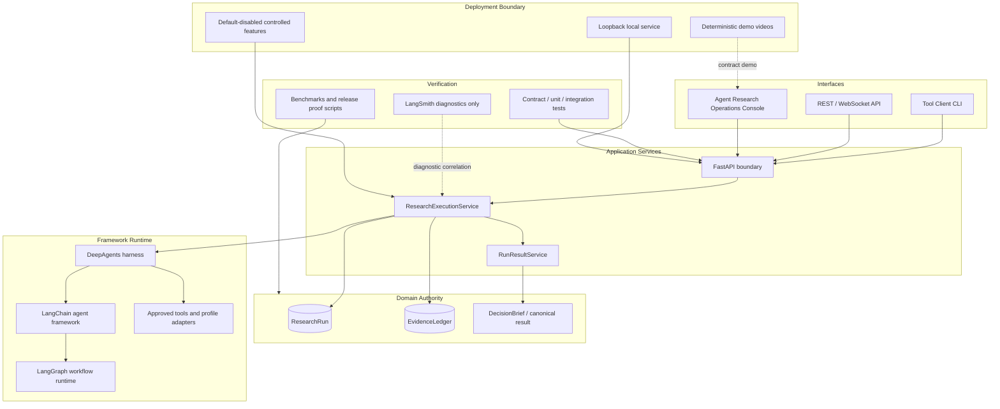

[English](./README.md) | [中文](./README_CN.md)

# Decision Research Agent

Decision Research Agent 是一个长任务研究服务：围绕来源证据生成有界、可审查、可交付的决策研究结果。项目使用 LangChain 作为 Agent Framework，DeepAgents 作为研究 harness，LangGraph 作为 durable workflow runtime，LangSmith 作为隐私优先诊断工具。

术语契约：

- LangChain = Agent Framework
- DeepAgents = research harness
- LangGraph = durable workflow runtime
- LangSmith = privacy-first tracing/evaluation
- Application DB = business authority

当前仓库、运行时配置、Tool Client、Docker 默认值和 health service ID 均使用 `decision-research-agent`。

## 当前能力

- 使用 canonical `run_id` 执行研究任务。
- 在应用数据库中持久化 ResearchRun、EvidenceLedger、review、verification、publication 和 canonical result 状态。
- 通过可选的 durable `Idempotency-Key` 支持丢失响应后的 run identity reconciliation，并在 Agent invocation 前恢复单节点已提交工作；不声称 exactly-once execution。
- 通过增量的 [run status contract](docs/reference/api-contract.md) 为失败 run
  暴露有界 durable `failure_cause`；非失败 run 返回 `null`，历史失败返回
  `not_observed`。
- 通过 `GET /api/runs/{run_id}/result` 暴露有界交付 artifact。
- 以 Talent Hiring Signal 作为首个已验证 benchmark profile。
- 通过显式 feature flag 提供受控 durable review 和 evidence verification workflow。

本仓库发布 backend、API、CLI、测试、文档、运维脚本和基于 React 的研究运行演示控制台（Agent Research Operations Console）。控制台可以创建 ResearchRun、观察生命周期并获取 canonical result，同时展示 EvidenceLedger、review、verification 和 authority 边界。它保留静态 fallback，不新增后端状态，也不成为业务事实源。

## Engineering Depth

- 服务将 interface clients 与应用拥有的 ResearchRun、EvidenceLedger、review、
  verification、publication 和 result authority 分离。
- `run_id` 约束 execution、persistence、telemetry、artifacts 和最终交付；
  `thread_id` 保留为调用方会话兼容标识。
- 终态 run 通过 fenced finalization 收口，避免 completion、timeout、
  cancellation 或 stale writer 覆盖已冻结 Evidence。
- Web、CLI、REST 和 demo console 均消费同一套 canonical API 与 result
  contract，不维护并行业务逻辑。
- LangGraph 和 LangSmith 分别保留在 framework/runtime 与 diagnostics 层；
  application database 是 business ledger。
- Release evidence 由显式验证脚本、文档契约、benchmark 报告和 feature-flag
  边界约束。

## 架构



服务端持久化状态是业务事实源。LangSmith 用于诊断，不替代 ResearchRun 或 EvidenceLedger。

- [Architecture Deep Dive](docs/architecture.md)
- [Demo Console](docs/demo-console.md)
- [Demo videos](https://itao-ai.github.io/my-website/#/projects/decision-research-agent)

Demo videos 是 deterministic loopback contract demos，不是 live provider
research recordings，也不是 public production service 或在线多用户部署证明。

## 快速开始

先 clone 仓库、创建本地 `.env`、按 constraints 安装依赖、启动后端，再做
healthcheck、doctor、创建 run 并读取 canonical result。

```bash
git clone https://github.com/iTao-AI/decision-research-agent.git
cd decision-research-agent
cp .env.example .env
python3.11 -m venv .venv
source .venv/bin/activate
pip install --no-deps -r constraints.txt
python api/server.py
```

健康检查：

```bash
curl --fail --silent http://127.0.0.1:8000/health
```

预期响应：

```json
{"status":"ok","service":"decision-research-agent"}
```

后续 Tool Client readiness、run 创建、result 获取和故障处理见完整的
[Getting Started tutorial](docs/getting-started.md)。
需要使用显式 API/MySQL 值、loopback-only host publication、health-gated
startup 和保留 volume 的 rollback 启动 authenticated container 时，请遵循
[Secure Local Runtime Operations](docs/operations/secure-local-runtime.md)。

## Demo Console

React console 默认进入可重复的 Static Demo 模式：

```bash
cd frontend
npm ci
npm run dev -- --host 127.0.0.1
```

打开 `http://127.0.0.1:5173`。可选的 Live Backend 模式要求配置精确的
CORS origin，并将未启用 `API_SECRET` 的 backend 绑定到 loopback；启用前请阅读
[Demo Console Guide](docs/demo-console.md)。当前 console 不接收或保存 API 凭据。

Live Backend 只渲染真实的 service-owned state，来源仅限 run status 与
canonical result contracts。create response 不明确时，reconciliation 重用
same key 和 byte-equivalent request。获得 `run_id` 后，observation resume
仅使用 GET，不能再次 create。Console 不拥有 review、verification、publication
或 delivery authority。

## Tool Client

```bash
python tools/decision_research_agent_tool.py healthcheck
python tools/decision_research_agent_tool.py doctor

python tools/decision_research_agent_tool.py run \
  --query "Research question" \
  --thread-id "demo-thread" \
  --wait

python tools/decision_research_agent_tool.py run \
  --query "Compare the evidence behind the proposed decision" \
  --wait \
  --result

python tools/decision_research_agent_tool.py result \
  --run-id "$RUN_ID"
```

当 backend 已经运行时，`--wait --result` 是最短本地 golden path：它创建
run、使用有界客户端 deadline 等待完成，并只输出 canonical result payload。
如果 run 需要受控 review，Tool Client 会返回结构化 recovery error，而不是绕过
review gate。

配置项：

```dotenv
DECISION_RESEARCH_AGENT_URL=http://127.0.0.1:8000
DECISION_RESEARCH_AGENT_API_KEY=
DECISION_RESEARCH_AGENT_TIMEOUT_SECONDS=10
DECISION_RESEARCH_AGENT_DB_PATH=data/decision_research_agent.db
DECISION_RESEARCH_AGENT_CHECKPOINT_DB_PATH=data/review_checkpoints.db
```

## 核心 API

- `GET /health`
- `POST /api/runs`
- `GET /api/runs/{run_id}`
- `GET /api/runs/{run_id}/result`
- `GET /api/telemetry/runs/{run_id}`
- `GET /api/token-usage/runs/{run_id}`
- `WebSocket /ws/runs/{run_id}`

受控 review 与 evidence verification endpoints 见 [API Contract](docs/reference/api-contract.md)。

## 受控功能

Durable review 默认关闭：

```dotenv
DECISION_RESEARCH_AGENT_ENABLE_DURABLE_HITL=false
```

Evidence verification 默认关闭：

```dotenv
DECISION_RESEARCH_AGENT_ENABLE_EVIDENCE_VERIFICATION=false
```

除非后续 rollout 扩展部署模型，否则这两个功能仅支持文档中定义的单节点 SQLite 边界。

## 验证

以下命令仅为选定的本地验证子集，并非完整的 required CI proof 清单：

```bash
PYTHON_DOTENV_DISABLED=1 python scripts/agent_evaluation_gate.py check
PYTHON_DOTENV_DISABLED=1 python scripts/run_failure_cause_proof.py check
PYTHON_DOTENV_DISABLED=1 python scripts/secure_local_runtime_proof.py check
PYTHON_DOTENV_DISABLED=1 python scripts/bounded_live_producer_proof.py check
python -m pytest -q
python scripts/check_canonical_identity.py --root .
python tools/decision_research_agent_tool.py doctor
```

### Required CI proof 清单

- Agent evaluation regression gate：`python scripts/agent_evaluation_gate.py check`
- Run creation idempotency proof：`python scripts/run_creation_idempotency_proof.py check`
- Run dispatch reconciliation proof：`python scripts/run_dispatch_reconciliation_proof.py check`
- Run failure cause proof：`python scripts/run_failure_cause_proof.py check`
- Secure local runtime proof：`python scripts/secure_local_runtime_proof.py check`
- Bounded live producer contract check：`python scripts/bounded_live_producer_proof.py check`

required pytest 覆盖 downstream fixture/CLI behavior；该行为没有独立的
top-level workflow step。当前 required-gate authority 是
[`.github/workflows/ci.yml`](.github/workflows/ci.yml)。

Bounded live producer 的 `check` 不使用 provider，也不启动 Docker。其需要
单独授权的 `observe-live` 命令只在文档中说明，不会被 tests 或 CI 调用；本次
implementation 未提交 live report。

## 文档

- [Documentation Index](docs/README.md)
- [Architecture Deep Dive](docs/architecture.md)
- [Demo Console Design](DESIGN.md)
- [Demo Console Guide](docs/demo-console.md)
- [Demo videos](https://itao-ai.github.io/my-website/#/projects/decision-research-agent)
- [Getting Started](docs/getting-started.md)
- [Contributing](CONTRIBUTING.md)
- [Agent Integration](docs/AGENT_INTEGRATION.md)
- [API Contract](docs/reference/api-contract.md)
- [Data Models](docs/reference/data-models.md)
- [Agent Evaluation Regression Gate](docs/reference/agent-evaluation-regression-gate.md)
- [Bounded Live Producer Evaluation](docs/reference/bounded-live-producer-evaluation.md)
- [Durable Run Failure Cause Proof](docs/evidence/run-failure-cause-v1.md)
- [Secure Local Runtime v1 Proof](docs/evidence/secure-local-runtime-v1.md)
- [Secure Local Runtime Operations](docs/operations/secure-local-runtime.md)
- [Talent Hiring Signal Benchmark v1](benchmarks/talent-hiring-signal-v1/README.md)
- [v0.1.5 Release Notes](docs/releases/v0.1.5.md)
- [v0.1.4 Release Notes](docs/releases/v0.1.4.md)
- [v0.1.3 Release Notes](docs/releases/v0.1.3.md)
- [v0.1.2 Release Notes](docs/releases/v0.1.2.md)
- [v0.1.1 Release Notes](docs/releases/v0.1.1.md)
- [v0.1.0 Release Notes](docs/releases/v0.1.0.md)
- [Controlled Review Workflow](docs/operations/controlled-review-workflow.md)
- [Evidence Verification Workflow](docs/operations/evidence-verification-workflow.md)

## 已知边界

- Durable failure cause 仅以增量 status projection 暴露。Canonical result
  endpoint、`409 run_failed` envelope 与冻结的
  `dra.downstream-consumer.v1` fixture 保持不变；该有界证明不构成 provider
  diagnosis、billing record 或 exactly-once execution 声明。
- Bounded live producer harness 只证明确定性 contracts 与一次 provider-free
  Docker lifecycle；provider/model 执行、live evidence publication、provider
  quality、research truth、billing、hosted deployment 与 SLA 声明仍需单独授权，
  不属于本次 implementation。
- Source launcher 仅在 direct-loopback 边界支持 credential-free 访问。
  Compose 要求认证，只把 backend/MySQL 发布到 `127.0.0.1`，并使用 required
  secrets、health declarations、warning-level logging、capability drop 与
  `no-new-privileges`。为兼容现有 volume，image 仍保留 root UID。
  Deterministic proof、required Docker lane 与后续 tag-archive smoke 是三层
  独立 local evidence；均不构成 TLS、identity/RBAC、hosted deployment、
  non-root operation 或 provider/research quality 声明。
- v0.1.3 dispatch contract 增加 Agent invocation 前由应用拥有的
  `run_dispatches_v1` reconciliation。历史 v0.1.2 identity proof 保持不变，
  其自身不证明 crash-before-schedule recovery；新的 dispatch proof 完成该
  有界证明。两者都不声称 exactly-once execution、running recovery、
  provider/tool side-effect exactly-once、multi-instance high availability
  或 live-provider result。
- v0.1.1 release surface 在既有 backend-and-CLI service 之外增加独立构建的
  Agent Research Operations Console 与确定性 contract gates；它不改变 runtime
  API、schema 或 database migration 要求。
- 研究运行演示控制台默认使用 Static Demo 模式，也可以通过受控 Live Backend 模式在 loopback backend 创建 ResearchRun。
- UI 交付必须消费 canonical API 与 result contract，不能重新引入并行 runtime。
- Markdown-only delivery：canonical 研究结果通过 result endpoint 返回 Markdown artifact。
- Durable review 与 evidence verification 是受控 feature-flag workflow，不是公开多用户生产功能。
- Evidence verification 记录人工决策和确定性 snapshot；不自动检索来源，也不使用 LLM 做证据核验。
- 已完成的实施历史保留在 Git 中；当前公开中性的项目计划保留在受控的
  Superpowers workspace 中。

## License

MIT. See [LICENSE](./LICENSE).
