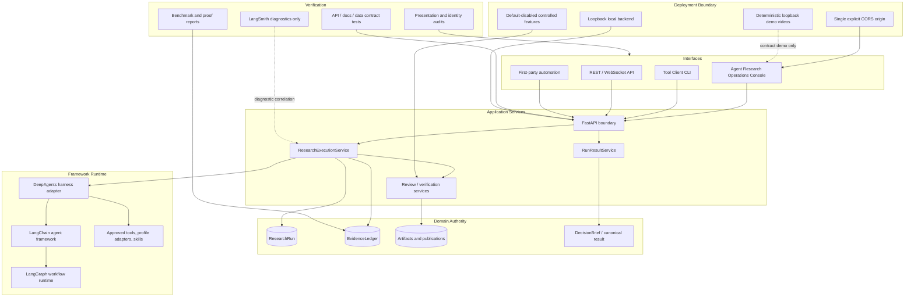

# Architecture Deep Dive: Decision Research Agent

Decision Research Agent is a backend research service with canonical
run-scoped APIs, DeepAgents-native execution, service-owned persistence, and
bounded result delivery. This document gives the 3-minute technical view. For
full schemas and state transitions, use the linked reference docs instead of
treating this page as a duplicate data-model specification.

Terminology contract: LangChain = Agent Framework; DeepAgents = research
harness; LangGraph = durable workflow runtime; LangSmith = privacy-first
tracing/evaluation; Application DB = business authority.

Canonical call path: ResearchExecutionService -> AgentHarness -> DeepAgentsHarness.

## Layered Architecture

## Ownership Boundaries

The durable rationale and rejected alternatives are recorded in
[Framework And Runtime Boundaries](decisions/framework-runtime-boundaries.md).
This document summarizes the current implementation.

| Layer | Owns |
|---|---|
| Interfaces | Web, CLI, REST, WebSocket, and automation access to canonical contracts |
| Application services | ResearchRun lifecycle, fenced finalization, result projection, review and verification workflows |
| Domain authority | ResearchRun, EvidenceLedger, artifacts, publications, DecisionBrief, and canonical result state |
| Framework runtime | DeepAgents execution, LangChain model/tool binding, LangGraph workflow execution |
| Verification | Tests, release proof scripts, bounded benchmark evidence, presentation and identity audits |
| Deployment boundary | Loopback local service, exact CORS origin, disabled-by-default controlled features, public demo limits |

LangSmith and LangGraph checkpoints are not business ledgers. LangSmith is
diagnostics only. Service-owned tables remain the source of truth for
ResearchRun, EvidenceLedger, review decisions, verification snapshots,
publication state, and delivery.

## Interface Consistency

Web, CLI, REST, WebSocket, and first-party automation all consume canonical
service contracts. The Agent Research Operations Console can create a
ResearchRun, observe lifecycle state, and retrieve
`GET /api/runs/{run_id}/result`, but it does not own business authority or
define a separate runtime.

The CLI golden path `run --wait --result` and the demo console Live Backend
mode resolve the same canonical result contract. Static Demo mode is a
deterministic bundled snapshot for explanation, not a replacement for the API.

Reference contracts:

- [API Contract](reference/api-contract.md)
- [Data Models](reference/data-models.md)
- [State Machines](reference/state-machines.md)
- [Tool Registry](reference/tool-registry.md)

## ResearchRun Lifecycle And Fenced Finalization

`run_id` owns one isolated execution. `thread_id` groups caller conversation
for compatibility and correlation; it is not the execution ledger. Run-scoped
workspace, runtime context, token accounting, telemetry, monitor routing, and
search cache must not leak across concurrent runs.

The service finalizes terminal states through fenced transactions. Completion,
timeout, cancellation, and stale writer paths must preserve frozen Evidence
and cannot silently overwrite terminal run state. Generic runs persist a
canonical Markdown report artifact. Talent runs may also persist structured
packets, review bundles, publications, and DecisionBrief artifacts under the
same run-owned authority.

The state-machine reference remains the contract source for transition detail:
[State Machines](reference/state-machines.md).

## Run creation and dispatch reconciliation boundary

The application database owns the optional idempotency-key hash, canonical
request hash, and run/thread/segment binding. FastAPI owns header validation
and stable transport errors. The Tool Client owns key preservation and the
caller's retry choice. The same transaction that creates the run and initial
segment also creates a private `run_dispatches_v1` intent. An unconditional
single-node worker reconciles pending or expired pre-start leases, while an
application dispatch authority fence atomically moves dispatch, run, and
segment to started/running before Agent invocation.

This dispatch gap is before the Agent framework boundary, so no Agent middleware,
LangGraph checkpoint, or LangSmith trace owns it. DeepAgents and
LangGraph begin only after the application start fence; LangSmith remains
diagnostics only. Keyed replays may wake targeted reconciliation but cannot win
a second claim. The proof covers committed pre-start recovery, not exactly-once
execution, recovery after running begins, provider/tool side effects,
multi-instance high availability, or a live-provider result.

## Durable Failure-Cause Authority

The application database owns the immutable bounded cause for a failed run.
Framework exceptions, packet validation, the task tracker's termination origin,
and private dispatch diagnostics are inputs only. A cause becomes authoritative
when the application terminal transaction or exact dispatch fence wins together
with the failed run and segment; framework state, LangGraph checkpoint data, and
LangSmith traces cannot fill, revise, or repair it.

`GET /api/runs/{run_id}` provides the additive status-only projection. New
failures expose an observed cause, historical failures expose `not_observed`,
and nonfailed runs expose `null`. The result endpoint remains unchanged, as do
its stable errors and the frozen downstream v1 fixture.

Migration `009_run_failure_cause_v1` protects first application with the
dedicated `.pre-run-failure-cause.bak`. Rollback is operator-controlled: stop
application writers, preserve the failed database for diagnosis, and restore
the complete backup with a compatible application revision before writers
restart.

This bounded contract is not exactly-once execution, not hard preemption, not
provider diagnosis, not multi-instance high availability, and not a billing
record. It also does not make framework runtime, trace, or checkpoint storage a
business ledger.

## EvidenceLedger, DecisionBrief, And Canonical Result Authority

Evidence is application-owned. Findings and claims must resolve to run-scoped
Evidence references where the profile requires them, and missing or invented
references fail closed. Review approval permits delivery, but approval does
not verify Evidence. Verification decisions are explicit persisted snapshots.

`GET /api/runs/{run_id}/result` is the delivery projection. For generic runs it
returns the canonical Markdown report when available. For Talent runs it
resolves the current publication artifact when publication is enabled, or the
canonical `decision-brief.md` artifact when that is the active contract.

Detailed fields and publication semantics live in
[Data Models](reference/data-models.md) and
[Evidence Verification Authority](decisions/evidence-verification-authority.md).

## Verification And Release Proof Boundaries

Verification is intentionally bounded:

- Unit, contract, integration, and documentation tests check repository
  behavior and public presentation.
- Benchmark and proof artifacts state their own scope and limitations.
- `scripts/final_presentation_audit.py` checks public-neutral presentation and
  tracked Markdown links.
- `scripts/check_canonical_identity.py` checks canonical repository identity.
- Release notes describe required gates without claiming a tag, GitHub
  Release, deployment, or Docker smoke that has not been run.

Evidence artifacts are not universal product claims. For example, the durable
HITL gate proves only the documented single-node SQLite feasibility boundary,
and real-source proof covers a small declared workflow sample.

Secure local runtime evidence is deliberately split. The deterministic
16-case proof exercises production access, WebSocket, CORS, source-launcher,
and checked-in container-configuration paths without starting Docker. The
required Docker lane separately owns real image build, exact backend/MySQL
health, loopback host bindings, privilege inspection, named-volume persistence
across restart, and task-owned cleanup. A later tag-archive smoke remains a
separately authorized post-publication check. None is a hosted deployment,
provider-quality, research-quality, TLS, identity, or RBAC certification.

The bounded live producer harness is another project-owned proof boundary. Its
required `check` validates deterministic manifest, report, error, and lifecycle
contracts without Docker, credentials, network, or Agent runtime imports. The
required Docker lane separately builds an exact tracked archive and verifies
protected create, application-owned persistence, dynamic loopback rebinding
after backend restart, same-key replay, privilege isolation, and exact cleanup
through a provider-free fixture. `observe-live` remains a separately authorized
operator action; no live report is committed, and the harness does not move
business authority into LangGraph, LangSmith, the frontend, or an external
consumer.

## Credential, CORS, Public Demo, And Local-Prod Separation

The current repository release is backend, API, CLI, tests, docs, scripts, and
the separately built Agent Research Operations Console. The console defaults
to Static Demo and can use bounded Live Backend mode only against a loopback
backend.

The browser client is not an authentication or deployment boundary. Live
Backend mode accepts only a loopback base URL, requires one exact CORS origin,
and does not accept or store API credentials. Authenticated environments should
use the first-party Tool Client.

The runtime access boundary is frozen when the FastAPI app is constructed.
With an empty secret, the direct peer and literal Host must both be loopback;
with a configured secret, protected HTTP and WebSocket access requires the
shared `X-API-Key`. CORS and Origin checks are not authentication. WebSocket
credentials are header-only, and query credentials are rejected before run
identity or connection ownership. Review and Evidence verification continue
through independent feature-owned gates after the shared access boundary.

The source launcher binds `127.0.0.1` with reload disabled. The source and
Compose launchers use Uvicorn warning-level logging, avoiding info-level
transport logging of rejected legacy query credentials. Compose requires
explicit API/MySQL secrets. Its backend listens on container-internal
`0.0.0.0:8000`, while backend and MySQL host publication remains exact on
`127.0.0.1`; private service communication stays on the Compose network. The
MySQL root credential value is isolated to the MySQL service and explicitly
suppressed from the backend service environment.

Compose gates backend startup on MySQL health, declares an exact backend
process/service identity check, drops all backend capabilities, and enables
`no-new-privileges`. Health does not establish database-query, provider,
model, tool, or research readiness. The container root UID remains in place
for compatibility with existing root-owned `data` and `output` volumes; a
non-root image is a separate ownership migration.

Non-loopback direct use requires a configured key plus operator-owned TLS and
is not a supported hosted deployment. The shared key does not provide TLS,
caller identity, authorization, RBAC, or multi-tenant hosting; those remain
outside this local runtime boundary.

Public demo videos are deterministic loopback contract demos. They are not
live provider research recordings, not a public production service, and not
evidence of an online multi-user deployment.

Controlled durable review and evidence verification stay disabled by default
and remain limited to the documented single-node SQLite boundary unless a
later architecture decision expands the deployment model.

Delivery is Markdown-only in v0.1.0. The result endpoint returns canonical
Markdown artifacts and does not generate PDF files.
