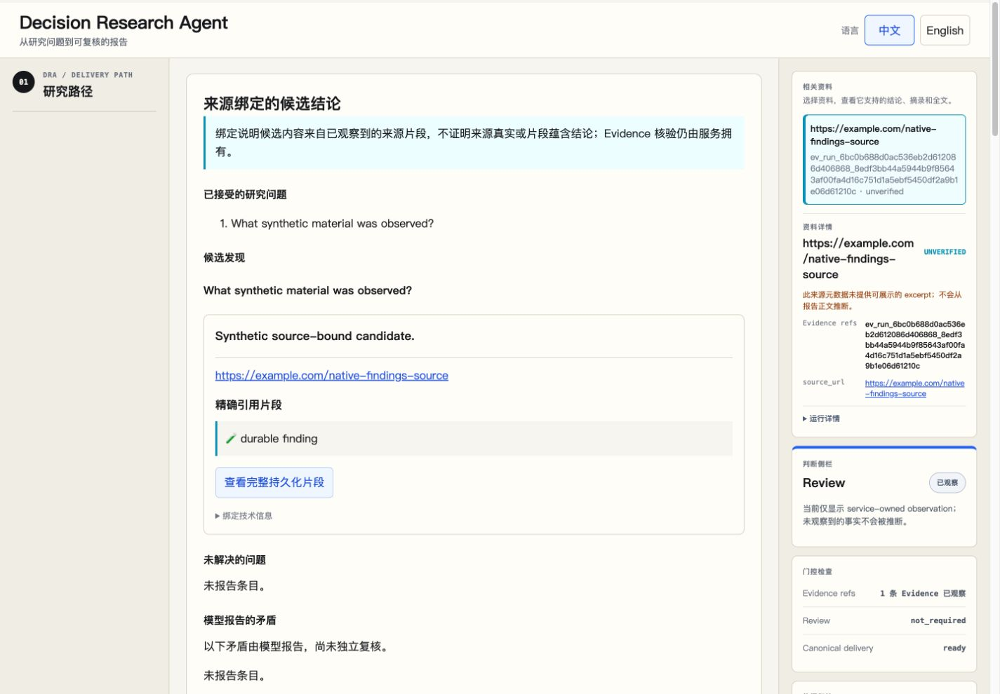
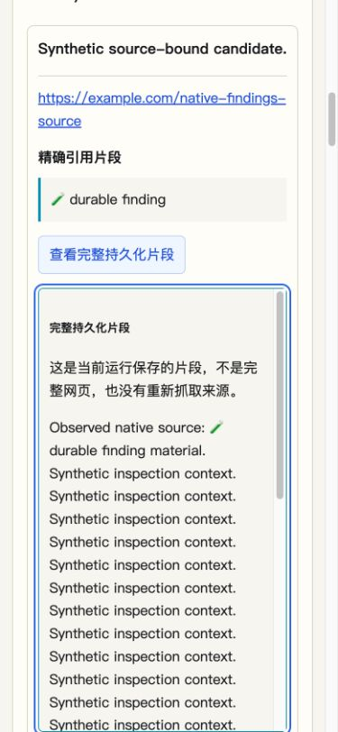
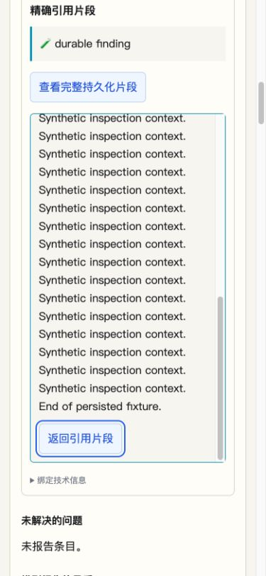
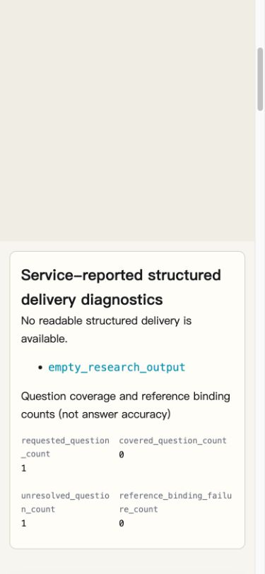

# Research evidence delivery browser observation v1

Observed on 2026-10-02 in the Codex in-app browser against the actual local
React console and temporary native fixture API. The producer started from
`9d6d715feec9fc199a9ef13c32e3366ecc55f40d`; the final rendered checks and
screenshots use frontend revision `7a26613cd6a0e411ce33bdde0643a9006862b60e`.
The latter changes only layout constraints and source-metadata wording.

[Operations walkthrough](../operations/research-evidence-delivery.md) ·
[Separate native HTTP proof](research-evidence-delivery-v1.md)

## Scope and method

The frontend used `http://127.0.0.1:5175` and the fixture-only API used
`http://127.0.0.1:8876` with that exact allowed Origin. UI actions selected Live
Backend, checked health, explicitly selected structured evidence research,
created a run, and observed its terminal service state. Seeded cases were then
attached through the existing known-run control. No completed run, findings,
delivery status or DOM content was manually substituted for browser acceptance.

The API used the installed graph, named researcher, native source/file tools,
stream capture, application execution and fenced persistence. The model and
source content were declared synthetic fixtures. This receipt proves browser
consumption and inspection of that path; it does not prove real-provider
instruction adherence, source truth, claim entailment or research quality.
External source links were inspected as DOM attributes and were not opened.

## Observed cases

| Case / run | Service state | Browser observation |
| --- | --- | --- |
| UI creation: `run_ad2723f5f3b555668a99b8ec2bd90f22` | completed / not_required / ready | One accepted q1, one source-bound candidate and exact Unicode excerpt appeared alongside canonical Markdown. |
| complete: `run_6bc0b688d0ac536eb2d612086d406868` | completed / not_required / ready | One accepted question, one candidate and one bound source; the 947-code-point persisted snippet could be inspected. |
| partial: `run_e4383ba9ee7353e89f6cc82563dd1470` | completed / not_required / ready | Both accepted questions appeared; q1 had a candidate and q2 retained the declared unresolved reason. |
| contradictory: `run_558e4f7a1d965b018568e8669dd6f2be` | completed / not_required / ready | Daily and weekly candidates retained two bound sources and one explicitly model-reported contradiction, with an independent-review caveat. |
| insufficient-evidence: `run_d057d451d4785220aa34d5887f3e061d` | completed / not_required / blocked | `empty_research_output` and requested/covered/unresolved/binding-failure counts `1/0/1/0` appeared. No structured finding reader, Markdown content or report download was present. |

The form was switched back to generic before attaching structured seed runs.
The attached run's service-observed profile still selected the structured
reader. Chinese and English labels preserved candidate, source-binding,
unresolved-question and model-reported-contradiction boundaries. The source
metadata panel described only its own missing excerpt projection; it did not
claim that the whole run lacked the excerpts shown by the findings reader.

## Rendered geometry and keyboard inspection

| Viewport | Client width | Document scroll width after correction | Checked state |
| --- | --- | --- | --- |
| 1440 × 1000 | 1425 | 1425 | Complete and contradictory ready readers, including the source sidebar. |
| 390 × 844 | 375 | 375 | Complete ready reader, expanded long snippet, partial and contradictory readers, and blocked diagnostics. |

The 15-pixel difference is the browser's vertical scrollbar. Before correction,
the actual ready page had document widths 1452 and 997 respectively: the desktop
source-heading flex item retained its minimum content width, and a long
Evidence ID overflowed the narrow Markdown paragraph. The corrected source
heading can shrink and wrap; long Markdown text wraps inside its reader.
These measurements come from rendered DOM geometry, not jsdom viewport labels.

At narrow width, **Enter** on the inspection trigger opened the persisted
snippet and focused its labelled region. That region had client height 510,
scroll height 1060 and matching client/scroll width 270. **Tab** reached the
return button, scrolled the region to its maximum 550-pixel offset, and exposed
the fixture's final sentence. **Enter** on the return button closed the region
and restored focus to the inspection trigger with `aria-expanded=false`.
The excerpt and the frozen snippet remained text; no source re-fetch occurred.
Bound source links used HTTPS with `_blank` and `noopener noreferrer`.

## Screenshots

The screenshots are direct browser captures of synthetic local data. Collapsed
navigation and inspection state differ between captures.

The temporary browser tab and viewport override were released after observation.
The fixture API and Vite processes were stopped; these screenshots do not imply
a continuously running service, hosted delivery or a deployed environment.
