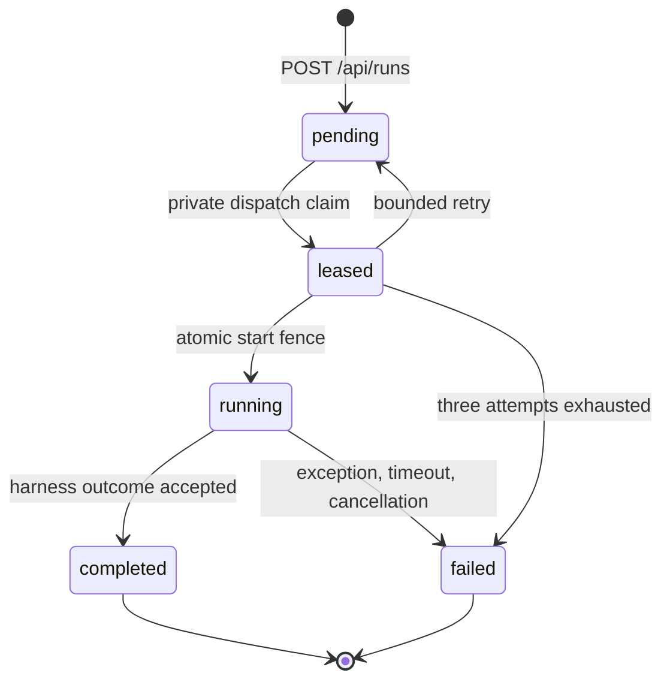
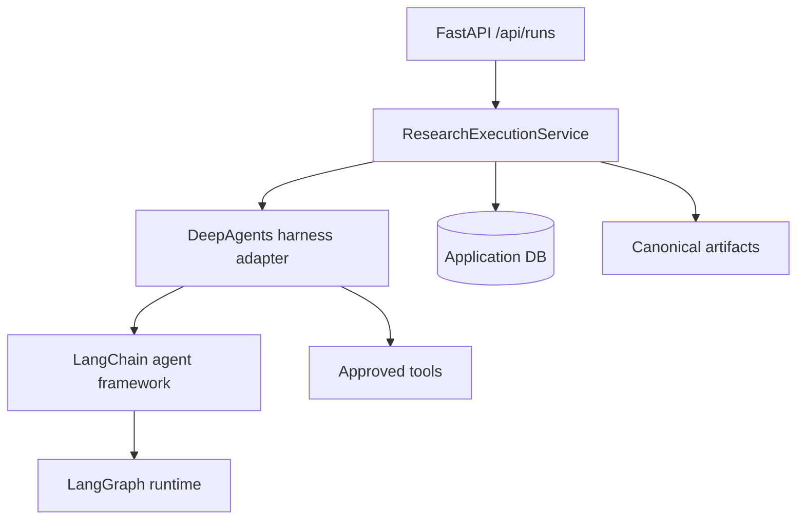
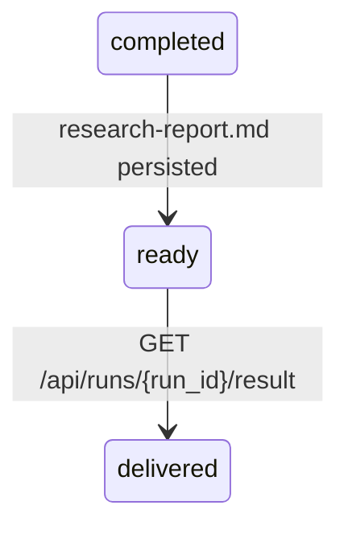
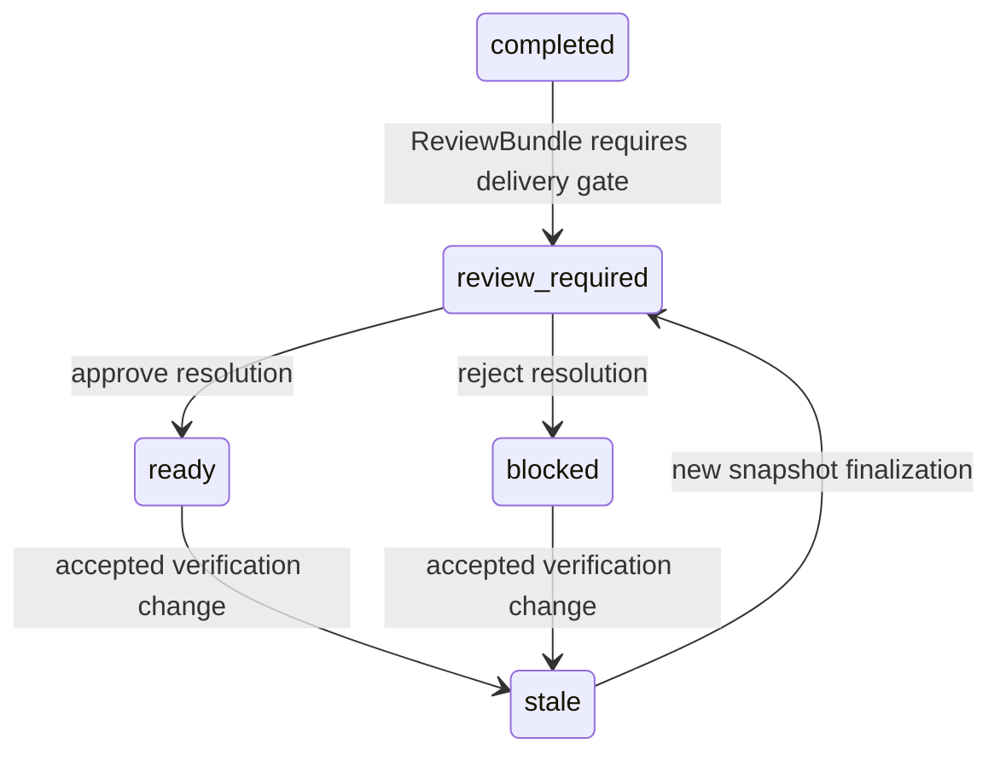
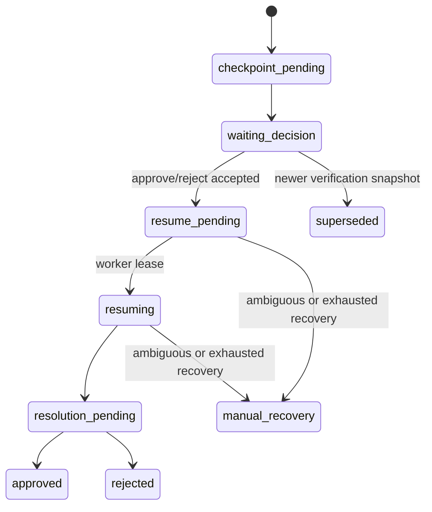
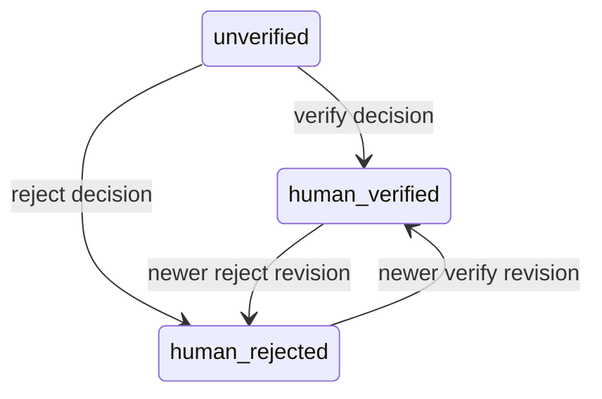

# State Machines

Decision Research Agent uses service-owned state machines around a
DeepAgents-native execution harness. LangGraph drives runtime execution, but
application database tables are the authority for run, evidence, review,
verification, publication, and delivery state.

## Execution Path

Execution identity:

- `thread_id` groups the caller conversation and LangGraph runtime context.
- `run_id` owns one isolated execution, workspace, telemetry, token usage,
  monitor route, cache partition, evidence ledger, and delivery result.
- `segment_id` identifies the terminal write segment used for fenced
  finalization.

Terminal writes use `state_version` and allowed previous statuses. A stale
writer, timeout callback, cancellation handler, or normal completion cannot
silently overwrite a terminal run written by another path.

The `leased` state is represented by private `run_dispatches_v1`; public
ResearchRun remains `pending` until the exact lease owner and attempt atomically
advance dispatch to `started`, run to `running`, and the initial segment to
`running`. Expired leases can be reclaimed. A stale task or timeout is a no-op
against a newer attempt. Attempts one and two retain only private retry
diagnostics and create no canonical cause. Only the exact third attempt may
terminalize dispatch, run, and segment with
`run_dispatch_schedule_failed`, `run_dispatch_start_failed`, or
`run_dispatch_start_timeout`; an expired third lease uses
`run_dispatch_lease_expired`. The exact fence ensures attempt four is never
created. Pre-start timeout
uses atomic timeout reconciliation: the exact attempt is released while leased,
timeout-finalized if already started, or ignored if a newer attempt owns state.

## Failure Cause Terminalization

Every post-migration transition to `failed` writes one observed bounded cause
in the same winning application transaction. Historical failures use
`not_observed`; nonfailed runs have no cause row and expose `null`. A stale,
duplicate, completion, timeout, cancellation, or exception writer cannot
replace the cause written by the state-version or exact-attempt winner.
Execution status `failed` is execution-terminal: no later transition, review
or publication writer may revive it or increment its run state version.

The tracker owns one monotonic termination origin from `unset` to `timeout` or
`cancelled`; the first transition wins, while the database fence still decides
the durable terminal winner. Application timeout is claimed before the inner
task receives cancellation, and a later outer cancellation cannot rewrite it.
Any already-launched start/terminal database task and the single winning
callback settle before the wrapper returns or re-raises cancellation.

A finalization checkpoint distinguishes execution-phase from
finalization-phase timeout/cancellation through the production tracker. The
service deadline is a cooperative deadline, not hard wall-clock preemption:
synchronous work or an already-started shielded transaction may settle first.
Harness strings cannot claim `run_timeout` or `cancelled`; unknown values and
inner self-cancellation without an application cancellation origin converge to
bounded execution or finalization errors.

A pre-start infrastructure cancellation is not a public business cancellation.
It creates no `cancelled` cause: attempts one and two release for retry, while
an interrupted exact third lease remains fenced and converges through
`run_dispatch_lease_expired`.

## Harness Boundary

DeepAgents owns agent execution, tool filtering, middleware, skills loading,
and runtime context injection. The service layer owns evidence capture,
terminal transactions, review decisions, verification snapshots, publications,
and canonical result delivery.

The main generic research state machine does not resume an interrupted tool
call after process death. Durable resume semantics apply only to the controlled
review workflow shown below.

## Generic Delivery

A completed generic run persists `research-report.md` in
`run_artifacts_v2` during the same terminal transaction. `GET
/api/runs/{run_id}/result` returns that artifact only when execution is
completed, delivery is ready, the artifact is safe, and the content hash
matches the persisted payload.

Before a generic coordinator exits normally without a valid
`/workspace/research-report.md`, framework middleware may issue one run-scoped
correction that asks the model to use the native `write_file` tool. The
completion middleware is registered before the existing call-limit middleware
so reverse `after_model` execution accounts for the completed call before any
re-entry. The correction does not enlarge the existing model, tool, or
recursion budgets and does not promote chat text or fallback content into the
canonical artifact. If the one correction still produces no valid file,
finalization keeps the existing fallback and fail-closed delivery behavior.

## Talent Review And Publication

Talent outputs must satisfy the structured contract:

- research packet schema is valid;
- findings and claims contain non-empty evidence references;
- every evidence reference resolves to the current run snapshot;
- review bundle and canonical DecisionBrief artifacts are deterministic.

Approval permits delivery. It does not verify evidence. Rejection blocks
delivery and does not start a new research run.

## Durable Review Workflow

The application DB stores decisions, workflows, leases, resume attempts, and
resolutions. The separate checkpoint DB stores only the LangGraph review-gate
checkpoint. Ambiguous state becomes `manual_recovery` instead of being guessed.

## Evidence Verification

Evidence rows are immutable. Human verification is an append-only decision for
the exact persisted fingerprint. Finalization creates or reuses a deterministic
snapshot and may create a new publication revision.

## Result Endpoint States

| Run state | Result endpoint |
|---|---|
| `pending` / `running` | `409 run_not_terminal` |
| `failed` | `409 run_failed` |
| `delivery_status=review_required` | `409 run_review_required` |
| `delivery_status=blocked` | `409 run_delivery_blocked` |
| missing, empty, unsafe, too-large, or hash-mismatched artifact | `409 run_result_unavailable` |
| `completed` + `delivery_status=ready` + valid artifact | `200` canonical artifact |

## Change Log

| Date | Change |
|---|---|
| 2026-05-19 | Initial state-machine document |
| 2026-06-26 | Replaced removed coordinator/workspace model with canonical run, review, verification, and delivery state machines |
