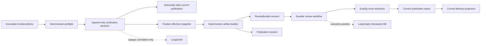
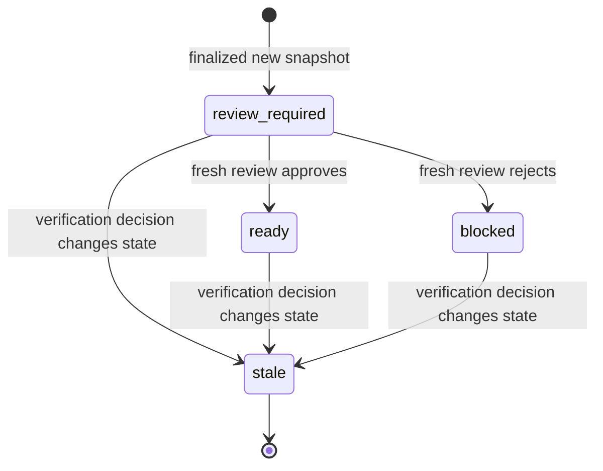
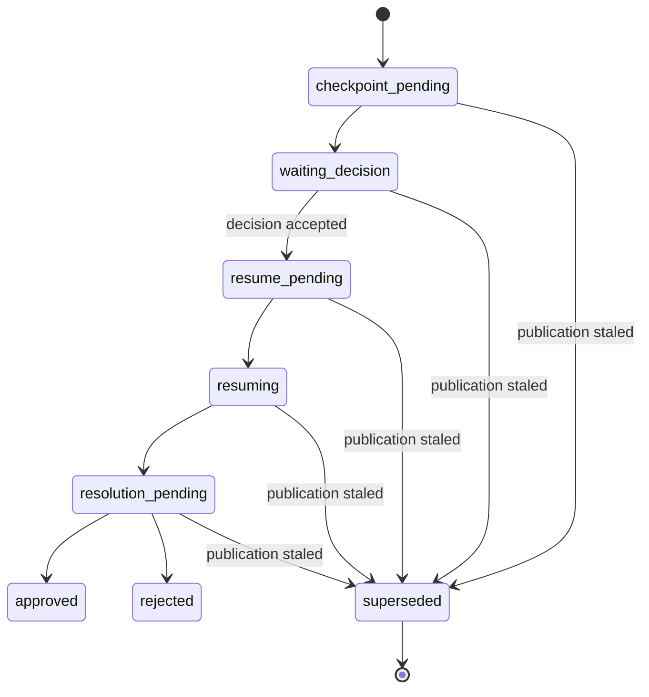

# P2A Controlled Verification Publication Design

**Status:** Implementation-ready refinement

**Date:** 2026-06-23

**Parent design:** `docs/superpowers/specs/2026-06-21-p2a-evidence-verification-design.md`

**Scope:** P2A PR2 only: authenticated Evidence verification operations,
revisioned publication, deterministic artifact rebuild, and fresh durable
review for every changed verification snapshot.

## Summary

P2A PR1 established the Evidence Verification authority: immutable collected
Evidence, deterministic no-network preflight, append-only human decisions, and
immutable effective-state snapshots.

PR2 connects that authority to delivery without weakening the existing durable
review boundary:

- every accepted non-idempotent verification decision invalidates the current
  publication in the same application-database transaction;
- finalizing the effective verification state deterministically creates or
  reuses one snapshot and one publication revision;
- a changed snapshot creates immutable revisioned artifacts, a new
  `ReviewBundle`, and a new durable review workflow;
- an earlier review decision can never approve a later publication revision;
- only the explicit current publication may affect run delivery state; and
- only a current publication with status `ready` is deliverable.

The feature remains default-disabled and limited to the existing controlled
single-node SQLite runtime. PR2 adds no UI, automatic source fetching, LLM
verification, Skills, Async Subagents, RBAC, PostgreSQL, or multi-instance
support.

## Current Project Facts

- `evidence_entries_v2` is immutable and PR1 already stores baseline origin,
  deterministic preflights, append-only decisions, and snapshots.
- `review_bundles_v2`, `review_workflows_v2`, and
  `review_resolutions_v2` currently enforce one row per run.
- `review_decisions_v2` already binds a decision to `review_id` and
  `review_revision`.
- `run_artifacts_v2` can already store multiple immutable artifacts when their
  IDs differ.
- `get_review_projection()`, `get_review_detail()`,
  `get_original_decision_brief()`, and `resolve_review()` currently assume one
  review or resolution per run.
- `claim_review_workflow()` currently hard-codes post-review segment sequence
  `1`, which is incompatible with multiple review revisions.
- the existing durable worker and LangGraph gate already bind checkpoint state
  to `run_id + review_id + review_revision`.
- application SQLite remains the business authority; the LangGraph SQLite
  checkpointer remains execution-position state only.

## Locked Decisions

### Delivery shape

PR2 remains one external PR because the review-table migration, publication
head, artifact revision, and review-resolution changes form one safety
invariant. Splitting them across externally mergeable PRs would create an
intermediate schema in which multiple revisions are possible but current-result
queries still assume one row per run.

Implementation is still divided into six independently testable commits:

1. schema and migration;
2. multi-revision review repository;
3. deterministic artifact and publication construction;
4. stale/current state-machine integration;
5. authenticated API and runtime readiness; and
6. CLI, operator documentation, and end-to-end verification.

Every intermediate commit keeps
`DECISION_RESEARCH_AGENT_ENABLE_EVIDENCE_VERIFICATION=false` by default.

### Explicit current publication

Do not infer current state from `MAX(revision)`, the newest artifact timestamp,
or run-level delivery fields.

`run_publications_v2.is_current` is the explicit publication head. A unique
partial index enforces at most one current row per run:

```sql
CREATE UNIQUE INDEX idx_run_publications_current
ON run_publications_v2(run_id)
WHERE is_current = 1;
```

A blocked publication may remain the current revision, but it is not
deliverable. Current delivery resolution requires:

```text
is_current = 1 AND status = "ready"
```

### Review supersession

Add terminal workflow status `superseded`.

When a new verification decision changes authoritative state, the application
transaction:

1. appends the verification decision;
2. changes the current publication to `stale`;
3. clears `is_current`;
4. changes its non-terminal workflow to `superseded`;
5. clears any workflow lease;
6. changes the run to non-deliverable review-required state; and
7. increments `research_runs_v2.state_version`.

The snapshot contains the effective decision ID and revision. Therefore every
accepted non-idempotent correction changes the authoritative snapshot input,
even when its action repeats the previous `verify` or `reject` action.

Accepted historical review decisions and completed checkpoints remain
immutable audit history. They are not deleted or reused.

### Post-review segment identity

Post-review segment sequence equals `review_revision`.

- initial review revision `1` keeps existing sequence `1`;
- publication revision `2` uses post-review sequence `2`;
- later revisions follow the same rule.

Repository queries validate both deterministic segment ID and sequence. They no
longer query a hard-coded sequence.

### Finalization fencing

Snapshot finalization accepts `expected_state_version`.

This fences finalization against concurrent verification or review decisions.
The same effective snapshot and same current publication are idempotently
returned. A changed snapshot is persisted with a new publication only when the
run version still matches.

### Baseline adoption

Every Talent run with canonical artifacts has a logical revision-one baseline,
even when it was created before the publication table existed.

- when Evidence verification is enabled during initial run finalization, the
  run transaction seeds the baseline snapshot and publication revision `1`;
- when an older run has no publication, the first decision or finalization
  transaction adopts its existing unversioned artifacts and revision-one
  ReviewBundle as the baseline before applying later state;
- if no human verification decision exists, the adopted baseline may be
  current;
- if human verification decisions already exist, the adopted baseline is
  immediately historical/stale and finalization creates revision `2`; and
- the original unversioned artifacts are never rebound to a snapshot containing
  later human decisions.

This prevents a post-PR2 run or a historical PR1-internal decision from causing
old artifact content to be mislabeled as the current verified publication.

### Revision-one compatibility

Existing unversioned artifact IDs remain the immutable revision-one artifacts:

```text
decision-brief.json
decision-brief.md
decision-brief.reviewed.json
decision-brief.reviewed.md
```

New revisions use:

```text
decision-brief.r{revision}.json
decision-brief.r{revision}.md
decision-brief.r{revision}.reviewed.json
decision-brief.r{revision}.reviewed.md
```

No revision overwrites another row.

Publication revision, ReviewBundle revision, and post-review segment sequence
are equal for the same derived delivery:

```text
publication.revision == review_bundle.revision == post_review_segment.sequence
```

Verification snapshot revision is independent because snapshots may exist
before publication.

## Approaches Considered

### A. Extend existing tables and keep run-level implicit current state

**Rejected.** It leaves current delivery dependent on query ordering and makes
stale artifacts easy to expose accidentally.

### B. Rebuild review constraints and add an explicit publication head

**Adopted.** It preserves existing IDs, supports immutable history, and gives
all current-result queries one authoritative predicate.

### C. Add a second publication database or a new workflow engine

**Rejected.** The application database is already authoritative and the
existing durable review gate is sufficient. Another store would add
cross-database consistency without product value.

## Architecture



## Data Model

### Review table migration

The migration preserves all existing row IDs and payloads while replacing these
constraints:

```text
review_bundles_v2:
  UNIQUE(run_id) -> UNIQUE(run_id, revision)

review_workflows_v2:
  UNIQUE(run_id) -> UNIQUE(run_id, review_revision)

review_resolutions_v2:
  UNIQUE(run_id) -> UNIQUE(run_id, review_id)
```

`review_decisions_v2` remains unique by
`(review_id, review_revision)`.

SQLite cannot remove these table-level `UNIQUE` constraints with a simple
`ALTER TABLE`. The migration uses the official create-copy-drop-rename rebuild
procedure, with a database backup, foreign keys disabled before the migration
transaction, explicit row-count checks, index recreation,
`PRAGMA foreign_key_check`, schema verification, and restore on failure.

### `run_publications_v2`

| Column | Contract |
|---|---|
| `publication_id` | Deterministic primary key |
| `run_id` | FK to `research_runs_v2` |
| `revision` | Monotonic per run |
| `verification_snapshot_id` | Immutable snapshot used for rebuild |
| `review_id` | ReviewBundle bound to this publication |
| `status` | `review_required`, `ready`, `blocked`, or `stale` |
| `is_current` | `0` or `1`; unique per run when `1` |
| `artifact_ids_json` | Sorted immutable artifact IDs |
| `content_hash` | Canonical DecisionBrief hash |
| `supersedes_publication_id` | Previous current publication, if present |
| `created_at` | UTC timestamp |
| `resolved_at` | UTC timestamp or null |
| `staled_at` | UTC timestamp or null |

Required constraints:

```text
PRIMARY KEY(publication_id)
UNIQUE(run_id, revision)
UNIQUE(run_id, verification_snapshot_id)
CHECK(status IN ('review_required', 'ready', 'blocked', 'stale'))
CHECK(is_current IN (0, 1))
```

Required indexes:

```text
idx_run_publications_current:
  UNIQUE(run_id) WHERE is_current = 1

idx_run_publications_review:
  (review_id)
```

### Migration backfill

For each existing Talent run with a canonical `decision-brief.json` and a
persisted revision-one `ReviewBundle`:

1. create or reuse a baseline snapshot derived only from immutable baseline
   origin, before human decision projection;
2. create publication revision `1` bound to that baseline;
3. bind the existing review and immutable artifact IDs;
4. derive status from existing delivery and resolution state; and
5. set `is_current=1`.

Backfill does not create verification decisions, review decisions, resolutions,
or LangGraph checkpoints.

If accepted human verification decisions already exist, revision one is
backfilled as `stale` with `is_current=0`. Authenticated finalization creates
the first snapshot-bound current revision from the effective state.

A historical `review_required` run without a durable workflow remains
non-deliverable. An authenticated finalization call may idempotently create the
missing workflow for its existing current revision after runtime readiness is
confirmed.

Runs without canonical Talent artifacts receive no publication row.

## Artifact Contract

`EvidenceSnapshot` adds backward-compatible optional fields:

```python
verification_state: Literal["unverified", "verified", "rejected"] | None = (
    Field(default=None, exclude_if=lambda value: value is None)
)
verification_origin: Literal["none", "declared_fixture", "human"] | None = (
    Field(default=None, exclude_if=lambda value: value is None)
)
verification_revision: int | None = Field(
    default=None,
    ge=0,
    exclude_if=lambda value: value is None,
)
```

Revision-one values that do not set these fields serialize exactly as before.

Revisioned DecisionBrief construction uses only persisted inputs:

- run profile, version, and `scope_json`;
- persisted final `ResearchPacket` rows;
- persisted Evidence rows;
- one immutable verification snapshot;
- deterministic renderer and canonicalization versions; and
- snapshot `created_at` as the revision generation timestamp.

The DecisionBrief `quality_summary` records:

```text
publication_revision
verification_snapshot_id
verification_snapshot_hash
verification_state_counts
verification_origin_counts
```

The content hash already excludes `generated_at`; the snapshot identity and
revision metadata make the rebuilt content explicitly bound to its authority
input.

Every changed snapshot forces the ReviewBundle trigger:

```text
verification_snapshot_changed
```

This trigger is present even when every Evidence item is verified. It ensures a
human reviews the changed deliverable rather than silently publishing it.

## State Machines

### Publication



### Review workflow



`manual_recovery` remains available for ambiguous checkpoint or lease state. A
superseded workflow is not retried, resumed, or force-resolved.

## Transaction Boundaries

### Accept verification decision

One `BEGIN IMMEDIATE` transaction:

1. validate exact run/evidence/fingerprint;
2. adopt the immutable revision-one baseline when no publication exists;
3. persist deterministic preflight;
4. enforce expected verification revision;
5. append the immutable decision;
6. stale and unhead the current publication;
7. supersede its active workflow, if present;
8. set run delivery to `review_required`;
9. increment run `state_version`; and
10. commit.

An idempotent replay returns before steps 5-8 and performs no additional state
transition.

### Finalize publication

Runtime readiness is checked before opening the transaction.

One `BEGIN IMMEDIATE` application-database transaction:

1. fence `research_runs_v2.state_version`;
2. finalize or reuse the effective verification snapshot;
3. return the existing current publication when snapshot and workflow are
   already complete;
4. repair a missing current workflow only when the existing current
   publication is `review_required`;
5. otherwise calculate next publication and review revision;
6. load persisted scope, packets, Evidence, and snapshot;
7. build revisioned artifacts and ReviewBundle without network or model calls;
8. persist artifacts, bundle, publication, and `checkpoint_pending` workflow;
9. set the publication head;
10. set run review/delivery state and increment `state_version`; and
11. commit.

The LangGraph checkpoint is created asynchronously by the existing worker after
the application transaction. Failure leaves a durable
`checkpoint_pending` workflow that existing restart reconciliation can recover.

### Resolve review

One `BEGIN IMMEDIATE` transaction:

1. validate workflow lease and exact publication binding;
2. reject a stale or non-current publication;
3. persist revisioned reviewed artifacts for approval;
4. append one resolution for the exact `review_id`;
5. change current publication to `ready` or `blocked`;
6. change run delivery state;
7. increment run `state_version`;
8. terminate the workflow; and
9. commit.

## API Contract

All endpoints require:

- `DECISION_RESEARCH_AGENT_ENABLE_EVIDENCE_VERIFICATION=true`;
- `DECISION_RESEARCH_AGENT_ENABLE_DURABLE_HITL=true`;
- strict `X-API-Key` authentication before identity or existence checks;
- complete P2A schema and controlled review readiness; and
- bounded public error envelopes.

New endpoints:

```text
GET  /api/evidence-verifications/health
GET  /api/runs/{run_id}/evidence/verifications
GET  /api/runs/{run_id}/evidence/{evidence_id}/verification
POST /api/runs/{run_id}/evidence/{evidence_id}/verification-decisions
POST /api/runs/{run_id}/evidence/verification-snapshots
```

Decision request:

```json
{
  "verification_id": "verification_example",
  "evidence_fingerprint": "lowercase-sha256",
  "expected_revision": 0,
  "action": "verify",
  "confirm_source_match": true,
  "reason_code": null,
  "reason_note": null
}
```

Finalization request:

```json
{
  "expected_state_version": 4
}
```

List pagination is keyset-based, capped at 100, and uses an opaque cursor
derived from `evidence_id`. List output omits decision notes and all private
audit fields. Detail output may include bounded reason notes but never actor
fingerprints or request hashes.

Run projection adds:

```text
current_publication
current_artifacts
verification_summary
```

These fields are emitted only when a publication exists. Feature-disabled runs
without publication rows retain their existing projection.

The compatibility `artifacts` list remains historical. Callers must use
`current_publication.artifact_ids` or `current_artifacts` for current delivery.

Explicit artifact retrieval by `run_id + artifact_id` remains available for
historical audit. It is not a current-delivery resolver.

## CLI Contract

Add canonical Tool Client commands only:

```text
evidence list
evidence show
evidence verify
evidence reject
evidence finalize
```

The legacy Tool Client shim and `DEEP_SEARCH_AGENT_*` resolver receive no new
P2A command or environment-variable support.

CLI rules:

- API keys remain environment-only;
- `verify` requires `--confirm-source-match`;
- reject notes use exactly one of `--reason-file` or `--reason-stdin`;
- note reads are bounded and reject truncation, invalid UTF-8, and I/O errors;
- deterministic verification IDs bind run, evidence, fingerprint, expected
  revision, action, reason code, and note hash;
- `finalize` fetches the current run state version before posting;
- JSON remains the stable automation output; and
- `doctor` reports verification as `disabled`, `ok`, or `failed`.

## Runtime Configuration

New canonical-only flag:

```text
DECISION_RESEARCH_AGENT_ENABLE_EVIDENCE_VERIFICATION=false
```

When true:

- durable HITL must also be true;
- `API_SECRET` must be configured;
- application and checkpoint DB paths must be persistent and separate;
- the application schema must include PR1 and PR2 migrations;
- the 13/13 durable gate report must remain valid;
- the review worker must be running; and
- exactly one backend replica remains the supported boundary.

Feature-disabled startup and existing P1A/P1C behavior remain unchanged.

## Stable Errors

Add:

```text
evidence_verification_disabled
evidence_verification_auth_not_configured
invalid_evidence_verification_identity
invalid_evidence_verification_query
invalid_evidence_verification_decision
invalid_verification_finalization
verification_runtime_not_ready
verification_schema_not_ready
verification_publication_conflict
verification_publication_stale
review_superseded
```

Keep PR1 repository errors unchanged:

```text
evidence_not_found
evidence_preflight_blocked
evidence_fingerprint_mismatch
verification_revision_conflict
verification_id_conflict
verification_persistence_conflict
```

No public error includes raw exceptions, paths, secrets, checkpoint payloads,
actor fingerprints, or request hashes.

## Security and Privacy

- PR2 performs no HTTP fetch, DNS lookup, browser action, or LLM call.
- persisted Evidence, URLs, snippets, and reason notes remain untrusted input;
- renderers preserve plain-text escaping;
- auth precedes resource existence checks;
- actor identity is derived from `API_SECRET` in a verification-specific
  namespace;
- the API returns bounded projections only;
- stale and rejected artifacts are never selected as current delivery;
- LangSmith receives opaque correlation IDs only and remains diagnostic; and
- all inputs and outputs remain hidden by the existing privacy-first tracing
  defaults.

## Test Matrix

| Area | Required assertion |
|---|---|
| Migration | existing IDs and payloads survive table rebuild |
| Migration | new unique constraints permit multiple revisions but reject duplicates |
| Migration | failed verification restores the backup |
| Migration | foreign key and row-count checks pass |
| Backfill | revision-one publication binds existing snapshot, review, and artifacts |
| Backfill | existing human decisions leave adopted revision one stale |
| Backfill | no canonical artifact means no publication |
| Review | detail/projection select by current publication or exact review ID |
| Review | post-review segment sequence equals review revision |
| Review | superseded workflow cannot accept or resolve a decision |
| Decision | idempotent replay does not stale twice or increment state twice |
| Decision | first decision adopts and stales a missing baseline publication |
| Decision | new accepted decision atomically stales current publication |
| Publication | partial unique index permits at most one current row |
| Publication | same snapshot returns same current publication |
| Publication | changed snapshot creates the next revision |
| Artifact | rebuild is byte-stable for identical persisted inputs |
| Artifact | revision one preserves compatibility IDs |
| Artifact | revision two never overwrites revision one |
| Artifact | snapshot metadata is present in DecisionBrief |
| ReviewBundle | changed snapshot always adds mandatory review trigger |
| Resolution | old approval cannot resolve a new publication |
| Resolution | approval marks only current publication ready |
| Resolution | rejection marks current publication blocked |
| Evidence authority | review approval never writes verification decisions |
| API | feature and auth checks precede identity/body/existence checks |
| API | private audit fields are absent |
| API | finalization fences stale run state |
| CLI | bounded note input fails closed |
| CLI | deterministic IDs replay safely |
| Restart | checkpoint-pending publication converges after restart |
| Kill window | stale or superseded workflow never becomes deliverable |
| Compatibility | feature-disabled P1A and P1C tests remain unchanged |
| Compatibility | feature-enabled new Talent run seeds baseline revision one |
| Durable gate | existing 13/13 gate remains PASS |

## Acceptance Criteria

PR2 is complete only when:

1. the migration preserves existing review data and passes backup/restore,
   foreign-key, row-count, and exact-constraint verification;
2. one accepted verification decision atomically invalidates the current
   publication and active workflow;
3. deterministic finalization creates at most one current publication;
4. each changed snapshot creates immutable revisioned artifacts and a fresh
   review workflow;
5. no old review decision can resolve a new publication;
6. only a current `ready` publication is returned as deliverable;
7. API and CLI operations are strictly authenticated and fail closed;
8. feature-disabled behavior remains compatible;
9. the complete backend suite passes;
10. the durable 13/13 gate passes;
11. the synthetic container verification-to-approval canary passes when Docker
    is available; and
12. no frontend, Skills, Async Subagents, LLM verification, legacy alias
    expansion, or multi-instance behavior is added.

## Official Documentation Facts Used

- SQLite requires a table rebuild to add or remove table-level `UNIQUE`
  constraints and documents the create-copy-drop-rename procedure:
  <https://www.sqlite.org/lang_altertable.html>
- SQLite unique partial indexes can enforce one current row per run:
  <https://sqlite.org/partialindex.html>
- FastAPI supports authentication and early termination through dependencies
  or path-operation checks, and validates declared response models.
- Pydantic v2 supports frozen, extra-forbidden contracts, literal validation,
  model validators, conditional field exclusion, and JSON-compatible
  `model_dump(mode="json")`.
