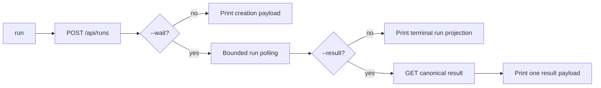

# CLI Golden Path And Structured Error Design

## Status

Approved for implementation.

## Summary

Decision Research Agent already exposes separate `run --wait` and
`result --run-id` commands. This change adds one bounded golden path for callers
that want to start a run, wait for terminal execution, and retrieve the
canonical result in a single command. It also replaces raw local exception
strings with a stable, private structured error envelope.

The change is limited to the Python Tool Client, its tests, and its public
documentation. It does not change the REST API, WebSocket contract, database,
Agent runtime, review workflow, or canonical artifact model.

## Current Behavior

- `run` creates a run and prints the creation response.
- `run --wait` polls the run projection without a total deadline and prints the
  terminal run projection.
- `result --run-id <id>` separately resolves the canonical deliverable.
- Structured HTTP error payloads from the service are preserved.
- Connection, timeout, malformed JSON, scope-file, and local validation errors
  do not share one stable output contract. Some paths can expose raw exception
  text, URLs, or local file details.

## Goals

1. Add `run --wait --result` as a single-output canonical delivery path.
2. Bound run polling with explicit poll and total timeout controls.
3. Emit one stable error envelope for service and local runtime failures.
4. Preserve existing successful command behavior when the new flag is absent.
5. Keep all failures free of API keys, raw response bodies, tracebacks, host
   paths, and transient exception text.

## Non-Goals

- Changing server endpoints or server error contracts.
- Returning a new structured DecisionBrief schema.
- Adding JSON or PDF export formats.
- Adding background job management, cancellation, or retry orchestration.
- Changing durable review, Evidence verification, or publication semantics.
- Adding dependencies or replacing the standard-library HTTP client.

## User-Facing Command Contract

### Existing Paths

```bash
python tools/decision_research_agent_tool.py run \
  --query "Research question"

python tools/decision_research_agent_tool.py run \
  --query "Research question" \
  --wait

python tools/decision_research_agent_tool.py result \
  --run-id "$RUN_ID"
```

These commands retain their current success payloads. `run --wait` gains a
bounded total wait as described below.

### Golden Path

```bash
python tools/decision_research_agent_tool.py run \
  --query "Research question" \
  --wait \
  --result
```

The command performs exactly these operations:

1. `POST /api/runs`.
2. Poll `GET /api/runs/{run_id}` until execution is terminal or the bounded
   deadline expires.
3. Call `GET /api/runs/{run_id}/result` exactly once.
4. Print only the canonical result response.

The client does not infer delivery readiness from the run projection. The
result endpoint remains authoritative for `ready`, `review_required`, failed,
blocked, missing, unsafe, stale, or hash-mismatched delivery state.

`--result` without `--wait` fails before network I/O with
`code=result_requires_wait`. The flag does not silently turn a non-blocking
command into a blocking one.

### Wait Controls

The `run` command adds:

```text
--poll-seconds FLOAT          default: 1
--wait-timeout-seconds FLOAT default: 600
```

Both values must be positive. Polling uses `time.monotonic()` and sleeps for no
longer than the remaining deadline. The timeout applies to total polling time,
not to an individual HTTP request. Individual requests continue to use the
existing client request timeout.

On deadline expiry the client returns `code=run_wait_timeout`. The run may
continue on the server; the error `fix` tells the caller to inspect the run by
ID or repeat `result --run-id` later. The error includes the created `run_id`.
The client does not cancel the run.

## Structured Error Contract

All runtime failures printed by the Tool Client use this minimum envelope:

```json
{
  "code": "connection_failed",
  "problem": "Cannot reach Decision Research Agent.",
  "cause": "The configured service endpoint is unavailable.",
  "fix": "Start the backend or verify DECISION_RESEARCH_AGENT_URL.",
  "retryable": true
}
```

The five fields are always present:

| Field | Contract |
|---|---|
| `code` | Stable machine-readable identifier |
| `problem` | Bounded user-facing summary |
| `cause` | Bounded reason without raw exception data |
| `fix` | Concrete next action |
| `retryable` | Whether retrying can reasonably succeed without changing the request |

The envelope may contain bounded recovery context. After `POST /api/runs`
succeeds, any later polling or result failure emitted by the composed `run`
command also includes that canonical `run_id`. It must not include the query,
scope, request URL, thread ID, or provider configuration.

Service-owned structured error fields are preserved. If a service response is
missing one of the minimum fields, the client fills only the missing field with
a status-safe generic value. It does not replace the service `code`, `problem`,
or `fix`, and it does not print a non-JSON response body.

### Local Error Mapping

| Condition | Code | Retryable |
|---|---|---|
| Connection refused, DNS, or transport unavailable | `connection_failed` | `true` |
| Individual request timeout | `request_timeout` | `true` |
| Response is not valid JSON | `invalid_json_response` | `false` |
| JSON response root is not an object | `json_response_not_object` | `false` |
| Scope file cannot be read | `scope_file_unreadable` | `false` |
| Scope file is not valid JSON object data | `scope_file_invalid` | `false` |
| Created run response has no valid `run_id` | `run_response_invalid` | `false` |
| `--result` without `--wait` | `result_requires_wait` | `false` |
| Non-positive run poll interval | `run_poll_seconds_must_be_positive` | `false` |
| Non-positive run wait timeout | `run_wait_timeout_seconds_must_be_positive` | `false` |
| Run wait deadline expires | `run_wait_timeout` | `true` |
| Review checkpoint requires operator recovery | `manual_recovery` | `false` |

Existing bounded domain codes for rejection input, verification input, missing
review state, and explicit source confirmation remain stable. They are emitted
through the same minimum envelope instead of `{status, error}`.

## Internal Design

### Error Ownership

`ToolClientError` becomes an application-owned error carrying a bounded payload
rather than arbitrary exception text. `ToolClientHTTPError` retains HTTP status
and a normalized service payload. A small error factory owns the static local
messages so call sites do not construct ad hoc JSON.

Exception chaining may remain for developer debugging, but chained exceptions
are never serialized by `main()`.

### Run Waiting

`wait_for_run()` accepts `poll_seconds` and `timeout_seconds`, validates them,
uses a monotonic deadline, and returns the same terminal run projection as
today. It does not call the result endpoint itself.

`main()` owns command composition:



This keeps the reusable API helpers composable and prevents `wait_for_run()`
from taking delivery authority away from the result endpoint.

### Scope File Handling

Scope-file reading moves behind one bounded helper. The helper accepts only a
JSON object and maps I/O, Unicode, JSON parsing, and wrong-root failures to the
stable local error contract without printing the path or parser exception.

## Compatibility

- `run` without `--wait` is unchanged.
- `run --wait` still prints the terminal run projection but now has a default
  600-second total deadline. Callers can raise the limit explicitly.
- `result --run-id` is unchanged.
- Review and Evidence commands retain their success payloads and stable domain
  codes.
- Server error payloads retain their existing fields.
- Exit status remains `0` on success and `1` on runtime failure.

The bounded default is an intentional safety change. It prevents an integration
client from hanging forever while leaving the server-side run untouched.

## Security And Privacy

- Never serialize exception strings from `URLError`, `OSError`, timeout, JSON,
  Unicode, or file I/O failures.
- Never serialize request URLs, API keys, raw response bodies, tracebacks, or
  scope/reason file paths.
- Do not echo rejection or verification reason text in failure responses.
- Keep service payload preservation limited to the server's existing bounded
  structured error contract.

## Test Matrix

### Command Composition

- Parser exposes `--result`, `--poll-seconds`, and
  `--wait-timeout-seconds` on `run`.
- `--result` without `--wait` performs no network request and returns
  `result_requires_wait`.
- `run` prints the creation payload.
- `run --wait` prints the terminal run projection.
- `run --wait --result` performs create, poll, result in order and prints only
  the canonical result payload.
- A wait path validates the creation response before indexing `run_id`; a
  missing, empty, or non-string value returns `run_response_invalid`.
- Result endpoint errors such as `run_review_required` and `run_failed` retain
  their service codes and minimum envelope.
- Polling or result failures after successful creation include `run_id` and no
  query, scope, URL, thread, or provider configuration.

### Bounded Waiting

- Completed, completed-with-fallback, and failed execution states terminate
  polling.
- Non-positive poll and timeout values fail before polling.
- Deadline expiry returns `run_wait_timeout`.
- The last sleep does not overshoot the remaining deadline.

### Error Normalization

- Connection, request timeout, invalid JSON, non-object JSON, unreadable scope,
  invalid scope, manual recovery, and existing bounded input failures contain
  all five minimum fields.
- Structured HTTP payloads preserve stable service fields.
- Non-JSON HTTP failures do not include response body content.
- Outputs do not contain API keys, raw exceptions, tracebacks, URLs, or local
  paths.

### Verification Commands

```bash
python -m pytest tests/unit/test_decision_research_agent_tool.py -q
python -m pytest -q
python scripts/final_presentation_audit.py --root .
python scripts/check_canonical_identity.py --root .
git diff --check
```

Docker, durable HITL, real-source proof, provider, benchmark, and frontend gates
are not required because this change does not affect those contracts.

## Documentation Impact

Update in the same implementation change:

- `README.md`: show the one-command golden path.
- `docs/AGENT_INTEGRATION.md`: define flags, success output, bounded wait, and
  minimum error envelope.
- `TODOS.md`: mark the two post-v0.1.0 CLI DX items complete.

No ADR change is required because framework, runtime, service authority, API,
and persistence boundaries are unchanged.

## Review Strategy

This is a Level 2 behavior change in one client module. It does not justify a
full multi-perspective Autoplan review. Required review depth is:

1. This specification self-review before implementation planning.
2. TDD and focused/full verification in the execution window.
3. One lightweight pre-PR review focused on compatibility, timeout behavior,
   error privacy, and documentation accuracy.
4. Targeted re-review only if fixes expand beyond the approved files or alter
   server contracts.

Escalate to a full Autoplan only if implementation requires a server API
change, a new result schema, new dependencies, cross-command output breaking
changes beyond the documented envelope, or broader runtime refactoring.
