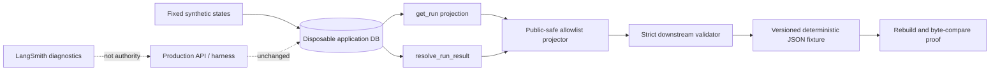

# Downstream Consumer Contract Proof Design

## Status

Approved for implementation.

## Summary

Decision Research Agent already exposes the application-owned state needed by
an upstream Agent or workflow: run status, run-level Evidence, canonical result
delivery, fallback distinction, review-required and blocked delivery, and
failed execution. The missing asset is not another runtime endpoint. It is a
versioned, deterministic, public-safe compatibility fixture plus a strict
reference validator that demonstrates how a downstream consumer must interpret
the existing contract and fail closed.

This change adds an offline proof surface only. It does not change the generic
research outcome, persistence schema, REST API, Tool Client, Agent profiles,
DeepAgents harness, LangGraph runtime, LangSmith tracing, review workflow,
Evidence verification, publication, or delivery authority.

## Inspected Baseline

- Branch and commit: `main@eb07f1059db105ce8a47123c4286877fcc065a6a`.
- `main` matches `origin/main` and the checkout is clean.
- Released backend contract: annotated `v0.1.0` at
  `646f430490cc7b498cedffe4f2d690a7f91f8e5e`.
- The relevant repository/result/API files have no released-to-current behavior
  change. Post-release changes are CLI, documentation, and demo-console work.
- The only open pull request at inspection time is an unrelated Vite
  Dependabot update. It is outside this change.

## Problem

The existing public API is sufficient for a conservative downstream adapter,
but consumers currently have to rediscover several non-obvious rules:

- `completed + ready` is not sufficient; artifact kind, media type, size, and
  hash semantics also matter.
- A fallback report is a valid persisted artifact but is not equivalent to a
  canonical research report for downstream approval.
- `review_required`, `blocked`, `failed`, and missing/invalid result artifacts
  have stable fail-closed meanings.
- Evidence is run-level. The generic contract does not provide typed finding,
  claim, comparison-dimension, limitation, conflict, or source-freshness
  references.
- The run projection contains fields a downstream public projection should not
  copy, including query text, Evidence snippets, tool details, and workflow
  internals.
- `completed_with_fallback` remains a compatibility execution status, while
  the active generic runtime identifies fallback primarily through artifact
  kind.

Without a committed compatibility proof, a downstream integration can easily
parse Markdown as if it were a typed schema, treat retrieval time as source
freshness, or accept a fallback artifact because delivery is `ready`.

## Goals

1. Publish one versioned, byte-deterministic, public-safe consumer fixture.
2. Generate the fixture through current application repository and result
   resolver behavior, without provider credentials, network, or LLM output.
3. Cover pending, running, canonical ready, active fallback, compatibility
   fallback, review-required, blocked, failed, and result-unavailable states.
4. Provide a strict validator for schema/version, state combinations, result
   error codes, artifact kind/media/hash, Evidence allowlist, fallback handling,
   and fail-closed unknown values.
5. Document `supported`, `partial`, and `unknown` semantics for upstream Agents.
6. Keep ResearchRun, EvidenceLedger, review, verification, publication, and
   delivery authority in the application ledger.

## Non-Goals

- No new runtime endpoint, response field, profile, database table, migration,
  exporter service, or public package.
- No typed generic findings, claims, limitations, conflicts, source titles,
  publishers, official as-of dates, failure taxonomy, or persisted usage.
- No Markdown parsing or URL text matching to manufacture typed Evidence refs.
- No provider/network run, credential lookup, real personal data, or unstable
  model output.
- No domain-specific tenant, case, family-decision, or workflow field.
- No Async Subagents, memory, RBAC, anonymous public research, MCP Server, UI,
  dependency maintenance, release, or deployment work.

## Considered Approaches

### A. Handwritten static fixtures

Smallest initial diff, but they can drift from `get_run()` and
`resolve_run_result()` without detection. Rejected as the authoritative proof
path.

### B. Deterministic application-contract fixture builder plus strict validator

Recommended. Seed disposable application state with fixed identities and time,
resolve it through existing repository/result code, project only an explicit
public allowlist, validate the result, and compare generated bytes with the
committed fixture.

### C. New read-only runtime projection endpoint

Rejected. Existing status/result endpoints already expose the required stable
states. A new endpoint would duplicate contract ownership and still could not
create typed generic semantics that are not persisted.

## Architecture



The proof script may import application repository and result-resolution
functions. It must not import or invoke the DeepAgents harness, LangGraph
execution, LangSmith client, provider model, search tools, token collector, or
telemetry collector.

## Fixture Contract

The committed JSON root is exact and versioned:

```json
{
  "schema_version": "dra.downstream-consumer.v1",
  "service": {
    "name": "decision-research-agent",
    "health": {"status": "ok", "service": "decision-research-agent"},
    "status_endpoint": "/api/runs/{run_id}",
    "result_endpoint": "/api/runs/{run_id}/result"
  },
  "capabilities": {
    "supported": [],
    "partial": [],
    "unknown": []
  },
  "cases": []
}
```

The bundle contains no generation wall-clock time, source commit, host path, or
random value. Version review, not volatile metadata, controls fixture updates.
Equivalent source code and fixed inputs must produce identical UTF-8 bytes.

Each case contains only:

- `case_id` and `profile_id`;
- bounded run state: `run_id`, `execution_status`, `review_status`,
  `delivery_status`, and `state_version`;
- allowlisted run-level Evidence;
- result HTTP status and bounded body;
- expected support classification and consumer disposition.

### Evidence Allowlist

Only these fields may enter the consumer fixture:

```text
evidence_id
source_url
source_identity
retrieved_at
citation_status
verification_status
```

The projection excludes query text, snippets, subagent/tool names, tool call
IDs, fingerprints, timestamps unrelated to source retrieval, review contents,
and workflow internals. `source_url` may be `null`; non-null fixture URLs must
be public `https` URLs without userinfo.

### Capability Semantics

`supported` means the validator can make a stable decision from typed fields:

- service identity and fixture schema version;
- execution/review/delivery state;
- run-level Evidence identity and compatibility statuses;
- generic canonical/fallback artifact distinction;
- generic report media type and raw-content SHA-256;
- stable result errors for non-terminal, failed, review-required, blocked, and
  unavailable results.

`partial` means a field is useful but insufficient for a stronger claim:

- run-level Evidence does not establish claim-level support;
- `retrieved_at` is retrieval time, not official source as-of date;
- Evidence `verification_status` is a compatibility projection and does not by
  itself prove a human verification decision or origin;
- fallback content is inspectable but not acceptable as canonical downstream
  research;
- `completed_with_fallback` is compatibility input, not the active generic
  fallback signal.

`unknown` is the required output for semantics the current generic contract
does not type:

- findings/claims/comparison dimensions to Evidence refs;
- typed limitations, conflicts, and gaps;
- source title, publisher, official effective date, fee intake, or ranking
  edition;
- persistent timeout/cancel/provider/runtime failure cause;
- persistent model/provider/currency/pricing-version usage.

The validator never derives an `unknown` field from Markdown.

## Scenario Matrix

| Case | Upstream state/result | Classification | Consumer disposition |
|---|---|---|---|
| `pending` | `pending/not_required/pending`, `run_not_terminal` | supported | `wait` |
| `running` | `running/not_required/pending`, `run_not_terminal` | supported | `wait` |
| `canonical_ready` | `completed/not_required/ready`, canonical generic artifact | supported | `accept_draft` |
| `fallback_ready` | `completed/not_required/ready`, fallback artifact | partial | `block_fallback` |
| `compatibility_fallback` | `completed_with_fallback/not_required/ready`, fallback artifact | partial | `block_fallback` |
| `review_required` | `completed/required/review_required` | supported | `await_review` |
| `blocked` | `completed/resolved/blocked` | supported | `block` |
| `failed` | `failed/not_required/failed` | supported | `block` |
| `result_unavailable` | `completed/not_required/ready`, no valid artifact | supported | `block` |

`accept_draft` means the artifact may enter a downstream draft synthesis step.
It does not mean Evidence was verified or a business decision was approved.

## Validator Rules

The validator is strict for the committed fixture schema and fail closed for
unknown upstream values.

1. Require exact top-level and nested fixture keys and exact schema version.
2. Require allowed execution, review, and delivery enums plus the state
   combinations in the scenario matrix.
3. Require the expected result HTTP status and stable result error code for
   each non-success state.
   The current result envelope marks every `409` as retryable, so the validator
   derives disposition from run state and stable error code, not from
   `retryable` alone.
4. Accept a generic canonical result only when:
   - execution is `completed`;
   - review is `not_required`;
   - delivery is `ready`;
   - artifact ID is `research-report.md`;
   - kind is `research_report_markdown`;
   - media type is `text/markdown`;
   - content is non-empty and at most 1 MiB;
   - `content_hash` is lowercase SHA-256 of the exact UTF-8 content.
5. Recognize `research_report_fallback_markdown` and
   `completed_with_fallback`, but always return `block_fallback`.
6. Reject unknown artifact kinds, media types, malformed hashes, hash mismatch,
   unsafe state combinations, and unknown status/error codes.
7. Require exact Evidence fixture keys. Never copy or accept an added snippet,
   query, tool payload, credential, local path, traceback, or checkpoint field.
8. Do not apply generic raw-content hash semantics to
   `decision_brief_markdown`; v1 marks that profile-specific result contract as
   unsupported by this reference validator rather than validating it
   incorrectly.

## Deterministic Builder

The builder uses a temporary SQLite database and fixed synthetic values:

- fixed run UUID sequence;
- fixed UTC timestamp;
- fixed public-safe query strings and public example URLs;
- fixed Evidence content used only to produce current repository rows;
- fixed report Markdown and expected hashes.

The output projector removes non-allowlisted fields before serialization.
Serialization uses sorted keys, two-space indentation, UTF-8, and exactly one
trailing newline. A `build` command writes the expected bytes; a `check`
command validates the committed fixture and fails if rebuilding produces a
different payload.

The fixture validator applies a public-safe marker check to its own committed
payload. This is a proof-artifact boundary, not a claim that the runtime result
endpoint is a general DLP system.

## Failure Handling

The command returns bounded JSON errors or a non-zero exit code without raw
exceptions. Stable proof errors include:

- `contract_file_invalid`;
- `contract_schema_unsupported`;
- `contract_state_invalid`;
- `contract_result_invalid`;
- `contract_artifact_invalid`;
- `contract_evidence_invalid`;
- `contract_fixture_drift`.

Error output must not contain raw fixture content, local paths, database paths,
tracebacks, credentials, or source snippets.

Review-required and blocked cases are synthetic application-contract states.
They prove downstream consumption of the stable status/result shape, not the
durable review worker, lease, restart, or SIGKILL lifecycle already covered by
the separate durable HITL proof.

## Testing

### Positive proof

- Build twice and assert byte identity.
- Assert the committed fixture equals a fresh build.
- Validate every scenario and its expected disposition.
- Assert canonical/fallback result bodies are produced through current
  repository/result behavior.
- Assert only the Evidence allowlist reaches the fixture.

### Negative and mutation cases

- Wrong/missing schema version or extra fixture key.
- Unknown execution, review, delivery, artifact kind, media type, or result
  error code.
- Impossible state combinations.
- Empty/oversized artifact content, malformed hash, or hash mismatch.
- Fallback relabeled as canonical or expected as accepted.
- Added Evidence snippet/query/tool/path/credential-like field.
- Missing Evidence identity or malformed/non-public URL.
- Markdown containing headings such as `Limitations` without typed data; the
  validator must not emit typed limitations.
- DecisionBrief artifact passed to the generic validator.

## Documentation

Add a public reference that explains:

- how an Agent consumes status then result;
- the fixture version and rebuild/check commands;
- the state/disposition matrix;
- Evidence allowlist and unknown semantics;
- fallback, review, blocked, failed, and retry behavior;
- why Markdown remains untrusted draft content rather than a typed contract;
- why LangSmith trace and LangGraph checkpoint are not consumer ledgers.

Link the reference from the Agent integration and evidence indexes. Do not add
consumer-specific business examples or private planning rationale.

## Compatibility And Authority

- Runtime API and persistence compatibility are unchanged.
- The fixture version belongs to the offline proof, not the production REST
  API.
- The reference validator is an example downstream boundary, not a second
  application ledger and not a supported package distribution promise.
- Application DB remains authoritative for ResearchRun, EvidenceLedger,
  review, verification, publication, and delivery.
- DeepAgents owns the research harness; LangGraph owns workflow execution and
  checkpoint-compatible review position; LangSmith remains privacy-first
  diagnostics only.

No ADR is required because these boundaries do not change. If implementation
needs a new endpoint, field, database column, profile, generic structured
outcome, Evidence capture rule, persisted failure cause, or persisted usage,
stop and return to architecture design.

## Review Strategy

This is a Level 3 public compatibility proof with no runtime behavior change.
A focused engineering plan review is required. A full Autoplan is not required
because there is no product direction, UI, framework, or authority expansion.

After implementation, run one authoritative diff review focused on fixture
drift, schema strictness, state combinations, hash semantics, Evidence
allowlisting, deterministic bytes, and documentation claims. Use targeted
re-review after any fixes.
