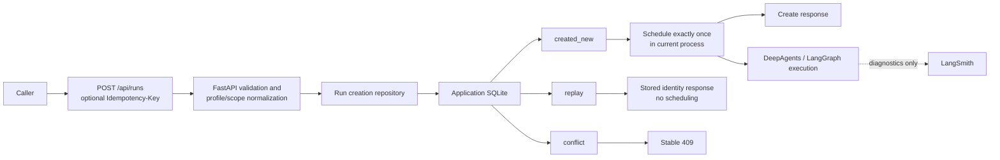

# Run Creation Idempotency And Lost-Response Reconciliation v1 Design

## Status

Approved for implementation planning.

## Summary

This design adds an optional `Idempotency-Key` header to `POST /api/runs`.
When the header is absent, the existing create-a-new-run behavior remains
exactly unchanged. When the header is present, the application database owns
a durable mapping from the key hash and canonical request hash to exactly one
run identity.

The same key and canonical request return the original run, thread, and
segment identities with `idempotent_replay=true` and schedule no second task.
The same key with a different canonical request fails closed with a stable
`409` response. This scope reconciles a client that lost a response and
provides durable identity lookup; it does not add crash-safe execution
dispatch.

This capability is the principal engineering addition proposed for a future
`v0.1.2` release. Version changes, tagging, publishing, and release creation
remain separate actions.

## Inspected Baseline

- `main` and `origin/main` were both at
  `889aabbe7c19415c63c1f2f698895f7b1f7ec9cd` after PR #83.
- `v0.1.0` remains the only release.
- `POST /api/runs` currently returns
  `{status:"started",thread_id,run_id,segment_id}` and accepts an optional body
  `thread_id`.
- Multiple independent runs on the same thread, including concurrent runs,
  are explicitly allowed.
- `create_run` generates UUID run and segment identities and inserts both in
  one atomic transaction, but it accepts no caller idempotency identity.
- The database transaction commits before the route creates its in-memory
  tracked task and sends the response. A client that loses the response can
  therefore create a duplicate independent run and duplicate provider work
  by retrying naively.
- The Tool Client sends no idempotency key and cannot reconcile a timeout or
  connection loss that occurs before it receives a `run_id`.
- The review and Evidence verification repositories already use canonical
  request hashes, `BEGIN IMMEDIATE`, immutable acceptance, replay, and conflict
  patterns.
- The application database owns business identity and state. DeepAgents,
  LangGraph, and LangSmith do not.

## Problem

Retrying an ambiguous `POST /api/runs` request after a timeout or connection
loss can create an independent duplicate run and schedule duplicate provider
work. The caller has no stable way to recover the identity of a run whose
database transaction committed when the response did not arrive.

Deduplicating by `thread_id` or payload alone is invalid. Multiple independent
runs with the same thread and even the same request remain legal. The service
therefore needs caller-controlled retry identity, a durable atomic claim,
conflict detection, and consumer recovery without changing runtime authority.

## Goals

1. Add an optional, bounded caller-supplied idempotency identity to
   `POST /api/runs`.
2. Implement atomic same-key create, replay, and conflict behavior in the
   application SQLite database.
3. Preserve all existing behavior when the header is absent.
4. Preserve the existing same-thread independent-run contract.
5. Prevent a second task from being scheduled on replay in a live server
   process.
6. Provide durable replay lookup after repository or server restart.
7. Make explicit and recoverable keys available through the Tool Client.
8. Add deterministic tests and public proof for replay, conflict, races,
   restart, response loss, compatibility, and failure boundaries.

## Non-Goals

- No transactional outbox, durable create worker, lease or fencing dispatcher,
  queue, broker, or exactly-once execution claim.
- No guarantee when request-handler cancellation or interruption, or process
  failure, occurs after database commit but before or during task scheduling.
  The durable identity mapping survives, but execution might never start and
  is not recovered by v1.
- No deduplication by query, scope, payload, `thread_id`, `run_id`, model
  output, or checkpoint.
- No change to same-thread concurrency.
- No tenant, RBAC, or actor scope, multiple credentials, or anonymous/public
  mode.
- No automatic HTTP retry or backoff policy in the server or Tool Client.
- No TTL, expiry, or cleanup job in v1.
- No new provider or framework dependency, LangGraph checkpoint authority,
  LangSmith business authority, REST authority duplication, frontend
  requirement, profile contract change, or result, Evidence, or review
  contract change.
- No release action.

## Considered Approaches

### A. Deduplicate by payload or thread

This conflicts with the current contract because same-thread and same-payload
independent runs remain valid. Rejected as a semantic mismatch.

### B. Add an optional header and durable application-database ledger

Recommended and selected. A caller-provided operation identity allows the
service to distinguish an intentional retry from an independent create. A
database-owned immutable binding makes the result durable across repository
and server restarts and permits deterministic conflict detection.

### C. Add a transactional outbox and durable worker

An outbox and worker could recover execution dispatch after process failure,
but it would add broader runtime authority, leases or fencing, and a new
operational migration. Deferred until real operator proof justifies that
scope.

### D. Use a LangGraph or DeepAgents checkpoint or store

Rejected as run-creation authority. Framework replay can re-execute calls, and
external side effects still need their own idempotency. Checkpoint state does
not provide the required immutable API request-to-run binding.

### E. Reuse Pydantic, FastAPI, and SQLite primitives

Selected where they match the contract: bounded validation, header parsing,
canonical models, transactions, and unique constraints. Project-owned logic
continues to define the ledger, hashing policy, stable errors, and proof. This
uses framework and standard-library capabilities without transferring
business authority to a framework.

## Architecture



DeepAgents and LangGraph begin execution only for a new accepted create.
LangSmith remains a diagnostic surface only.

## Authority Boundaries

- The application database is authoritative for the idempotency-key binding,
  request fingerprint, run, thread, and segment identity, and run state.
- FastAPI owns transport, header validation, and stable HTTP error mapping.
- The Tool Client owns key generation and preservation and the caller's retry
  choice.
- DeepAgents owns the research harness only after a new create is accepted.
- LangGraph owns graph execution and checkpoint state, not API retry identity.
- LangSmith is diagnostics only.
- The proof report is authoritative only for its deterministic fixed-input
  contract. It does not establish production exactly-once execution.

## Public API Contract

### Header

`Idempotency-Key` is optional. A valid key contains 8 through 128 ASCII
characters and matches:

```text
[A-Za-z0-9][A-Za-z0-9._:-]{7,127}
```

Callers should use a UUID or another high-entropy value. Whitespace, control
characters, non-ASCII input, and oversized values are rejected.

### Header Absent

The service preserves existing behavior. Every accepted request creates a new
run, even when another request has the same thread, query, profile, and scope.

### First Keyed Acceptance

The first accepted request under a key returns HTTP `200` with the existing
response fields and one additive field:

```json
{
  "status": "started",
  "thread_id": "thread-id",
  "run_id": "run-id",
  "segment_id": "segment-id",
  "idempotent_replay": false
}
```

The route schedules the task once in the current live server process.

### Same Key And Same Canonical Request

The service returns HTTP `200` with the original run, thread, and segment
identities and `idempotent_replay=true`. It does not schedule a second task.

`status="started"` remains a create-acknowledgement compatibility field. It is
not the current execution state. Callers use the existing `GET` contract to
read current run state.

### Same Key And Different Canonical Request

The service returns HTTP `409` with the direct stable envelope code
`run_idempotency_conflict`, `retryable=false`, and no disclosure of the
existing run identity. The error advises the caller to use the original
request or a new key. The service creates and schedules nothing.

### Invalid Key

The service returns HTTP `422` with the direct stable envelope code
`run_idempotency_key_invalid` and `retryable=false`.

### Ledger Unavailable

If the idempotency ledger is unavailable or persistence fails for a request
that supplied a key, the service fails closed with HTTP `503`, the direct
stable envelope code `run_idempotency_unavailable`, and `retryable=true`. It
must not fall back to an unkeyed create.

### Authentication Scope

The existing authentication middleware remains unchanged. The key is
service-wide within the current single-service credential or development
deployment. This design makes no tenant-isolation claim.

The raw key is a replay identity, not a credential. It is neither logged nor
persisted by the server, but callers must still use high-entropy values.

## Canonical Request Fingerprint

The canonical JSON object is exactly:

```json
{
  "schema_version": "dra.run-create-request.v1",
  "query": "<validated request query>",
  "thread_id": null,
  "profile_id": "<validated profile id>",
  "scope": {}
}
```

The field values are defined as follows:

- `query` is the validated request query, preserving its value.
- `thread_id` is the caller-supplied value or JSON `null` when omitted.
- `profile_id` is the validated profile identifier.
- `scope` is the validated and normalized scope object.

Serialize the object as UTF-8 JSON with `ensure_ascii=false`, sorted keys, and
compact separators, then compute SHA-256. Generic scope uses JSON key
canonicalization. Talent scope uses the current `ResearchScope` normalized
JSON.

When the caller omits `thread_id`, the omission hashes as JSON `null`. The
first create generates and persists a thread identity, and a retry with the
same omission returns that generated identity. A later retry that supplies a
thread identity is a different canonical request and conflicts.

The server-resolved `profile_version` is stored on the run but excluded from
the caller request fingerprint. This permits the original key to recover its
original run after a compatible deployment change. The request schema version
makes any future canonicalization change explicit.

## Key Identity

- Validate the raw header before hashing.
- Compute SHA-256 over the UTF-8 bytes of
  `dra.run-create-idempotency.v1\0` followed by the raw key.
- Persist only this hash, never the raw key.
- Never place the raw key in database rows, logs, traces, Evidence, artifacts,
  proof reports, or server error bodies.
- Keep the table specific to run creation. Do not create a generic
  cross-operation idempotency framework.

## Persistence Contract

Add the additive migration `007_run_create_idempotency` and table
`run_create_idempotency_v1`:

| Column | Contract |
|---|---|
| `key_hash` | `TEXT PRIMARY KEY` |
| `request_schema_version` | `TEXT NOT NULL` |
| `request_hash` | `TEXT NOT NULL` |
| `run_id` | `TEXT NOT NULL UNIQUE REFERENCES research_runs_v2(run_id) ON DELETE CASCADE` |
| `created_at` | `TEXT NOT NULL` |

The ledger has no TTL in v1. A record lives with its run; deletion, if later
introduced, cascades from the run.

Migration, readiness, proof, and schema tests must cover checksum identity,
required tables and columns, the foreign key, repeated application, legacy
upgrade, backup/restore, and fail-closed full schema verification. Full
migration and schema verification is not a keyed-request hot-path operation.
The existing `003_run_identity_backbone` authority is not renamed; `007` is
added to the expected migrations.

## Repository Contract

- Retain the current `create_run(...) -> dict` behavior for unkeyed and
  internal callers.
- Extract one transaction-local insert helper so keyed and unkeyed paths do
  not fork run and initial-segment creation semantics.
- Add a typed acceptance containing `run_id`, `thread_id`, `segment_id`, and
  `idempotent_replay`, plus bounded conflicts with stable internal codes.
- For a keyed request, perform idempotent additive schema initialization,
  canonicalize and hash the request, then start `BEGIN IMMEDIATE`. Run the full
  migration and schema verifier only through migration, readiness, proof, and
  test paths, not for every keyed request.
- If the key exists with the same request hash, join to the canonical run and
  initial segment and return a replay.
- If the key exists with a different request hash, return a conflict.
- If the key is absent, generate the identities and insert the run, initial
  segment, and ledger row in the same transaction.
- A corrupt or missing joined row, or an unexpected integrity or database
  error, fails closed. It never creates another run as a fallback.
- Unique constraints and the immediate transaction serialize concurrent
  duplicates. Tests use multiple connections and threads.

## Scheduling And Crash Boundary

- The route builds and schedules the research coroutine only when
  `idempotent_replay=false`.
- Replay never creates, cancels, or closes a second run coroutine.
- If scheduling throws after a new database create, retain the current
  fail-finalization behavior and error mapping. A retry returns the original
  identity, and the caller can use `GET` to inspect current state.
- A live concurrent request can replay after the transaction commits but
  before the first route schedules. The first route remains the sole
  scheduler.
- Request-handler cancellation or interruption, or process death, after commit
  but before or during in-memory scheduling can leave work that never started
  or is unrecovered. The durable identity mapping survives and prevents a
  duplicate identity, but it does not prove that execution started and v1 does
  not recover execution.

Any stronger claim requires a separately approved outbox and worker design.

## Tool Client Contract

- `start_run` accepts an optional `idempotency_key` and sends it only in the
  `Idempotency-Key` header.
- The CLI `run` command adds `--idempotency-key`.
- When the flag is absent, the CLI generates one `run-create-<uuid>` key and
  reuses it for that invocation.
- Client-owned success metadata and timeout or connection-error context include
  the key so an operator or Agent can retry with the exact identity.
- Server errors never echo the raw key. Local Tool Client output may contain
  the value that it generated or received; documentation states that it is a
  replay identity, not an authentication secret.
- The Tool Client does not retry automatically.
- The recovery command and example reuse the same request body, scope file,
  profile and thread inputs, and key.
- The client maps the `409`, `422`, and `503` stable codes without collapsing
  them into generic HTTP errors.

## Deterministic Proof And Tests

### Repository

- First create and replay identity equality.
- Request conflict.
- Omitted and generated thread semantics.
- Explicit thread semantics.
- Independent unkeyed calls on the same thread.
- Canonical request-hash behavior.
- Raw-key non-persistence.
- Corrupt-state fail-closed behavior.

### Concurrency

Use multiple independent SQLite connections and threads for the same key and
request. Exactly one acceptance is new; all others are replays. Exactly one
run, initial segment, and ledger row exist.

### API

- Requests without the header schedule independent runs.
- The first keyed request schedules once.
- A same-key replay schedules nothing.
- A conflict schedules nothing.
- Invalid key and unavailable-persistence responses use their stable direct
  envelopes.
- Persistence failure does not fall back to unkeyed create.
- Existing status and identity response fields remain compatible.
- Scheduling failure retains its current mapping.

### Lost Response

Execute the first keyed request through database creation and current-process
task scheduling, then deliberately discard its response from the caller's
perspective. Retry the same body and key, then assert the original identities,
one scheduling action, and one persisted run. This proof does not model
request-handler cancellation or interruption, or process death, between
commit and scheduling. An ambiguous transport failure outside the proved
sequence must not be described as proof that execution started.

### Restart

Close and reopen the database and, preferably, cross an independent process or
service boundary. The same key and request resolve the persisted identity
without new scheduling. This proves durable identity lookup. It does not prove
that execution started before restart and does not recover interrupted or
never-scheduled execution.

### Tool Client

- Header forwarding.
- Generated and explicit keys.
- Timeout context.
- Explicit retry key reuse.
- Stable error mapping.
- No key leakage into server error or log fixtures.

### Migration

- Upgrade from a legacy database.
- Repeated migration application.
- Checksum and required-schema verification.
- Backup and restore.
- Foreign-key integrity.

### Public Proof

A deterministic public proof command emits stable JSON. Add Markdown only if
the repository's existing evidence conventions justify it. The report has
exact cases and explicitly declares:

```json
{
  "crash_before_schedule_recovery": "not_proven"
}
```

The committed output contains no credentials, network calls, provider output,
wall-clock values, or random identifiers. Tests exercise production
repository, API, and Tool Client paths rather than a duplicate fake validator.

Verification includes focused tests, the downstream consumer proof, the Agent
evaluation gate, documentation tests, the full available suite,
`git diff --check`, and public-marker, dependency, and runtime-import audits.
If the available environment lacks declared dependencies, the implementation
report states the exact limitation and does not claim the full suite passed.

## Compatibility, Migration, Security, And Cost

- This is an additive, optional API feature. Unkeyed clients remain unchanged.
- HTTP `200` and all existing response fields remain. `idempotent_replay` is
  additive.
- Same-thread concurrency remains unchanged.
- Storage is O(keyed runs): two SHA-256 strings, one foreign key, and one
  timestamp per keyed run.
- The feature adds no provider cost and makes no provider-invoice claim.
- No dependency change is expected.
- Global service scope is documented. High-entropy keys mitigate accidental
  collisions.
- A `409` response does not disclose the run bound to the key.
- Public documentation and examples contain no private paths, credentials,
  private consumer context, real-provider data, or invented adoption or
  performance claims.

## Documentation

Implementation updates the following only where the actual behavior requires
it:

- API contract;
- Agent integration and Tool Client guide;
- architecture, data model, and migration documentation;
- evidence and documentation indexes if a proof artifact is added;
- README and CHANGELOG only when justified by the delivered implementation.

Documentation continues to describe `v0.1.2` as a future release until a
separate release action occurs.

## Stop Conditions

Return to design before implementation if the work requires any of the
following:

- multi-tenant scope or actor identity;
- an outbox, worker, queue, lease, or task recovery after process failure;
- key expiry or cleanup;
- a new endpoint;
- framework checkpoint state as business authority;
- automatic retry policy;
- a result or Evidence contract change;
- a new dependency or broad runtime restructuring.

## Acceptance Criteria

1. Omitting the header preserves independent create semantics.
2. The same valid key and canonical request return the same identity after
   response loss and restart and mark the response as a replay.
3. A different canonical request under the key returns stable `409`, creates
   nothing, and schedules nothing.
4. Concurrent duplicate requests persist and schedule one new run in a live
   process.
5. The raw key is never persisted or echoed or logged by the server.
6. The migration is additive, repeatable, verifiable, and recoverable.
7. The Tool Client makes exact key reuse possible after an ambiguous failure
   without automatic retry.
8. Deterministic public proof accurately states what is and is not proven.
9. Framework and business-authority boundaries remain unchanged.
10. Tests, documentation, and checks pass in the available declared
    environment, with any limitation reported honestly.

## Open Questions

None for implementation planning. Outbox and worker recovery, TTL,
multi-tenant scoping, and automatic retries are explicitly deferred.
