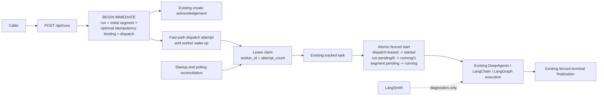

# Durable Run Dispatch Reconciliation v1 Design

## Status

Approved for implementation planning.

## Summary

Decision Research Agent already durably reconciles a caller that loses the
response to `POST /api/runs`: an optional `Idempotency-Key` binds one canonical
request to one persisted run identity. The remaining gap is server-side. The
application commits a new `pending` run before it creates the in-memory task,
so handler cancellation or process death in that interval can leave a durable
run that never enters DeepAgents execution.

This design adds an application-owned transactional dispatch intent and a
single-node SQLite reconciliation worker. New run creation persists the run,
initial segment, optional idempotency binding, and one dispatch row in the same
transaction. A worker claims dispatches with a bounded lease, schedules the
existing tracked execution task, and requires that task to perform an atomic,
fenced `pending -> running` start before any model or tool call. Expired leases
can be reclaimed; stale or duplicate tasks cannot enter DeepAgents.

The change proves crash-before-schedule recovery within the existing
single-node SQLite boundary. It does not claim exactly-once execution, resume
an arbitrary running model or tool call, or add a broker, multi-instance high
availability, new public endpoint, provider, or dependency. Version changes,
tagging, publication, and release creation remain separate actions.

## Inspected Baseline

- `main` and `origin/main` were both at
  `d590fb1b93e6e753814f7ef20ed0e4c69068a84e`, the annotated `v0.1.2` release
  commit, when this design was finalized.
- No open pull request was present at inspection time.
- PR #85 added optional `POST /api/runs` idempotency and lost-response identity
  reconciliation. It intentionally records
  `crash_before_schedule_recovery: not_proven` and
  `exactly_once_execution: not_claimed`.
- `create_run` and `create_or_replay_run` persist the run and initial segment;
  the keyed path also persists its idempotency binding in the same
  `BEGIN IMMEDIATE` transaction.
- After that transaction returns, the FastAPI route constructs
  `_run_v2_with_persistence` and passes it to `create_tracked_task`.
- `_run_v2_with_persistence` currently performs the first
  `pending/state_version=0 -> running/state_version=1` transition before
  invoking the DeepAgents harness.
- `ReviewWorker` already demonstrates a bounded single-node SQLite
  lease/reclaim loop, stable internal error codes, three-attempt exhaustion,
  startup reconciliation, and an `asyncio.Event`-compatible lifecycle pattern.
  Dispatch remains a separate workflow and authority.
- The pinned framework metadata is `deepagents==0.6.11`,
  `langchain==1.3.10`, `langgraph==1.2.6`,
  `langgraph-checkpoint-sqlite==3.1.0`, and `pydantic==2.13.4`.
- The generic harness already uses the DeepAgents middleware stack plus
  server-owned `ModelCallLimitMiddleware` and `ToolCallLimitMiddleware`; the
  Talent path also uses a narrow structured-output recovery middleware.

## Problem

The durable create transaction and the in-memory scheduler are two separate
systems. A process can fail after the application database accepts a run but
before `asyncio.create_task` makes the execution live. Replaying a keyed
request returns the original identity but deliberately does not schedule a
second task, so the accepted run can remain `pending` indefinitely. An unkeyed
caller has the same server-side failure window even though it cannot replay by
key.

LangGraph checkpointing begins only after graph invocation. LangChain and
DeepAgents middleware run inside Agent execution. Neither can atomically join
the application transaction that creates the ResearchRun to pre-invocation
task scheduling. Closing the gap therefore requires an application-owned
dispatch intent and reconciliation boundary.

## Goals

1. Persist exactly one dispatch intent atomically with every newly accepted
   keyed or unkeyed ResearchRun.
2. Recover a committed but never-scheduled run after handler cancellation,
   process death, or service restart.
3. Use bounded single-node SQLite leases so concurrent workers or stale tasks
   cannot start the same run from the same pending state.
4. Fence execution before any DeepAgents model or tool call using application
   run state, dispatch claim identity, and attempt number.
5. Preserve keyed replay, unkeyed independent-create, ResearchRun, Evidence,
   review, verification, canonical result, and Tool Client contracts.
6. Fail terminally with bounded, non-sensitive internal codes after a fixed
   number of dispatch scheduling attempts.
7. Add deterministic production-path proof for the recovered crash window,
   lease reclaim, duplicate suppression, failure exhaustion, migration, and
   compatibility boundaries.
8. Reuse existing framework and project primitives where their semantics fit,
   without transferring application business authority.

## Non-Goals

- No exactly-once execution claim.
- No recovery or replay of an arbitrary run after it has atomically entered
  `running`.
- No replay safety claim for provider calls, external APIs, or tool side
  effects.
- No replacement of `create_tracked_task`, the existing execution harness,
  timeout handling, fenced terminal finalization, review worker, or result
  resolver beyond the minimum integration required by the new start fence.
- No Celery, Redis, RabbitMQ, Kafka, hosted queue, external scheduler, or new
  dependency.
- No multi-process or multi-instance high availability, leader election,
  distributed lock, tenant isolation, RBAC, anonymous/public execution, or
  production SLA.
- No new REST endpoint, request field, response field, Tool Client command,
  frontend requirement, profile field, Evidence schema, review schema,
  publication schema, or generic structured research outcome.
- No generic failure taxonomy redesign, persisted provider usage, cost ledger,
  or LangSmith business gate.
- No new runtime Skill, Async Subagent, model fallback, model retry, tool
  retry, PII, HITL, tool-selector, or context-editing middleware in this PR.
- No backfill or automatic execution of pre-migration pending runs.
- No consumer-specific field, fixture, adapter, or product claim.
- No version bump, tag, release, deployment, or provider-backed proof.

## Considered Approaches

### A. Retry scheduling from the FastAPI route only

This narrows a transient failure but does not survive handler cancellation or
process death. Rejected because it does not close the durable gap.

### B. Application-owned transactional dispatch ledger and worker

Selected. It atomically records the obligation to start a run, reuses the
existing SQLite, lifecycle, task tracker, and fenced state transitions, and is
small enough to prove deterministically within the current deployment
boundary.

### C. LangGraph Functional API or checkpointer as dispatch authority

Rejected. Checkpointing starts after invocation and cannot atomically join the
application run-create transaction. Replaying unfinished Agent work can repeat
external side effects, which this project has not declared idempotent. The
application database continues to own run identity and start state.

### D. LangChain or DeepAgents middleware

Rejected for this gap. Middleware is appropriate inside model/tool execution,
not for a committed application run that has not yet entered the framework.
The project already reuses framework-native planning, filesystem, subagent,
summarization, call-budget, prompt-caching, and structured-output middleware.
Adding another Agent middleware would not make pre-invocation dispatch atomic.

### E. External broker and worker fleet

Rejected for v1. A broker could support a broader deployment model but would
add infrastructure, delivery semantics, credentials, operations, and failure
modes that current consumer and benchmark evidence do not require.

## Architecture



The route no longer owns the only opportunity to construct the research
coroutine. It creates durable intent, asks the dispatch service for a bounded
fast-path attempt, signals the worker, and returns the existing acknowledgement.
The worker remains responsible for reconciliation even when the fast path
cannot schedule immediately.

## Authority Boundaries

- The application database owns ResearchRun state, initial segment state,
  dispatch intent, lease, claim attempt, and terminal dispatch failure.
- FastAPI owns request validation, create acknowledgement, lifespan startup,
  and worker shutdown.
- `RunDispatchWorker` owns claim/reclaim and scheduling orchestration. It does
  not own Evidence, review, verification, publication, or result semantics.
- `create_tracked_task` continues to own in-process task tracking and timeout.
- DeepAgents and LangChain begin only after the application start fence wins.
- LangGraph owns Agent execution and the existing controlled review checkpoint
  position, not dispatch identity.
- LangSmith remains privacy-first diagnostics and never changes reconciliation
  or readiness.
- The deterministic proof is authoritative only for its fixed local cases.

## Framework Reuse Decision

The implementation must retain and verify the current pinned framework stack.
It reuses DeepAgents for the research harness, LangChain for agents, tools,
structured output and existing middleware, LangGraph for already-started graph
execution, Pydantic for strict immutable dispatch contracts, FastAPI lifespan
for worker lifecycle, and SQLite `BEGIN IMMEDIATE` for the application claim.

No new Agent middleware is added because the failure precedes Agent execution.
`HumanInTheLoopMiddleware` is not substituted for the existing application-
owned durable review. `ModelRetryMiddleware` and `ToolRetryMiddleware` remain
future candidates only after observed transient failures, explicit retryable
exception classification, tool-side-effect classification, bounded cost, and
deterministic failure proof. `PIIMiddleware` remains conditional on a real
consumer handling sensitive data. Model fallback, tool selection, context
editing, and runtime grading remain deferred until evidence shows a gap.

This decision must be summarized in the eventual architecture documentation;
it does not require a dependency change.

## Persistence Contract

Add migration `008_run_dispatch_reconciliation` with checksum
`run-dispatch-reconciliation-v1` and the table `run_dispatches_v1`:

| Column | Contract |
|---|---|
| `run_id` | `TEXT PRIMARY KEY REFERENCES research_runs_v2(run_id) ON DELETE CASCADE` |
| `status` | `TEXT NOT NULL`, exactly `pending`, `leased`, `started`, or `failed` |
| `lease_owner` | nullable bounded worker identifier; present only while leased |
| `lease_expires_at` | nullable UTC timestamp; present only while leased |
| `attempt_count` | `INTEGER NOT NULL DEFAULT 0`, non-negative and incremented on every successful claim |
| `last_error_code` | nullable stable internal code; never raw exception text |
| `created_at` | `TEXT NOT NULL` UTC timestamp |
| `updated_at` | `TEXT NOT NULL` UTC timestamp |
| `started_at` | nullable UTC timestamp; present only after a successful fenced start |

Add one exact non-partial index over
`(status, lease_expires_at, created_at)`. Migration verification must inspect
the migration marker and checksum, exact columns, primary key, foreign key and
cascade action, index columns/order/uniqueness/partial flag, status and
non-negative attempt constraints, and state-dependent nullability rules.

The row states are:

- `pending`: no lease fields, no `started_at`; `last_error_code` may retain the
  preceding bounded scheduling error.
- `leased`: both lease fields set, no `started_at`.
- `started`: lease fields cleared and `started_at` set.
- `failed`: lease fields cleared, no `started_at`, and `last_error_code` set.

`run_dispatches_v1` deliberately does not duplicate `segment_id`, query,
profile, scope, idempotency key, or request hash. Claim reads join the run and
the unique initial segment (`sequence=0`, `kind='initial'`). Corrupt or missing
joined state fails closed.

Migration creates no dispatch rows for existing runs. This avoids scheduling
unknown historical `pending` records and incurring unapproved provider work.
Only runs created after migration `008` receive the new guarantee.
Replaying a pre-`008` idempotency binding keeps its existing identity response
and is neither backfilled nor scheduled by this feature.

## Atomic Run Creation

Refactor the transaction-local run insert path so every newly accepted keyed
or unkeyed run inserts its dispatch row in the same transaction as the run and
initial segment. The optional idempotency binding remains in that transaction.

Keyed replay does not insert another dispatch row. It may signal the worker or
attempt a fast-path claim for the existing run only when the run remains
`pending` and its dispatch is `pending` or reclaimable. A replay cannot revive
a `started`, terminal, or dispatch-`failed` run and cannot bypass the lease
fence.

If dispatch schema integrity is unavailable, creation fails closed before
committing a run. It must not create a run without a dispatch row and must not
fall back to the pre-v1 scheduling path.

## Dispatch Claim Contract

Claiming uses an independent SQLite connection and `BEGIN IMMEDIATE`.
Eligible rows are ordered by `created_at`, then `run_id`, and are either:

- `pending`; or
- `leased` with `lease_expires_at <= now`.

One successful claim atomically sets `status='leased'`, a bounded
`lease_owner`, a new `lease_expires_at`, increments `attempt_count`, updates
`updated_at`, and returns a strict immutable `RunDispatchClaim`. The claim
contains the joined run, initial segment, worker, and attempt identity needed
to construct the existing execution input. Public APIs never expose lease
fields or the claim model.

Claim validity is the tuple `(run_id, lease_owner, attempt_count)`. Checking
only `lease_owner` is insufficient because the same worker identity can
reclaim a later attempt. All start, release, retry, and failure writes must
include the attempt fence.

## Worker And Lifecycle

Add a dedicated `RunDispatchWorker`, modeled on the operational shape of
`ReviewWorker` but with separate repositories, contracts, errors, and tests.
It is a core runtime component rather than a review or evidence-verification
feature and is not controlled by those feature flags.

FastAPI lifespan must:

1. resolve the canonical application database path;
2. initialize and verify the core schema including migration `008`;
3. construct the dispatch worker;
4. start its `run_forever` task and yield once so immediate startup failure is
   observed;
5. expose only private app-state handles needed by route/tests; and
6. signal stop and await clean worker termination during shutdown.

The worker performs startup reconciliation before normal polling, scans at a
bounded interval, and also accepts an `asyncio.Event` wake-up after new create
or keyed replay. Polling remains the durable fallback; event delivery is only
an optimization.

The route may request a bounded fast-path dispatch attempt for the newly
created run. Both fast path and background loop call the same claim/schedule
operation. The route must not construct `_run_v2_with_persistence` directly or
create a second scheduling authority.

## Atomic Fenced Start

The scheduled coroutine's first externally meaningful action is one
application transaction that verifies the exact claim and atomically:

1. changes dispatch `leased -> started`, clears lease fields, and sets
   `started_at`;
2. changes ResearchRun `pending/state_version=0 -> running/state_version=1`;
3. changes the unique initial segment `pending -> running`; and
4. verifies the run, segment, dispatch, profile inputs, and claim still agree.

Only a successful transaction may call `run_deep_agent`. A stale lease,
reclaimed attempt, duplicate task, terminal run, malformed initial segment, or
state-version mismatch exits before model/tool execution. It must not perform
best-effort Agent execution or overwrite newer state.

Refactor the existing execution wrapper only enough to separate this fenced
start from the already-proven running-state execution and terminal
finalization. After start succeeds, existing timeout, cancellation, Evidence
preservation, artifact creation, review workflow, and fenced finalization
semantics remain authoritative.

## Retry And Terminal Dispatch Failure

Claim acquisition increments `attempt_count`. A failure to construct or
submit the in-memory tracked task, or a retryable failure before fenced start,
is converted to a bounded internal code. Raw exceptions, paths, credentials,
provider messages, query text, and stack traces are not persisted.

If the exact claim still owns the lease and `attempt_count < 3`, release it to
`pending`, clear the lease, retain the stable `last_error_code`, and wake the
worker. If `attempt_count >= 3`, one transaction atomically:

- marks dispatch `failed` and clears its lease;
- marks the still-pending run `failed` with `state_version=1`;
- marks the initial segment `failed`;
- keeps delivery `failed` and review `not_required`; and
- stores only the bounded dispatch error code.

The public result path continues to use its existing `run_failed` behavior;
this PR does not add a general public failure taxonomy. A lost/stale claim is
a no-op for the stale task and must not count against or fail the current
attempt.

Once the fenced start commits `started/running`, dispatch reconciliation is
complete. A later process death can leave a running run and is outside v1.

## API And Compatibility Contract

`POST /api/runs` keeps HTTP `200` and the existing response shapes. The
compatibility field `status='started'` remains a create acknowledgement, not a
statement that the model has begun. Callers continue to inspect
`GET /api/runs/{run_id}` and `GET /api/runs/{run_id}/result` for current state.

After the create transaction commits, immediate scheduler failure no longer
causes the route to finalize the run and re-raise an ambiguous server error.
The durable intent is accepted, the worker retries asynchronously, and the
route returns the canonical run identity. If the fixed retry budget is later
exhausted, polling observes the existing failed-run contract.

Before commit, validation, idempotency conflict, migration integrity, or
persistence failure retains the existing fail-closed response behavior. The
raw `Idempotency-Key` remains absent from server persistence, logs, traces,
errors, and proof artifacts.

Unkeyed requests still create independent runs, including identical requests
on the same thread. Keyed same-request replay still returns the original
identity with `idempotent_replay=true`. Same-key different-request conflict
remains `409`; invalid and unavailable idempotency states retain their current
codes. The Tool Client does not need a new argument or retry policy.

## Deterministic Proof And Tests

Add a production-path proof script with deterministic JSON and Markdown
artifacts. The script must have bounded reads, stable CLI errors, exact schema
validation, byte-stable serialization, import silence, and no network,
credentials, provider, wall-clock, random identifier, or private-path output.

The fixed matrix must prove:

1. run, initial segment, optional idempotency binding, and dispatch are atomic;
2. commit-before-schedule interruption leaves durable intent and is recovered;
3. handler cancellation after commit is recoverable;
4. service/worker restart recovers a never-started dispatch;
5. an expired lease is reclaimed with a higher attempt number;
6. concurrent workers produce one winning fenced start;
7. a stale task cannot enter a fake DeepAgents boundary after reclaim;
8. scheduler failure retries and the third failed claim terminates the still-
   pending run consistently;
9. keyed replay produces one run and one effective Agent entry;
10. unkeyed independent-create behavior remains intact;
11. run status, result, Evidence, review, verification, and downstream
    consumer compatibility remain unchanged;
12. migration `008` verifies exact constraints/indexes, upgrades safely, is
    idempotent, restores on injected failure where the migration tooling owns
    backup/restore, and does not backfill old pending runs; and
13. two generated reports and committed JSON/Markdown baselines are byte-
    identical.

The fake Agent boundary used in required tests must increment only after the
production start fence. A test that merely mocks the worker without exercising
the repository claim/start path is insufficient.

The report must declare exact boundaries equivalent to:

```json
{
  "commit_before_execution_start_recovery": "proven",
  "crash_before_schedule_recovery": "proven",
  "single_node_sqlite_dispatch_reconciliation": "proven",
  "exactly_once_execution": "not_claimed",
  "running_execution_recovery": "not_proven",
  "provider_tool_side_effect_exactly_once": "not_claimed",
  "multi_instance_high_availability": "not_proven",
  "live_provider_result": "not_observed"
}
```

Required verification includes focused unit/integration/docs tests, the new
proof check twice plus byte comparison, the existing run-creation idempotency
proof, Agent evaluation gate, downstream consumer contract check, canonical
identity and final-presentation audits, dependency/runtime-authority/private-
marker scans, full available backend suite, and `git diff --check`. If the
environment lacks declared dependencies, the report states the exact blocker
and does not claim the full suite passed.

## Documentation Impact

Implementation must update, where behavior actually changes:

- architecture and framework/runtime boundary decision;
- API contract wording for create acknowledgement and asynchronous dispatch
  failure;
- data-model and state-machine references;
- Agent integration/operator guidance;
- migration/backup/rollback guidance;
- evidence and documentation indexes;
- README/README_CN/CHANGELOG public summaries; and
- current documentation that describes the v0.1.2 idempotency boundary so it
  links to the new additive proof without rewriting the historical v0.1.2
  artifact.

Historical release notes and committed proof outputs remain immutable unless a
contract test identifies a factual link/index correction. The feature PR does
not change `VERSION` or claim a future release.

## Security, Cost, Migration, And Rollback

- The worker accepts no caller-supplied worker ID, lease value, database path,
  provider URL, credential, filesystem path, or retry count.
- Stable internal codes replace raw exceptions in persistence and public
  artifacts.
- The feature adds no provider call on keyed replay and no framework or hosted
  service dependency. Recovered runs may incur the provider work that their
  already-accepted request intended; this is not a cost estimate or invoice.
- Dispatch storage is one bounded row per post-migration run and cascades with
  run deletion.
- SQLite writer serialization and polling are acceptable only for the current
  single-node boundary. No throughput or latency claim is added without a
  benchmark.
- Upgrade guidance backs up the application database before applying migration
  `008` through the supported migration path and verifies schema afterward.
- Rollback stops the new worker and restores the pre-migration database backup
  before running old code. Old code must not be pointed at a partially rolled-
  back database. There is no downgrade migration that silently deletes
  dispatch history.

## Delivery Shape

This is one independent feature PR containing migration, repository contracts,
worker/lifespan integration, start-fence refactor, deterministic proof, CI,
tests, ADR/reference updates, and public documentation. It must not include
dependency maintenance, consumer integration, middleware expansion,
generic structured outcomes, usage persistence, or release preparation.

After merge and verification, release preparation for a possible `v0.1.3` is
a separate decision. Consumer closed-loop work remains a separate phase when
its integration is ready.

## Acceptance Criteria

The design is complete when implementation evidence shows all of the
following:

- every new run has one atomic dispatch row;
- restart recovers a committed, never-started run;
- concurrent/stale tasks cannot cross the Agent boundary twice from pending;
- three scheduling failures converge to consistent failed run/segment/dispatch
  state;
- current API, Tool Client, result, Evidence, review, verification, and
  downstream contracts remain compatible;
- proof artifacts are deterministic and honest about all non-claims;
- no dependency or framework authority expansion occurred;
- documentation and migration/rollback instructions match the actual diff;
  and
- the feature branch is clean, locally committed, and ready for authoritative
  branch-diff review without any remote or release action.
