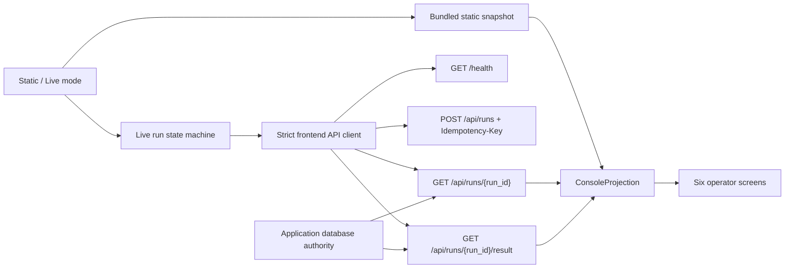

# Agent Research Operations Console Live Authority Closure v1 Design

## Status

Approved for implementation planning.

## Summary

Decision Research Agent already ships an Agent Research Operations Console with
two modes. Static Demo renders a deterministic bundled snapshot. Live Backend
checks a loopback service, creates one generic ResearchRun, polls its public
status, and retrieves the canonical result. The transport path is real, but the
six operator screens still render most run-specific lifecycle, Evidence,
review, verification, and artifact facts from the static snapshot even after
Live Backend is selected. The browser create path also omits the service's
existing `Idempotency-Key` contract, so an ambiguous lost response cannot be
reconciled safely from the current page session.

This design closes those two first-party consumer gaps without changing the
backend. It introduces a strict frontend projection boundary, makes Static and
Live data mutually exclusive, adds browser-session run-create reconciliation,
and supports resuming observation after a known `run_id` without creating a
second run. The Console remains a loopback-only, unauthenticated consumer. It
does not gain review, verification, publication, cancellation, or delivery
authority.

The change is one independent frontend capability and one pull request. It can
be implemented in parallel with Durable Run Failure Cause v1 because it does
not modify the application database, migrations, dispatch, task tracker,
server, result service, or CI. Final landing is serialized: the Console branch
must rebase onto the main branch containing the failure-cause status addition
before shared discovery documentation and final verification are completed.

## Inspected Baseline

- `main` and `origin/main` were both at
  `87b2a8e335385eb865086f7a69fe2b190567cfa2`, the annotated `v0.1.3` release
  commit, when this design was finalized.
- The existing Durable Run Failure Cause v1 integration branch had advanced to
  implementation and explicitly declared no frontend requirement.
- `frontend/src/apiClient.ts` already validates a loopback-only base URL and
  exposes `health`, create, status, and canonical result calls.
- `frontend/src/useLiveRun.ts` already aborts stale requests, applies a bounded
  browser deadline, polls terminal execution states, and preserves a known
  `run_id` in bounded errors.
- `frontend/src/App.tsx` always renders `demoRun` inside Command Center,
  Lifecycle, Evidence, Review / Verification, and Canonical Result. Only the
  separate Live Demo panel and top summary partially use live state.
- `startRun` creates a new timestamp-derived `thread_id` inside the request and
  does not send `Idempotency-Key`.
- The public run-create contract accepts an optional high-entropy key, returns
  `idempotent_replay`, and safely returns the original run identity for the
  same key and canonical request.
- `GET /api/runs/{run_id}` already returns the application-owned run,
  segments, Evidence, review projection, publication projection, verification
  summary, artifacts, and state version.
- `GET /api/runs/{run_id}/result` remains the only canonical artifact selector.
- Live Backend is intentionally limited to unauthenticated
  `http://127.0.0.1:<port>` endpoints and does not accept or persist API keys.

## Problem

The current mode switch changes how a run is started but does not change the
source of truth for the operator screens. A user can select Live Backend,
observe one real `run_id` in the summary, then open Evidence or Review and see
IDs and accepted states that belong only to the bundled static snapshot. This
is a presentation integrity problem: individually correct demo facts become
misleading when displayed as though they describe the active live run.

Run creation has a separate reliability gap. If the backend commits a keyed
create but the response is lost, replaying the same request is safe. The
Console currently sends no key and generates request identity inside
`startRun`, so the browser cannot preserve the exact request across an
ambiguous transport failure. Retrying the current action may create another
run.

The correct fix is not a frontend-specific backend aggregate or a second
authority model. The status and result contracts already expose the facts the
Console needs. The missing layer is a strict consumer projection and a
bounded in-memory retry intent.

## Goals

1. Make Static Demo and Live Backend run data mutually exclusive.
2. Render every run-specific Live screen only from current public API
   observations or an explicit absence state.
3. Preserve the deterministic static snapshot and keep it the default mode.
4. Generate one high-entropy create intent per user action and send its key only
   in the `Idempotency-Key` header.
5. Reuse the exact key and request after an ambiguous create response so the
   backend can return the original run identity.
6. Once `run_id` is known, resume observation through GET requests without
   issuing another create.
7. Use only the canonical result endpoint to render the deliverable artifact.
8. Treat terminal non-ready states as observed run outcomes rather than generic
   network failures.
9. Consume the additive failure-cause projection when available while
   remaining compatible with an older status response that omits it.
10. Reject malformed rendered fields and prevent stale requests from replacing
    a newer mode, endpoint, intent, or run.
11. Preserve the loopback, credential-free, no-business-authority boundary.
12. Add deterministic frontend tests for reconciliation, projection truth, all
    terminal dispositions, and static/live isolation.

## Non-Goals

- No backend route, response alias, schema, database, migration, dispatch,
  task-tracker, result-service, or authentication change.
- No review, verification, publication, cancellation, retry-run, or delivery
  write action.
- No chat input, arbitrary research query form, file upload, credential input,
  browser credential storage, login, RBAC, public deployment, or multi-tenant
  mode.
- No WebSocket, SSE, replayable event ledger, telemetry dashboard, token usage,
  cost display, or trace viewer.
- No provider-backed browser test and no claim that the Console proves live
  research quality.
- No parsing of result Markdown to manufacture typed findings, Evidence,
  review, or verification facts.
- No selection of a deliverable from the ordinary artifact list.
- No LangChain, DeepAgents, LangGraph, LangSmith, model, tool, prompt, Skill,
  Middleware, or provider change.
- No new npm or Python dependency.
- No version bump, tag, release, deployment, or public hosted Console.

## Considered Approaches

### A. Add a strict frontend consumer projection

Selected. Existing public endpoints already expose the required service-owned
facts. A pure projection layer can distinguish observed, absent, unsupported,
and static data without changing backend authority. Browser-native fetch,
AbortController, and Web Crypto are sufficient.

### B. Add a frontend-specific aggregate endpoint

Rejected. An `/api/console` projection would duplicate public status and result
contracts, create another compatibility surface, and encourage frontend needs
to shape backend authority. It is unnecessary for one loopback consumer.

### C. Expand the Console into a writable operator application

Rejected. Review, verification, cancellation, authentication, and multi-user
operation require independent authority and security designs. Adding them to a
truthful read-only consumer closure would make the pull request unreviewable
and collide with current runtime work.

## Architecture



The frontend API client owns transport, exact rendered-field validation,
loopback endpoint validation, and bounded public errors. The live state machine
owns create-intent lifetime, request cancellation, reconciliation choice,
polling, resumption, and terminal disposition. Pure projection functions own
the distinction between static values, observed live values, and explicit
absence. React components render the projection and never choose their own
fallback authority.

## Authority Boundaries

- The application database remains authoritative for ResearchRun, segment,
  Evidence, review, verification, publication, and delivery state.
- `GET /api/runs/{run_id}` is the Console's only run-state projection.
- `GET /api/runs/{run_id}/result` is the only canonical artifact source.
- The browser owns one temporary create intent and the user's decision to retry
  an ambiguous request. It does not own the server key binding or run identity.
- Static Demo owns only its labelled deterministic snapshot.
- The Console never converts an absent live fact into a static value.
- LangGraph checkpoint and LangSmith diagnostics remain outside the Console's
  business projection.

## Platform Reuse Decision

- Use browser `crypto.randomUUID()` to create high-entropy intent identities.
- Use the existing Fetch and AbortController path for transport and stale
  request cancellation.
- Use React state for public UI state and a private ref for the unrendered
  in-memory create intent.
- Use pure TypeScript discriminated unions and validators for consumer
  projections.
- Keep Vitest, Testing Library, Vite, ESLint, and the existing frontend build.

No Agent framework capability belongs in this browser consumer. Adding
LangChain, LangGraph, DeepAgents, or LangSmith to the Console would introduce
semantic and dependency mismatch without satisfying a missing contract.

## Static And Live Projection Contract

Introduce one presentation-level discriminated union:

```ts
type Observation<T> =
  | { kind: "observed"; value: T }
  | { kind: "not_observed" }
  | { kind: "not_applicable" }
  | { kind: "unsupported" };
```

The exact user-facing translation may vary by language, but the four states
must not collapse into one another.

### Static projection

- Built only from `demoRun`.
- Carries an explicit `source: "static"` discriminator.
- Retains every existing deterministic screen and identifier.
- Sends no network request.

### Live projection

- Built only from current health, create acknowledgement, status projection,
  and canonical result observations.
- Carries an explicit `source: "live"` discriminator.
- Before the backend returns a field, the screen uses an absence state rather
  than `demoRun`.
- Unknown upstream fields are ignored. A field selected for rendering must
  match its expected type; a malformed selected field produces
  `invalid_response` rather than a partial invented value.
- Changing mode or base URL clears the complete live projection.

Static and Live run IDs, Evidence IDs, review decisions, verification states,
artifact identities, lifecycle entries, and result content must never coexist
inside one rendered run projection.

## Browser Run-Create Intent

Create one exact value before the first POST:

```ts
type RunCreateIntent = {
  idempotencyKey: string;
  payload: {
    query: string;
    thread_id: string;
    profile_id: "generic";
    scope: Record<string, never>;
  };
};
```

- `thread_id` uses `demo-console-<uuid>`.
- `idempotencyKey` uses `run-create-console-<uuid>` and satisfies the existing
  8–128 character public contract.
- The intent is generated once per new-run action, before transport begins.
- `startRun` receives the complete intent; it must not generate or mutate any
  request field.
- The raw key is sent only as the `Idempotency-Key` header.
- The raw key is never rendered, serialized to an error, placed in URL/body,
  logged, or stored in localStorage/sessionStorage.
- The intent lives only in memory. A page refresh is an explicit loss of
  reconciliation capability and is documented as such.

Because every Console create is keyed, a successful response must include a
boolean `idempotent_replay`. Missing or non-boolean replay metadata is an
invalid keyed-create response.

## Create And Observation State Machine

```text
static
  -> live idle
  -> checking
  -> ready
  -> creating new intent
       -> acknowledgement -> polling
       -> ambiguous transport failure -> reconciliation_required
            -> retry same intent -> acknowledgement -> polling
            -> discard -> ready
       -> stable HTTP/contract failure -> error

polling
  -> nonterminal status -> polling
  -> ready terminal -> fetch canonical result -> result
  -> non-ready terminal -> terminal
  -> transport/client deadline -> observation_interrupted
       -> resume by run_id with GET only

mode/base URL change
  -> abort active request + invalidate generation + clear intent/run/projection
```

An ambiguous create failure is a fetch-level connection failure or create
request abort before a valid acknowledgement is observed. The UI offers an
explicit same-request retry. It does not automatically loop and does not
silently generate a replacement intent.

Stable `409 run_idempotency_conflict`, `422 run_idempotency_key_invalid`, and
other structured HTTP responses are not ambiguous. They retain their bounded
server code. A conflict or invalid key requires discarding the intent before a
new run can be started.

Once a valid acknowledgement exposes `run_id`, the create intent may be
discarded. All recovery uses GET with that run identity. A polling or result
transport failure must never invoke `POST /api/runs` again.

## Live Run Projection

The client selects and validates only fields required by the screens:

- Run: `run_id`, `thread_id`, `profile_id`, `execution_status`,
  `review_status`, `delivery_status`, `state_version`.
- Segments: `segment_id`, `kind`, `sequence`, `attempt`, `status`.
- Evidence: `evidence_id`, `source_url`, `source_identity`,
  `evidence_fingerprint`, `citation_status`, `verification_status`.
- Review: public `review_status` plus bounded presence/projection of
  `review_workflow`, `review_decision`, and `review_resolution`.
- Verification: `verification_summary.state_counts`, `origin_counts`, and
  `snapshot_hash` when present.
- Publication/artifact metadata: public current publication and artifact
  identity only; it does not establish canonical delivery.
- Failure cause: optional additive projection described below.

The client does not render query text, Evidence snippet, actor fingerprint,
review reason, raw telemetry error, lease data, database path, checkpoint
payload, trace content, or arbitrary unknown fields.

## Failure Cause Compatibility

The status client accepts four distinct conditions:

1. Property absent: `unsupported`; the backend predates the additive contract.
2. Property present as `null`: `not_applicable`; the run has no failure cause.
3. `observation_status="not_observed"`: historical failure without an inferred
   diagnosis.
4. `observation_status="observed"`: render only bounded schema version, phase,
   code, and recorded time.

Any other selected failure-cause shape is `invalid_response`. The Console does
not infer a code from execution status, HTTP errors, logs, or result content.

## Screen Behavior

### Command Center

Static mode retains the deterministic snapshot. Live mode displays the actual
service identity, create acknowledgement, `run_id`, profile, current execution,
review, delivery, replay, and state-version observations. Before a run exists,
it displays explicit absence rather than a demo run.

### Run Lifecycle

Live mode displays current persisted run and segment states. It does not call
the current projection a complete event history. Telemetry remains outside this
slice; the page labels its data as state projection rather than a trace.

### Evidence Ledger

Live mode displays only the selected public Evidence metadata returned for the
current run. An empty list is an observed empty ledger. A missing or malformed
selected Evidence field fails the live projection; it never substitutes static
Evidence.

### Review / Verification

Live mode displays the run's public review status and bounded review/
verification observations. A generic run normally reports review not required
and no verification snapshot; those are legitimate live states, not reasons to
show the static approved decision.

### Canonical Result

The page renders content and metadata only from a successful canonical result
response. Ordinary status artifact metadata may be shown separately as
observed state but cannot be promoted to the deliverable.

### Architecture Explain Mode

This screen remains a mode-independent reference explanation and is labelled
accordingly. It does not claim that every optional runtime is active for the
current run.

## Terminal And Result Semantics

- Continue polling while execution is nonterminal.
- If `delivery_status="ready"`, request the canonical result.
- If execution is terminal but delivery is not ready, stop polling and render
  the observed terminal/delivery state without an automatic result request.
- `completed_with_fallback` is a completed execution disposition; its result is
  still canonical only when delivery is ready.
- Failed, cancelled, timeout, review-required, and blocked outcomes are live
  terminal observations, not connection failures.
- A canonical result transport failure preserves `run_id` and permits a GET-only
  resume.
- The browser deadline stops observation only. It does not cancel or mutate the
  server run.

## Error And Security Boundary

- Preserve structured server error codes and bounded problem/fix guidance.
- Never render raw exception objects, stack traces, paths, credentials, raw
  response bodies, or the idempotency key.
- Continue accepting only `http://127.0.0.1:<port>` with no credentials, path,
  query, or fragment.
- Continue requiring the exact health identity
  `{"status":"ok","service":"decision-research-agent"}`.
- Authenticated, LAN, HTTPS, hosted, and public browser deployments remain out
  of scope.
- Stale completions are fenced by the existing request generation and abort
  mechanism. New reconciliation/resume paths must use the same fence.

## Parallel Implementation And Landing Boundary

Implementation may proceed in a fresh Console worktree while Durable Run
Failure Cause v1 is active, with this temporary ownership:

- Console lane owns `frontend/src/**`, frontend tests, `DESIGN.md`,
  `docs/demo-console.md`, and a dedicated Console documentation contract test.
- Console lane does not modify `api/**`, migrations, backend integration tests,
  failure-cause proof/evidence, `.github/workflows/ci.yml`, `README.md`,
  `README_CN.md`, `CHANGELOG.md`, shared docs indexes, or the existing shared
  documentation-contract file during parallel implementation.
- Failure-cause lanes do not modify frontend files.

The Console implementation can reach a clean local frontend commit and near-
field verification in parallel. It must not be pushed or opened as a pull
request until Durable Run Failure Cause v1 lands. It then rebases onto current
`origin/main`, consumes the final additive status contract, adds the necessary
shared README/CHANGELOG/index discovery in one integration-owned commit, runs
the complete final matrix, and enters authoritative review.

If the failure-cause branch changes existing status fields rather than adding
only its approved optional field, or if it modifies frontend files, stop the
Console integration and return for design review.

## Testing Strategy

### API client tests

- Exact loopback URL and health identity remain enforced.
- A new create sends one high-entropy key only in the header and sends the
  complete immutable intent as body.
- Keyed success requires boolean `idempotent_replay`.
- An ambiguous first create preserves the intent; retry sends byte-equivalent
  body semantics and the same header key.
- Stable idempotency errors remain distinguishable from ambiguous transport
  failure.
- Malformed selected status, Evidence, review, verification, result, and
  failure-cause fields produce bounded `invalid_response`.

### State-machine tests

- New intent, reconciliation retry, discard, acknowledgement, polling,
  terminal, result, interrupted observation, and GET-only resume follow the
  approved transitions.
- No POST occurs after `run_id` is known.
- Client deadline preserves safe run identity and does not imply cancellation.
- Mode and base-URL changes clear all live state and invalidate late responses.

### Projection and component tests

- Static mode retains every existing deterministic screen.
- Live mode contains none of the static run, Evidence, review, verification,
  publication, artifact, or result identifiers.
- Each operator screen renders observed live values or the correct absence
  state.
- Live empty Evidence is distinguishable from unobserved Evidence.
- Ready, fallback, failed, cancelled, timeout, review-required, and blocked
  dispositions render truthfully.
- Failure-cause absent, null, not-observed, observed, and malformed cases are
  distinct.
- The canonical result screen never selects from ordinary artifacts.
- Chinese/English, accessibility roles, stale response handling, and Static
  reset remain green.

### Required verification

```bash
cd frontend
npm ci
npm run test
npm run lint
npm run build
npm audit --audit-level=moderate
cd ..

PYTHON_DOTENV_DISABLED=1 python -m pytest \
  tests/unit/test_frontend_retirement.py \
  tests/unit/test_demo_console_contracts.py -q

git diff --check origin/main..HEAD
```

After rebase and shared documentation integration, also run the current
documentation/release contracts and every required CI check affected by the
final diff. Backend full-suite verification is not a substitute for frontend
tests and is not required solely for unchanged backend code.

## Documentation

- Update `DESIGN.md` and `docs/demo-console.md` with the static/live truth
  boundary, browser-session reconciliation, GET-only resume, failure-cause
  compatibility, and nonclaims.
- Add a dedicated deterministic documentation-contract test during parallel
  work to avoid editing the failure-cause branch's shared test file.
- After rebase onto merged failure-cause main, add concise README, CHANGELOG,
  docs-index, and release-boundary discovery only where current repository
  conventions require it.
- Do not edit historical release notes or imply that the capability was part of
  `v0.1.3`.

## Compatibility, Rollback, And Migration

- There is no database, API, persisted-browser-state, or dependency migration.
- Existing backend callers and Static Demo behavior are unchanged.
- The status parser remains compatible with a backend that omits the additive
  `failure_cause` field.
- Rollback is a frontend/doc revert. Application data and backend state require
  no restoration.
- Versioning, tagging, and release preparation remain separate decisions.

## Acceptance Criteria

The feature is complete only when:

1. Live mode never renders run-specific static snapshot facts.
2. A lost create acknowledgement can be reconciled in the same page session
   with one preserved key/request and no duplicate run.
3. A known run can resume status/result observation without another POST.
4. Every screen distinguishes observed, absent, not-applicable, and unsupported
   data where those meanings differ.
5. Terminal non-ready outcomes remain visible as run outcomes.
6. Canonical artifact content comes only from the result endpoint.
7. Optional failure-cause semantics remain exact and fail closed when malformed.
8. The Console remains loopback-only, credential-free, read-only with respect
   to business authority, and free of raw private failure details.
9. Required frontend, documentation, diff, dependency, and public-safety checks
   pass on the rebased final branch.
10. The branch is clean and contains no backend, dependency, version, release,
    provider, or unrelated changes.

## Explicit Non-Claims

This work does not prove production deployment, public browser access, live
provider quality, external users, exactly-once execution, durable browser
intent recovery, running-execution recovery, multi-instance availability,
review authority, Evidence verification, or business impact. It proves only a
bounded first-party Console consumer that truthfully renders service-owned
state and safely reconciles one ambiguous keyed create within the current page
session.
