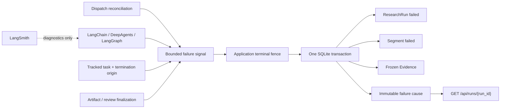

# Durable Run Failure Cause v1 Design

## Status

Approved for implementation planning.

## Summary

Decision Research Agent already persists the terminal status of a ResearchRun,
its initial segment, frozen Evidence, artifacts, and review state in an
application-owned fenced transaction. It also durably reconciles accepted runs
that have not yet crossed the Agent start fence. The remaining operator and
consumer gap is that a failed run loses its bounded terminal cause. Framework
adapters can distinguish call-budget exhaustion, recursion exhaustion,
cancellation, malformed structured output, and generic execution errors;
dispatch reconciliation retains a private final error code. None of those
signals is currently part of the durable run projection.

This design adds an immutable application-database failure-cause ledger and an
additive status projection. Every run that becomes failed after the migration
must atomically persist exactly one bounded cause with the winning terminal
state. Historical failed runs receive an explicit `not_observed` marker without
an inferred cause. Nonfailed runs expose `failure_cause: null`.

The design also closes the current timeout-versus-cancellation ordering bug.
The task tracker must record a monotonic termination origin before cancelling
the inner task, so a real application deadline is durably classified as
`run_timeout` rather than being incorrectly committed as `cancelled`.

The change is one additive capability and one pull request. It does not change
the canonical result endpoint, downstream fixture bytes, provider behavior,
usage or cost accounting, running-execution recovery, or framework business
authority. Version changes, tagging, publication, and release creation remain
separate actions.

## Inspected Baseline

- `main` and `origin/main` were both at
  `87b2a8e335385eb865086f7a69fe2b190567cfa2`, the annotated `v0.1.3` release
  commit, when this design was finalized.
- No open Decision Research Agent pull request was present at inspection time.
- Migration `008_run_dispatch_reconciliation` and `run_dispatches_v1` already
  own bounded pre-start retry, lease, exact-attempt start fencing, and terminal
  dispatch convergence.
- `ExecutionOutcome.failure_kind` is an immutable in-memory signal, not a
  persisted business fact.
- `ResearchExecutionService` already maps framework call-limit and recursion
  exceptions to stable application strings and freezes partial Evidence on
  cancellation or generic exceptions.
- `_run_started_v2_with_persistence` uses `failure_kind` to choose failed versus
  completed, but `finalize_run_transaction` does not persist the reason.
- Dispatch terminalization atomically fails dispatch, run, and initial segment
  while retaining only private `last_error_code`.
- `GET /api/runs/{run_id}` is the bounded status projection. The result endpoint
  deliberately returns only the existing canonical result or stable
  `run_failed` error.
- `dra.downstream-consumer.v1` explicitly treats persistent failure cause as
  outside its projection and ignores additive upstream status fields.
- The pinned framework metadata is `deepagents==0.6.11`,
  `langchain==1.3.10`, `langgraph==1.2.6`,
  `langgraph-checkpoint-sqlite==3.1.0`, and `pydantic==2.13.4`.

## Problem

A caller or operator can observe that a run failed, but cannot determine from
durable application state whether the terminal winner was dispatch exhaustion,
Agent call-budget exhaustion, recursion exhaustion, invalid structured output,
application timeout, explicit cancellation, an unknown execution exception,
or post-execution finalization failure.

Logs and LangSmith traces are insufficient authority. They can be absent,
redacted, sampled, unavailable after restart, or disagree with the fenced
application transaction. Likewise, `run_dispatches_v1.last_error_code` is a
private attempt ledger: attempts one and two may retain transient codes even
when a later attempt starts successfully. Only the error that atomically wins
the terminal run transition is a canonical cause.

The current timeout path contains a more serious correctness bug for this
feature. Python `asyncio.wait_for()` cancels and waits for the inner task before
raising timeout. The inner execution service therefore first publishes
`failure_kind="cancelled"`, and the running-state wrapper can finalize the run
before the timeout callback executes. Persisting the current `failure_kind`
without changing ownership would make real timeouts deterministically appear
as cancellations.

## Goals

1. Persist exactly one immutable bounded cause for every run that transitions
   to failed after migration `009`.
2. Commit the cause in the same fenced transaction as run state, segment state,
   frozen Evidence, and any other terminal writes.
3. Distinguish dispatch, execution, and finalization phases without exposing
   raw provider or framework details.
4. Distinguish an application run timeout from explicit cancellation before
   the inner task receives cancellation.
5. Preserve exact-attempt dispatch fencing and record only the final exhausted
   dispatch cause, never a transient retry or infrastructure-cancellation code.
6. Expose an additive, bounded `failure_cause` field only on the run status
   projection.
7. Represent historical failed rows honestly as `not_observed`, without
   guessing or parsing logs.
8. Fail closed on malformed, missing, duplicate, or state-inconsistent cause
   rows.
9. Preserve the existing result endpoint, downstream fixture, Tool Client,
   Evidence, review, publication, and canonical artifact contracts.
10. Add deterministic production-path proof for classification, restart
    durability, transaction rollback, stale writers, timeout races, migration,
    and public safety.
11. Reuse current framework-native failure signals where their semantics fit,
    while retaining application-database terminal authority.

## Non-Goals

- No provider-specific error taxonomy, raw exception persistence, retryability
  inference, provider invoice, token usage, latency, or cost ledger.
- No change to model selection, provider calls, tools, prompts, Skills,
  structured research output, or canonical Markdown delivery.
- No new LangChain or DeepAgents middleware, model fallback, model retry, tool
  retry, or LangGraph node-timeout policy.
- No use of LangGraph checkpoint, store, or LangSmith trace as failure-cause
  authority.
- No recovery, replay, or terminalization guarantee after a process dies with
  an already-running model or tool call.
- No exactly-once execution or provider/tool side-effect claim.
- No multi-process or multi-instance high availability, external broker,
  distributed lock, tenant model, RBAC, anonymous execution, or production SLA.
- No new cancellation REST endpoint or user-visible retry endpoint.
- No change to `GET /api/runs/{run_id}/result`, its `409 run_failed` body, or
  existing downstream consumer fixture bytes.
- No consumer-specific field, profile, adapter, domain schema, or business
  authority.
- No frontend requirement.
- No version bump, tag, release, deployment, or provider-backed proof.

## Considered Approaches

### A. Add nullable cause columns to `research_runs_v2`

Rejected. Rebuilding or weakening the core SQLite run table creates avoidable
migration risk. Null would also conflate nonfailed runs, historical failures,
and post-migration invariant corruption. A separate one-to-one ledger expresses
immutability and observation status more precisely.

### B. Add an immutable application-owned failure-cause ledger

Selected. One row per failed run can join the current fenced transactions,
represent historical absence explicitly, remain additive to the status API,
and preserve application-database authority without changing result delivery.

### C. Use LangGraph state, checkpoint, Middleware, or LangSmith trace

Rejected. Framework state begins after invocation and cannot atomically join
pre-start dispatch or the application terminal transaction. Checkpoint replay
does not make model, API, or tool side effects exactly once. LangSmith remains
diagnostic and cannot become a required business ledger.

### D. Keep failure causes log-only

Rejected. Logs do not survive or correlate with the exact terminal winner as a
bounded public contract, and they cannot support deterministic consumer or
restart proof.

## Architecture



The public cause is not written when a framework exception is first observed.
It becomes authoritative only when the application terminal transaction wins
the state-version or exact dispatch-attempt fence.

## Authority Boundaries

- The application database owns ResearchRun state, segment state, dispatch
  state, frozen Evidence, and the canonical failure-cause ledger.
- `ResearchExecutionService` owns conversion from framework and provider
  behavior to an immutable in-memory outcome.
- The server execution wrapper owns bounded mapping from an in-memory outcome
  or application stage to a typed terminal cause.
- The task tracker owns in-process deadline and cancellation ordering, not the
  durable cause itself.
- `RunDispatchWorker` and its repository own pre-start lease, retry, cancellation,
  and terminal dispatch fencing.
- LangChain Middleware owns call-budget counting and typed limit exceptions.
- LangGraph owns graph execution and recursion-limit signaling. Its checkpointer
  remains limited to the existing controlled-review execution position.
- DeepAgents owns the research harness and existing middleware composition.
- LangSmith remains privacy-first diagnostics and never fills, changes, or
  backfills the application cause.
- The deterministic proof is authoritative only for its fixed local cases.

## Framework Reuse Decision

The existing framework integration is retained:

- `ModelCallLimitMiddleware` and `ToolCallLimitMiddleware` continue to use
  `exit_behavior="error"`; their typed exceptions are mapped to
  `call_budget_exceeded`.
- LangGraph `GraphRecursionError` continues to map to
  `recursion_limit_exceeded`.
- DeepAgents and LangChain continue to emit execution behavior through the
  existing harness port.
- Pydantic strict, frozen, extra-forbid models validate cause contracts and
  projections.
- FastAPI, asyncio, and SQLite continue to provide lifecycle, in-process task,
  and application transaction primitives.

No new Agent middleware is added. LangGraph node `TimeoutPolicy` is not reused
because it bounds one node attempt, while the existing service deadline spans
the whole ResearchRun across coordinator, subagents, models, and tools.
LangGraph persistence is not reused because it cannot join the run, segment,
Evidence, and cause in one application transaction.

The task tracker uses a small project-owned termination-origin object because
the required semantic is the order in which the application requests timeout
or cancellation. It is not a framework graph concern and forcing it into
Middleware or checkpoint state would introduce a semantic mismatch.

References:

- [LangChain built-in middleware](https://docs.langchain.com/oss/python/langchain/middleware/built-in)
- [LangGraph recursion limits](https://docs.langchain.com/oss/python/langgraph/graph-api#recursion-limit)
- [LangGraph persistence](https://docs.langchain.com/oss/python/langgraph/persistence)
- [Python asyncio task timeouts](https://docs.python.org/3/library/asyncio-task.html#asyncio.wait_for)

## Failure Cause Contract

Add strict immutable application models for one write contract and two public
projection variants.

### Observed projection

```json
{
  "schema_version": "dra.run-failure-cause.v1",
  "observation_status": "observed",
  "phase": "execution",
  "code": "call_budget_exceeded",
  "recorded_at": "2026-07-16T00:00:00+00:00"
}
```

### Historical projection

```json
{
  "schema_version": "dra.run-failure-cause.v1",
  "observation_status": "not_observed"
}
```

`recorded_at` is the application-database time used for the winning terminal
transition. It does not claim to be the time at which a provider, framework,
or operating system first produced an error.

The public projection never exposes `terminal_state_version`, exception class,
exception text, traceback, query, provider payload, retry count, lease owner,
checkpoint identity, database path, local path, credential, or trace ID.

## Phase And Code Taxonomy

The v1 phase/code allowlist is exact.

### Dispatch

- `run_dispatch_schedule_failed`
- `run_dispatch_start_failed`
- `run_dispatch_start_timeout`
- `run_dispatch_lease_expired`

Dispatch codes apply only before the exact Agent start fence. Attempts one and
two may retain private retry diagnostics but do not create a canonical cause.
The code is public only when the exact claim terminalizes the still-pending run.

### Execution

- `call_budget_exceeded`
- `recursion_limit_exceeded`
- `invalid_research_packet`
- `missing_research_packet`
- `run_timeout`
- `cancelled`
- `execution_error`

`run_timeout` is application-owned and cannot be accepted from an arbitrary
harness `failure_kind`. `cancelled` is used only after the Agent start fence or
when already-started execution receives a non-timeout cancellation. Unknown
framework or provider exceptions map to `execution_error`; their text and class
do not enter the cause contract.

### Finalization

- `run_timeout`
- `cancelled`
- `run_finalization_failed`

The finalization phase begins after the Agent outcome has returned and ends
when the terminal transaction settles. `run_timeout` or `cancelled` applies
when the corresponding termination origin wins before a terminal transaction
is launched, or after an already-launched transaction rolls back. The
`run_finalization_failed` code covers artifact, review, or terminal
materialization failure when no termination origin has precedence. A stale
writer is not a finalization cause: it lost the fence and the existing winner
remains authoritative.

Adding or changing a public code requires an explicit schema-version decision,
contract tests, documentation, and proof update. Runtime exception strings
must never become codes automatically.

## Persistence Contract

Add migration `009_run_failure_cause_v1` with checksum
`run-failure-cause-v1` and table `run_failure_causes_v1`:

| Column | Contract |
|---|---|
| `run_id` | `TEXT NOT NULL PRIMARY KEY REFERENCES research_runs_v2(run_id) ON DELETE CASCADE` |
| `observation_status` | `TEXT NOT NULL`; exactly `observed` or `not_observed` |
| `terminal_state_version` | nullable integer; positive run version created by an observed failed transition, null for historical `not_observed` rows |
| `phase` | nullable; exact `dispatch`, `execution`, or `finalization` for observed rows |
| `code` | nullable; exact phase-specific allowlist for observed rows |
| `recorded_at` | nullable timezone-aware UTC text; present only for observed rows |

One table-level constraint must enforce both variants with explicit `IS NULL`
and `IS NOT NULL` predicates so SQLite cannot accept a null-valued `CHECK`
expression as valid:

- `not_observed` requires `terminal_state_version`, `phase`, `code`, and
  `recorded_at` to be null;
- `observed` requires
  `typeof(terminal_state_version) = 'integer' AND terminal_state_version > 0`,
  all three remaining fields to be non-null, and an exact allowed phase/code
  pair.

Migration verification must inspect `PRAGMA table_info` and reject a schema in
which `run_id` or `observation_status` lacks the exact `NOT NULL` constraint.
This is required because a non-`INTEGER PRIMARY KEY` does not by itself provide
the intended SQLite null guarantee.

There is no supported mutable update path for cause rows. Production terminal
writers use plain `INSERT`; a duplicate row is an integrity failure and rolls
back the whole terminal transaction. No application method updates or deletes a
cause except the existing run cascade when a run is deleted by controlled test
or maintenance code. This contract does not claim that a local SQLite operator
with direct database write access is cryptographically unable to alter a row.

The ledger intentionally omits `segment_id`. The cause is a run-level terminal
fact, and the existing terminal transaction already validates that the exact
segment belongs to the run. Duplicating `segment_id` would create another
cross-row consistency rule without adding public semantics.

## Migration And Historical Rows

Migration `009` must run before dispatch and review workers start. After the
dedicated backup is ready, it obtains a `BEGIN IMMEDIATE` migration lock and
checks the marker before any legacy-row operation. When the exact `009` marker
is absent, one transaction performs this exact order:

1. create `run_failure_causes_v1` and exactly verify its schema;
2. insert one `not_observed` row with null `terminal_state_version` for every
   already-failed ResearchRun;
3. insert the exact `009` marker and checksum exactly once;
4. verify schema, marker, historical rows, and all cross-table invariants; and
5. commit.

Any failure rolls the transaction back. The migration connection must close
before the complete backup is restored. When the exact marker already exists,
startup performs verification only and must not insert, infer, or repair any
cause row.

This is not a cause backfill. It records only that no bounded cause was observed
under the new contract. The migration must not read logs, traces, dispatch
attempt text, Evidence, artifacts, timestamps, or exception messages to infer a
cause.

Once the marker exists, schema initialization must never run the legacy marker
insert again. `CREATE IF NOT EXISTS` plus recurring `INSERT OR IGNORE ... SELECT`
is forbidden because it could disguise a post-migration missing cause as
historical `not_observed`. A present marker with a missing table, malformed
constraint, missing marker row, or invalid data is a verification failure.

The run-creation transaction must verify that the exact `009` marker and schema
are ready before inserting a new run. It cannot accept a run while migration is
partial or while the cause ledger is unavailable.

After migration:

- a failed run must have exactly one marker or observed cause row;
- a nonfailed run must have no cause row;
- a missing row for a failed run is invariant corruption, not legacy state;
- a cause row attached to a nonfailed run is invariant corruption.

Migration verification must inspect exact columns, primary key, foreign key and
cascade action, variant constraint, exact phase/code pairing, marker/checksum,
and the absence of malformed legacy markers. Repeated apply must be idempotent.

Use a dedicated full-database backup suffix
`.pre-run-failure-cause.bak`. If `009` is missing and that backup already exists,
refuse to overwrite it. On schema application, marker, data-marker, or
verification failure, restore the complete backup. Existing earlier migration
backups remain untouched.

Rollback requires stopping the service and restoring the complete pre-`009`
database. Operators must not manually delete the table or marker from a live
database.

## Atomic Terminal Finalization

Extend `finalize_run_transaction` with a strict optional failure-cause write
model and enforce:

- `execution_status="failed"` requires one observed cause;
- every nonfailed terminal status rejects a cause;
- the fenced run update must win before the cause is inserted;
- run, segment, Evidence, packets, artifacts, review workflow, and cause commit
  or roll back together;
- `recorded_at` and run/segment `updated_at` use the same application timestamp;
- an observed `terminal_state_version` is the version produced by the winning
  update;
- a stale run update returns false before any cause insert;
- a duplicate or invalid cause rolls back all terminal writes;
- a losing timeout, cancellation, completion, or exception writer cannot
  attach, replace, or update a cause.

`transition_run` must reject `execution_status="failed"` and any
`allowed_previous_statuses` containing `failed`. Production failure may be
written only by typed `finalize_run_transaction` or the exact dispatch
terminalizer. Existing start and review/delivery transitions may continue to
use the narrow transition helper, but a failed run is execution-terminal in v1:
it cannot transition to another execution state, accept a later review/delivery
mutation, or increment its run `state_version`.

`finalize_run_transaction` must reject any previous execution status outside
the non-empty subset `{"pending", "running"}`. This preserves existing trusted
fixture setup while preventing a completed or failed run from being finalized
again. The exact dispatch terminalizer remains the production authority for
pending pre-start dispatch failures. No finalizer or transition helper may move
a run out of `failed`.

The same execution-terminal rule applies to every direct SQL writer, not only
these two helpers. Review decision acceptance, review resolution, publication
invalidation/backfill, publication workflow repair, and verification
publication finalization currently update `research_runs_v2` directly. Each
such update must add an exact nonfailed execution-status fence appropriate to
its authority; review and publication mutations require
`execution_status IN ('completed', 'completed_with_fallback')`. A row-count miss
must roll back its surrounding authority transaction and return the existing
bounded conflict. Migration/backfill code must fail verification rather than
mutate a failed row. The implementation must audit every direct
`UPDATE research_runs_v2` statement so no alternate path can revive or
version-increment a failed run.

Migration-only creation of `not_observed` markers is separate from the
production finalizer. No production escape hatch permits failed-without-cause.

The normal execution wrapper tracks whether failure occurred during Agent
execution or after an outcome returned. Only the existing bounded harness and
packet values `call_budget_exceeded`, `recursion_limit_exceeded`,
`invalid_research_packet`, and `missing_research_packet` map directly through
the execution table. Unknown non-null values, including a harness-supplied
`cancelled` or `run_timeout`, map to `execution_error`; they are never passed
directly to the database. Public `cancelled` may originate only from a caught
`asyncio.CancelledError` after the Agent start fence when the monotonic origin
is `cancelled`. Public `run_timeout` may originate only from the application
tracker when the origin is `timeout`. Exceptions raised while building
artifacts, review state, or the first terminal transaction attempt map to
`run_finalization_failed` if a fallback terminal transaction can still win.
Database unavailability that prevents both attempts cannot persist either run
status or cause and remains outside the guarantee.

Terminal persistence currently runs in `asyncio.to_thread()`, and cancelling
its await does not stop the database thread. The execution wrapper must create
an explicit terminal-write task, shield it from cancellation, and await it to a
settled result before attempting another terminal transaction:

- a committed transaction remains the winner even if timeout or cancellation
  arrived after launch;
- a false/stale result means another writer won and no fallback cause is added;
- only a rolled-back or raised transaction may proceed to bounded fallback;
- if termination origin was already set before terminal-write launch, the
  wrapper must not launch a success transaction and instead writes the
  applicable phase/cause;
- timeout origin orders timeout versus cancellation only; it does not override
  a database transaction that already started and commits successfully.

The same shield-and-settle rule applies to any `to_thread` start-fence operation
whose late completion could otherwise race a cancellation callback.

## Dispatch Terminal Finalization

The direct dispatch terminal writer must insert an observed dispatch cause in
the same `BEGIN IMMEDIATE` transaction that updates dispatch, run, and initial
segment. Its canonical code and private `last_error_code` must be equal.

Required behavior:

- attempt one or two schedule/start failure releases only the exact claim and
  produces no cause row;
- the third exact schedule failure writes
  `run_dispatch_schedule_failed`;
- the third exact start failure writes `run_dispatch_start_failed`;
- the third exact pre-start timeout writes `run_dispatch_start_timeout`;
- an expired third lease writes `run_dispatch_lease_expired` without creating
  attempt four;
- stale or superseded claims are no-ops and never create a cause;
- a non-targeted scan continues to the next eligible pending row after
  terminalizing an exhausted candidate.

Pre-start task cancellation is infrastructure interruption, not a business
cancel authority. It creates no public cancellation cause. Any already-launched
`start_run_dispatch` thread must be shielded and awaited first. If the start
commits, post-start cancellation semantics apply. If the exact claim remains
leased, attempts one and two release for retry; an interrupted third claim is
left fenced and converges through the existing lease-expiry terminal path.
There is no new public cancel endpoint in v1.

`reconcile_run_dispatch_timeout` must preserve the difference between retry,
terminal failure, already-started, and stale outcomes. It must not collapse
retry and terminal failure into the same return value, because proof and monitor
behavior depend on which transaction actually won.

Private log-only codes such as repository-unavailable or malformed-state
diagnostics are not canonical causes when the application database cannot
commit a terminal transition.

## Timeout And Cancellation Ownership

Replace implicit `asyncio.wait_for(coroutine, timeout=...)` ownership with an
explicit inner task, bounded `asyncio.wait`, and one monotonic application-owned
termination-origin object shared by the tracker and execution wrapper.

The origin states are `unset`, `timeout`, and `cancelled`. The first transition
from `unset` wins and cannot be changed. It chooses timeout versus cancellation;
the SQLite state-version and exact-attempt transactions still decide whether a
terminal write wins over completion or another writer.

Extend `create_tracked_task` with an optional `on_cancel` callback alongside the
existing `on_timeout` callback. The tracker invokes exactly one of them, exactly
once, only after inner cleanup and every shielded start or terminal-write task
has settled: `on_timeout(task_id, timeout_seconds)` when timeout wins, or
`on_cancel(task_id)` when external cancellation wins. Normal completion invokes
neither callback. Cancellation that arrives after timeout has already won may
still cancel the outer tracked task after mandatory settlement, but it cannot
rewrite the origin or invoke `on_cancel`. Callback failure is diagnostic unless
its bounded database reconciliation commits a terminal transition; it cannot
change the winning origin or suppress Python cancellation semantics.

The chosen callback itself runs in an explicit task and follows the same
shield-and-settle rule as start and terminal writes. A second cancellation may
be remembered for later propagation, but it cannot abandon an already-started
callback or its `to_thread` reconciliation. Only after that callback settles may
the outer task return the existing timeout value or re-raise the pending
`CancelledError`.

### Deadline path

1. The bounded wait expires.
2. The tracker marks `timeout` before calling `inner_task.cancel()`.
3. The tracker awaits cancellation cleanup, including any shielded start or
   terminal-write task, so the service can freeze partial Evidence without
   abandoning a live database thread.
4. If no terminal transaction was already launched, the wrapper reads the
   current stage and attempts atomic `execution/run_timeout` or
   `finalization/run_timeout` finalization.
5. If a terminal transaction was already launched, it is awaited: commit wins,
   stale means another writer won, and rollback permits timeout fallback.
6. The single `on_timeout` callback reconciles the exact dispatch attempt. It
   releases or exhausts a still-leased pre-start claim, or performs a bounded
   fallback finalization if the claim had started but the inner wrapper did not
   win.
7. Existing monitor emission remains diagnostic and does not change the cause.

### Explicit cancellation path

1. External cancellation of the tracked wrapper marks `cancelled` if the
   origin is still unset.
2. The tracker cancels and awaits the inner task.
3. The wrapper awaits any shielded start or terminal transaction. A committed
   transaction wins; stale adds no cause; rollback permits cancellation
   fallback.
4. If no terminal transaction was launched and the start fence was crossed,
   the wrapper attempts atomic `execution/cancelled` or
   `finalization/cancelled` finalization and re-raises `CancelledError`.
5. The single `on_cancel` callback reconciles the exact dispatch attempt. A
   still-leased attempt one or two is released for retry; an interrupted third
   lease is left for exact lease-expiry convergence; a started claim receives
   bounded fallback finalization; stale claims are no-ops.
6. The outer tracked task preserves Python cancellation semantics and does not
   return a success-like value.

If already-started execution catches `asyncio.CancelledError` while origin
remains unset, the wrapper atomically marks the shared origin `cancelled` before
freezing and finalizing the outcome. A timeout can never be inferred from
`OutcomeBox.failure_kind="cancelled"` or from exception text, and an ordinary
harness outcome carrying that string maps to `execution_error`.

The deadline remains cooperative rather than hard wall-clock preemption.
Synchronous Python work and a shielded database transaction that already
started may finish before cancellation settles. The public cause describes the
transactional winner, not which wall-clock event was observed first.

Races must be tested with deterministic barriers, not sleeps alone. Required
interleavings include timeout versus explicit cancellation, termination before
terminal-write launch, termination after terminal-write launch, timeout versus
normal completion, cancellation during `start_run_dispatch` in `to_thread`,
timeout after exact start but before the execution wrapper begins, and a stale
timeout/cancel callback after a newer or terminal writer wins.

## Run Status Projection

`GET /api/runs/{run_id}` adds exactly one top-level field.

### New failed run

```json
{
  "failure_cause": {
    "schema_version": "dra.run-failure-cause.v1",
    "observation_status": "observed",
    "phase": "execution",
    "code": "call_budget_exceeded",
    "recorded_at": "2026-07-16T00:00:00+00:00"
  }
}
```

### Historical failed run

```json
{
  "failure_cause": {
    "schema_version": "dra.run-failure-cause.v1",
    "observation_status": "not_observed"
  }
}
```

### Nonfailed run

```json
{
  "failure_cause": null
}
```

The repository must read run state and explicitly aliased cause columns with one
joined SQLite query so a reader cannot compose projections from different
commits or depend on duplicate `SELECT *` names. It validates the row through
the strict projection model before returning it.

Malformed phase/code pairs, failed-without-row, nonfailed-with-row, malformed
timestamps, a non-null historical terminal version, and an observed terminal
version that differs from the run `state_version` fail closed with a bounded
internal error. Public responses must not include the corrupt row or raw
database exception.

## Result And Consumer Compatibility

`GET /api/runs/{run_id}/result` remains byte-for-byte compatible for existing
success and error cases. Failed runs still return the current `409 run_failed`
envelope without a cause field. Consumers that need a cause read the status
endpoint first or after receiving `run_failed`.

The committed `dra.downstream-consumer.v1` fixture, validator, capability list,
and bytes remain unchanged. Its projector intentionally selects only its v1
fields and ignores additive upstream status fields. Its
`persistent_failure_cause` capability therefore remains unknown inside that
historical v1 projection. This feature is owned by a separate proof contract
rather than silently revising the existing fixture schema or checksum.

The Python Tool Client and frontend require no new command or UI. Existing raw
status transport may carry the additive field, but no existing strict result
model is widened in this PR.

## Deterministic Proof Contract

Add:

```text
scripts/run_failure_cause_proof.py
docs/evidence/run-failure-cause-v1.json
docs/evidence/run-failure-cause-v1.md
```

The JSON report schema is `dra.run-failure-cause-proof.v1`. The proof is
offline, credential-free, provider-free, network-free, deterministic, and
fail-closed. It uses production migration, repository, tracker, dispatch,
service, finalization, and status-projection paths with deterministic fake
harness behavior at the existing port boundary. A fixed aware UTC application
clock must be injected at the existing time boundary so `recorded_at`, run
updates, migration output, JSON, and Markdown do not depend on wall-clock time;
production code continues to use the real application clock.

The fixed ordered matrix must cover every public code plus the nonfailed and
historical projections:

1. completed run -> null;
2. historical failed run -> `not_observed`;
3. third schedule failure;
4. third start failure;
5. third pre-start timeout;
6. expired third lease;
7. native call-limit mapping;
8. LangGraph recursion mapping;
9. invalid research packet;
10. missing research packet;
11. application run timeout during execution;
12. application run timeout during finalization;
13. post-start explicit cancellation during execution;
14. post-outcome explicit cancellation during finalization;
15. generic execution error;
16. finalization failure.

Additional invariant observations must prove:

- attempts one and two create no canonical cause;
- dispatch private and canonical terminal codes agree;
- cause insert failure rolls back run, segment, Evidence, and artifacts;
- completed-with-cause and failed-without-cause are rejected;
- stale and duplicate writers cannot replace the winning cause;
- restart preserves exactly the same projection;
- timeout and cancellation remain distinct under controlled interleavings;
- pre-start infrastructure cancellation does not create a public cancellation
  cause and cannot leave a late start thread unobserved;
- an already-launched terminal transaction is shielded and settled before any
  fallback writer runs;
- no raw exception, traceback, credential, provider payload, private host,
  absolute path, or query enters the DB, API, JSON, or Markdown evidence;
- corrupt and oversized baseline input fails closed with bounded reads;
- invalid or missing CLI arguments return exit 1, empty stdout, and one stable
  JSON error line on stderr; help remains exit 0;
- JSON and Markdown reports are byte-identical across two fresh runs.

Mutation tests must break the real production mapper, dispatch terminal insert,
terminal transaction, status join, or timeout-before-cancel ordering and prove
the check fails. A validator that only checks self-generated report shape is
insufficient.

## Test Strategy

### Contract and mapping tests

- strict Python-object validation, extra-forbid, frozen models, aware UTC time;
- exact observed/not-observed variants;
- exact phase/code pairing;
- unknown harness string maps to `execution_error` rather than entering the DB;
- `run_timeout` cannot be supplied by arbitrary harness output;
- `cancelled` cannot be supplied by arbitrary harness output and requires a
  caught cancellation with the application cancellation origin;
- raw exception, path, credential, and provider text never becomes a code.

### Migration tests

- exact table SQL, columns, PK, FK, cascade, constraints, marker, and checksum;
- null mutations for `run_id`, `observation_status`, and every variant field are
  rejected; observed terminal versions reject non-integer and non-positive
  values;
- repeated apply;
- migration from a pre-`009` database with completed, pending, running, and
  failed rows;
- only historical failed rows receive `not_observed` markers;
- historical markers have null `terminal_state_version` and the migration marker
  is inserted once, after those rows, inside the same transaction;
- no inferred observed cause;
- malformed legacy marker or schema fails verification;
- dedicated backup refusal/no-overwrite;
- injected application, marker, data-marker, and verification failure restores
  the complete backup.

### Repository and transaction tests

- each failed transition commits exact cause, state version, segment, and
  frozen Evidence;
- success commits no cause;
- `transition_run` rejects both a failed target and any previous-status set that
  contains `failed`;
- `finalize_run_transaction` rejects previous statuses outside `pending` and
  `running`; a failed run cannot be revived, mutated, or version-incremented;
- every direct review/publication run writer rejects a failed run, including a
  historical failed run with residual workflow or publication rows, and leaves
  its state version unchanged;
- cause insertion failure rolls back all writes;
- stale and concurrent writers produce exactly one winner and one cause;
- duplicate insert cannot update the first cause;
- legacy and observed projections survive restart;
- invariant corruption fails closed without raw DB content.

### Dispatch tests

- attempt one/two retry and attempt-three terminal behavior for schedule, start,
  timeout, and lease expiry;
- pre-start cancellation fences a late start;
- exact claim payload, lease owner, and attempt are required;
- stale/newer attempts cannot write a cause;
- exhausted candidate scan continues;
- dispatch code and canonical code are equal.

### Execution and race tests

- real framework exception classes reach the current adapter mapping;
- invalid and missing packet resolution reaches production outcome mapping;
- generic execution and finalization stage distinction;
- timeout origin is marked before inner cancellation;
- explicit cancellation is not rewritten as timeout;
- `on_timeout` and `on_cancel` are mutually exclusive, exactly-once, and run
  only after shielded cleanup settles;
- cancellation during either callback cannot abandon its database thread or
  invoke the other callback;
- termination before and after terminal-write launch respects database winner
  precedence;
- completion, timeout, cancellation, and stale callbacks share one terminal
  fence;
- partial Evidence belongs to the winning terminal write.

### API and compatibility tests

- exact observed, historical, and null status projections;
- result success and all stable error envelopes remain unchanged;
- existing downstream fixture remains byte-identical and validates;
- existing failed fixture seeds provide a typed cause even though the v1
  projector deliberately omits the additive field;
- Tool Client and frontend tests remain green without requiring new behavior;
- OpenAPI and reference docs describe only the additive status field.

## CI And Verification

The deterministic failure-cause check runs after dependency installation and
before the broad backend suite. Required CI must not use a live provider,
credential, network, LangSmith service, or external consumer.

Final verification includes:

- focused contract, migration, repository, dispatch, tracker, execution, API,
  proof, and documentation tests;
- two fresh proof runs with byte comparison against committed JSON and Markdown;
- existing run-creation idempotency proof;
- existing durable dispatch reconciliation proof;
- existing Agent evaluation regression gate;
- existing downstream consumer contract validator;
- canonical identity and presentation audits;
- full backend suite in the declared Python 3.11 environment installed through
  `constraints.txt`;
- frontend tests, lint, and build only if a frontend file or frontend contract
  unexpectedly changes;
- `git diff --check`, dependency diff, runtime-authority import scan, and public
  safety scan.

The current global development Python is not accepted as exact dependency
evidence when it differs from the pinned versions or lacks
`langgraph-checkpoint-sqlite`. Docker or CI using the locked Python 3.11 stack
must supply the final broad-suite evidence.

## Security And Privacy

- Caller input cannot set `phase`, `code`, `observation_status`, timestamp, or
  terminal state version.
- Framework/provider exception text is diagnostic only and never persisted in
  the cause table or returned by the status endpoint.
- The projection excludes database, checkpoint, filesystem, credential, lease,
  actor, and trace identities.
- Proof fixtures use synthetic queries and stable fake exceptions with no
  private host, private path, credential, or external consumer data.
- The feature does not widen authentication, CORS, provider URL, filesystem,
  upload, or tool permissions.
- LangSmith remains optional privacy-first diagnostics and is not required to
  read or validate a cause.

## Documentation Impact

The implementation updates, as applicable:

- `README.md` and `README_CN.md`;
- `CHANGELOG.md` under `Unreleased`;
- `docs/architecture.md`;
- `docs/decisions/framework-runtime-boundaries.md` only to clarify the existing
  application-versus-framework authority boundary, not to create a new
  authority;
- `docs/reference/api-contract.md`;
- `docs/reference/data-models.md`;
- `docs/reference/state-machines.md`;
- `docs/reference/downstream-consumer-contract.md` only to state that its v1
  projection remains frozen and the new capability has a separate proof;
- `docs/AGENT_INTEGRATION.md`;
- documentation and evidence indexes;
- the new JSON/Markdown evidence pair.

No release note under `docs/releases/` is created in the feature PR.

## Implementation Shape

The capability remains one pull request because schema, terminal writers,
timeout ownership, projection, and proof are one atomic public contract. It may
be implemented in independently tested lanes, but shared server, repository,
migration, integration, and final verification ownership must remain singular.

Splitting schema from writers would create either a period in which failures
can still bypass the ledger or a period in which required causes cannot be
written. Splitting projection/proof before the terminal invariant is available
would publish an unproven contract. The multi-file scope is therefore necessary
integration work, not multiple product capabilities bundled together.

Expected production modules include a narrow failure-cause contract module,
the existing run migration/repository, dispatch repository, task tracker,
execution service/server wrapper, and status projection. The implementation
plan must name exact files and tests after re-reading the approved spec and
current repository.

No dependency change is expected. If implementation evidence shows a new
dependency is necessary, stop and require a separate design decision rather
than silently widening the PR.

## Acceptance Criteria

1. Every post-`009` failed run has exactly one immutable bounded cause written
   by the terminal winner.
2. Completed, pending, and running runs have no cause row and expose
   `failure_cause: null`.
3. Historical failed runs expose `not_observed` without inferred phase, code,
   time, or terminal version.
4. Timeout and cancellation are distinct because origin is recorded before
   inner cancellation; their callbacks are mutually exclusive and exactly-once
   after cleanup settles.
5. Dispatch attempts one and two remain retry diagnostics; only the terminal
   exact attempt writes a canonical cause.
6. Run, segment, Evidence, artifacts/review state, and cause commit or roll back
   together.
7. Stale, duplicate, completion, timeout, cancellation, and exception writers
   cannot replace the winner.
8. A failed run cannot transition, accept later review/delivery mutation, or
   increment its run state version through any helper or direct SQL authority
   path.
9. The status endpoint exposes only the exact additive bounded projection.
10. The result endpoint and existing downstream fixture remain unchanged.
11. No raw error, provider detail, secret, local path, trace, or query enters
    the database, API, or proof.
12. The production-path deterministic proof passes twice with byte-identical
    JSON and Markdown.
13. Existing idempotency, dispatch, Agent evaluation, downstream, identity, and
    presentation gates remain green.
14. Full relevant verification passes in the pinned Python 3.11 environment,
    with any environment limitation reported honestly.
15. Framework runtime, trace, and checkpoint facilities remain separate from
    application business authority.
16. The feature is independently reviewable as one PR and does not include a
    version bump, release, provider-backed run, or unrelated maintenance.

## Open Questions

None for implementation planning.
