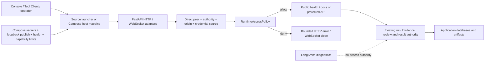

# Secure Local Runtime v1 Design

## Status

Approved for implementation planning.

## Summary

Decision Research Agent documents its Agent Research Operations Console as a
credential-free loopback consumer and describes the repository as a local,
single-node research capability service rather than a hosted multi-user
product. The executable defaults do not fully enforce that boundary today.
The direct Python entrypoint listens on every interface with development reload
enabled, Docker Compose publishes the backend port on every host interface,
and an empty `API_SECRET` causes the general HTTP and WebSocket surfaces to
accept requests from any peer. A copied `.env.example` also enables a
predictable placeholder API secret and contains database defaults that do not
match the Compose application-user boundary.

This design makes the supported local runtime secure by default without
breaking the existing Console. It introduces one small application-owned
runtime access policy, permits credential-free protected HTTP requests only
when the direct peer and request authority are explicit loopback values, keeps
API-key authentication for Tool Client and operator-managed access, and removes
the undocumented WebSocket query credential. The source launcher binds to
`127.0.0.1` with reload disabled. Local Compose publishes only to loopback,
requires explicit API and database secrets, adds bounded health checks, and
reduces backend container privileges without changing persistent-volume
ownership.

The capability is delivered as two feature pull requests followed by one pure
release-preparation pull request for `v0.1.5`. It does not change ResearchRun,
Evidence, result, review, verification, dispatch, failure-cause, or downstream
consumer contracts. It does not claim hosted-service security, TLS, identity,
multi-user authorization, non-root volume migration, or production deployment.

## Inspected Baseline

- `main` and `origin/main` were both at
  `4dc695e98bb2784b3ba8d8c6ff4738ec66bb3a52` with a clean primary worktree
  when this design was finalized.
- `VERSION` was `0.1.4`, the public `v0.1.4` release was current, and there
  were no open pull requests.
- `APIKeyMiddleware` accepted every protected general HTTP request when
  `API_SECRET` was empty and compared configured credentials with ordinary
  string equality.
- The run-scoped WebSocket accepted either `X-API-Key` or `?api_key=` when a
  secret was configured and accepted every connection when the secret was
  empty.
- Controlled review and Evidence verification already required their feature
  flags and a configured `API_SECRET`, used constant-time comparison, and
  retained their own authority-specific error contracts.
- `python api/server.py` called Uvicorn with `host="0.0.0.0"` and
  `reload=True`.
- `docker-compose.yml` published backend port `8000` on every host interface;
  MySQL alone was restricted to `127.0.0.1`.
- `Dockerfile.backend` correctly listened on `0.0.0.0` inside the container
  but had no image health check and ran as the image default root user.
- The existing Console accepted only `http://127.0.0.1:<port>`, sent no API
  credential, rejected redirects, and used HTTP polling rather than WebSocket.
- `.env.example` contained `API_SECRET=your-secret-key`, enabled LangSmith
  tracing by default, and used `MYSQL_USER=root`, while Compose created a
  separate application database user.
- Existing container integration tests exercised restart and persistence but
  could skip when Docker was unavailable unless
  `DECISION_RESEARCH_AGENT_REQUIRE_DOCKER_TESTS=true` was set.
- The previously published source-archive Compose smoke proved the local
  backend could build and return the exact `/health` identity. That proof did
  not validate the stronger access and container boundaries defined here.

## Problem

The documented trust boundary and executable defaults disagree in three
places.

First, network exposure is unsafe by default. A developer running
`python api/server.py` or the checked-in Compose file can unintentionally make
the service reachable from a LAN interface. CORS does not authenticate curl,
scripts, tools, or other non-browser callers and therefore cannot repair that
exposure.

Second, authentication behavior conflates local convenience with global
disablement. An empty `API_SECRET` currently means “accept every peer,” even
though the only supported credential-free consumer is an exact loopback
Console. Requiring a secret globally would close the exposure but would also
break that supported Console and encourage browser credential storage without
an approved browser-authentication model.

Third, the release container is missing executable security contracts. Host
port binding, explicit secret requirements, database credential defaults,
container health, Docker-test availability, and privilege reduction are not
enforced together. Directly changing the image to a non-root user would appear
stronger but could make existing root-owned SQLite and output volumes
unwritable. That is a state migration, not a safe one-line hardening change.

The correct fix is a layered local-runtime boundary. Network launchers must
bind safely, application access policy must fail closed when launchers are
misused, and container tests must prove the supported path. None of those
layers should become a new business authority or a claim that the service is
safe to expose publicly.

## Goals

1. Preserve the credential-free `127.0.0.1` Console flow.
2. Make an empty `API_SECRET` mean direct-loopback protected HTTP access only,
   not global authentication disablement.
3. Reject protected HTTP requests with an empty secret when the direct peer or
   request authority is non-loopback, missing, malformed, or proxy-shaped.
4. Preserve authenticated Tool Client and operator-managed API access through
   `X-API-Key` and existing environment variables.
5. Centralize general HTTP and WebSocket access decisions in one small,
   application-owned policy seam without building an authentication framework.
6. Use constant-time secret comparison and never place credentials in URLs,
   response bodies, logs, proof artifacts, or command-line arguments.
7. Remove the undocumented WebSocket `api_key` query parameter and preserve
   header authentication as the only credential channel.
8. Validate browser origins as exact origins and preserve CORS as a browser
   boundary rather than treating it as authentication.
9. Bind the direct Python entrypoint to `127.0.0.1` with reload disabled.
10. Keep container-internal Uvicorn on `0.0.0.0` while publishing the Compose
    backend only on host loopback.
11. Require explicit Compose API and database secrets and remove shipped
    predictable credential defaults.
12. Add exact backend and MySQL health contracts, bounded dependency readiness,
    backend capability reduction, and no-new-privileges.
13. Require existing Docker integration tests in CI rather than allowing an
    unavailable daemon to silently turn the container lane green.
14. Add deterministic public proof of the access matrix and a real local
    Compose smoke that uses no provider call.
15. Preserve every existing business, framework, persistence, result, Evidence,
    review, and consumer contract.
16. Document migration, rollback, supported runtime modes, and non-claims
    precisely for `v0.1.5`.

## Non-Goals

- No public hosted service, LAN product mode, production deployment claim, SLA,
  or anonymous research runner.
- No TLS termination, certificate management, reverse-proxy configuration,
  trusted-proxy allowlist, VPN, SSH tunnel, or ingress controller.
- No OAuth, OIDC, JWT, bearer-token issuer, browser session, BFF, cookie,
  WebSocket ticket, API-key rotation service, principal, tenant, RBAC, or
  multi-user model.
- No rate limiter, quota system, abuse service, WAF, audit-log platform, or
  security event pipeline.
- No Kubernetes, Helm, multi-replica, HA, service mesh, external broker, or
  public container-registry publication.
- No claim that a shared API key alone protects sensitive remote traffic. Any
  non-loopback topology remains operator-managed and requires an external
  secure transport boundary.
- No trust in `Forwarded`, `X-Forwarded-*`, arbitrary `Host`, or caller-supplied
  network identity when the local credential-free policy is active.
- No Console credential field, localStorage/sessionStorage secret, login, or
  authenticated browser mode.
- No acceptance of credentials in URL path, query, fragment, request body, CLI
  flag, logs, trace payload, evidence artifact, or public error.
- No non-root image change until fresh and existing persistent-volume ownership,
  rollback, and custom-mount behavior have a separately approved migration
  proof.
- No read-only root filesystem until all runtime write paths and temporary-file
  behavior are separately proven.
- No database migration and no change to existing SQLite, MySQL, checkpoint,
  output, or artifact content.
- No API route addition, run/result/Evidence field change, state transition,
  provider behavior, Agent middleware, prompt, tool, model, Skill, or framework
  dependency change.
- No LangGraph checkpoint or LangSmith trace as access-control authority.
- No live-provider research, cost claim, benchmark, or external consumer action
  in the runtime security proof.

## Threat Model

### Protected assets

- Research queries, canonical results, Evidence projections, review state, and
  generated artifacts.
- Provider-backed execution capacity and the cost of starting ResearchRuns.
- Application databases, checkpoint files, output directories, and persistent
  Docker volumes.
- API credentials and other environment-provided secrets.

### In-scope threats

- Accidental LAN exposure caused by `0.0.0.0` source or host port defaults.
- Unauthenticated non-loopback requests reaching a service with an empty
  `API_SECRET`.
- Malicious browser origins targeting a loopback service.
- DNS-rebinding-style requests whose direct peer is local but whose request
  authority is not an explicit loopback literal.
- Local reverse proxies forwarding remote requests into an unauthenticated
  loopback listener.
- API credentials leaked through a WebSocket query string, access log, error,
  proof, or example configuration.
- Operators copying predictable API or database credential defaults.
- Container processes retaining unnecessary Linux capabilities.
- CI reporting success because Docker security tests were skipped.
- Container health checks accepting a different service or malformed response.

### Accepted residual risks

- A compromised host, same-user malicious process, or local administrator can
  access a credential-free loopback service. That is the declared local trust
  model.
- An operator-created port forward or tunnel can make a connection appear as a
  direct loopback peer. The application does not claim to discover physical
  caller location.
- A configured API key sent over direct plaintext non-loopback HTTP can be
  observed in transit. Such a topology is unsupported without external TLS.
- One shared API key has no per-user identity, authorization, revocation list,
  or independent audit principal.
- The backend container remains UID 0 in `v0.1.5`; capability removal and
  no-new-privileges reduce but do not eliminate container compromise impact.
- `/health` and OpenAPI documentation remain deliberately public and reveal
  only bounded service identity and the published interface contract.
- Rate-based denial of service and expensive authenticated caller behavior are
  not addressed in this capability.

## Supported Runtime Matrix

| Runtime | Host exposure | Authentication | Support status |
|---|---|---|---|
| Static Console | No backend | None | Supported |
| Source loopback Console | `127.0.0.1` | Empty `API_SECRET` | Supported |
| Source Tool Client | Loopback | `X-API-Key` when configured | Supported |
| Local Compose | Host `127.0.0.1`, container `0.0.0.0` | Explicit required `API_SECRET` | Supported |
| Direct non-loopback API | Operator selected | Required `X-API-Key`; external TLS still required | Operator-managed capability, not a supported deployment |
| Browser-authenticated Console | Any | No approved browser credential mechanism | Unsupported |
| Reverse proxy / hosted / multi-user | Any | No approved identity or proxy trust model | Unsupported |

The matrix is a capability boundary, not a public `runtime_mode` configuration
enum. This release does not introduce a profile name that would imply support
for TLS, reverse proxies, or hosted operations.

## Considered Approaches

### A. Require `API_SECRET` for every protected request

Rejected. It is simple and strict, but it breaks the supported credential-free
Console. Repairing that break would require either placing a long-lived secret
in browser state or creating a new session/BFF design. Neither is justified by
the current product surface.

### B. Keep empty-secret behavior and only change launcher bindings

Rejected. Safe launch defaults are necessary but not sufficient. Operators can
still invoke Uvicorn with `--host 0.0.0.0`, embed the application, publish a
container port differently, or place a local proxy in front of it. The
application must fail closed when a protected request is outside its declared
credential-free boundary.

### C. Add an explicit runtime profile and generic authentication-provider
framework

Rejected. Public profiles such as `local`, `remote`, or `operator_managed`
would create compatibility promises before TLS, proxy trust, browser auth, or
identity exists. A generic provider framework would increase surface area for
one shared-secret mechanism and one local exception.

### D. Add a small application-owned access policy plus safe launchers

Selected. One strict policy can centralize direct-peer, authority, origin, and
credential decisions; HTTP and WebSocket adapters can reuse it without
changing business routes. Launcher and Compose defaults then provide the first
defense, while the application provides the backstop.

## Architecture



Network launchers own listener and port publication. Transport adapters own
extraction of request metadata. `RuntimeAccessPolicy` owns only the general
access decision. Existing review and Evidence-verification routers retain
their feature-specific authentication and authority checks. Business routes
never inspect peer addresses or choose authentication policy.

## Authority Boundaries

- The operating system and Docker own socket exposure. The application does
  not infer the host's firewall, physical network, tunnel, or proxy topology.
- The runtime access policy owns whether a general HTTP or WebSocket request
  may reach existing route behavior.
- `API_SECRET` remains an operator-provided shared transport credential. It
  does not identify a person, tenant, role, organization, or decision maker.
- Controlled review and Evidence verification continue to own their independent
  feature flags, decision identities, and persisted business authority.
- The application database remains authoritative for ResearchRun, segment,
  dispatch, failure cause, Evidence, review, verification, publication, and
  delivery state.
- The Console remains a consumer. CORS and Origin validation do not grant it
  review, verification, publication, cancellation, or delivery authority.
- Docker health owns only bounded process/service health. It does not become a
  provider-readiness, MySQL-query, model-quality, or end-to-end research claim.
- CI and evidence artifacts prove only the declared local cases. They do not
  certify arbitrary deployments.

## Framework And Standard-Library Reuse

- Reuse FastAPI and Starlette middleware/request/WebSocket adapters for
  transport integration.
- Reuse the existing controlled-review pattern of `hmac.compare_digest` for
  configured secret comparison.
- Use Python `ipaddress` to parse IPv4, IPv6, and IPv4-mapped IPv6 direct peers.
- Use strict immutable Pydantic models only where they materially improve
  configuration and decision validation; do not add another settings library.
- Use Uvicorn's existing programmatic launcher with explicit host, port, and
  reload values.
- Use Docker Compose required-variable interpolation, `healthcheck`,
  `depends_on.condition`, `cap_drop`, and `security_opt` rather than adding an
  orchestrator or custom supervisor.
- Use Python stdlib HTTP and JSON parsing inside the backend image health check;
  do not add curl solely for health.
- Reuse the existing Docker integration fixtures, restart tests, CI backend
  lane, proof CLI conventions, and public evidence indexes.

LangChain, DeepAgents, LangGraph, and LangSmith do not provide the missing
network/authentication boundary. No Agent middleware or checkpoint mechanism
is added. Framework execution state remains downstream of the access decision
and does not own it.

## Runtime Access Policy

### Internal contract

Add one small module such as `api/runtime_access.py`. The exact implementation
may use frozen Pydantic models or equivalently strict immutable project types,
but the semantics are fixed:

```python
RuntimeAccessPolicy(
    api_secret: SecretStr | None,
    local_unauthenticated_http: bool,
)

RequestAccessContext(
    transport: Literal["http", "websocket"],
    direct_peer: str | None,
    authority_host: str | None,
    origin: str | None,
    forwarded_headers_present: bool,
    header_credential: str | None,
    query_credential_present: bool,
)

AccessDecision(
    allowed: bool,
    code: Literal[
        "allowed_public",
        "allowed_loopback",
        "allowed_api_key",
        "api_auth_not_configured",
        "api_key_invalid",
        "local_authority_required",
        "forwarded_request_rejected",
        "origin_not_allowed",
        "query_credential_rejected",
    ],
)
```

The internal types are not serialized into run state or exposed as a second
public authentication API. Stable bounded denial codes are projected through
the existing HTTP error shape and WebSocket close contract.

### Configuration normalization

- Missing or exactly empty `API_SECRET` activates credential-free local HTTP
  policy.
- A non-empty `API_SECRET` activates API-key policy for every protected general
  HTTP and WebSocket request, including loopback callers.
- The legacy shipped sentinel `your-secret-key` is invalid configuration. The
  process fails closed with a bounded startup error that does not echo the
  value. Operators may either set the secret to empty for source-loopback use
  or generate a real secret.
- The `.env.example` `API_SECRET` line changes to an explicit empty value in
  the same pull request that rejects the legacy sentinel. The remaining
  provider, tracing, and database template hardening may land with the
  container pull request, but no intermediate `main` state documents a value
  that the runtime rejects.
- A whitespace-only secret is invalid configuration rather than an alias for
  empty local mode or a usable authenticated secret.
- Other non-empty values remain accepted for compatibility. Documentation
  generates at least 32 random bytes with Python `secrets`; the application
  does not claim to measure entropy.
- The policy is loaded once per application process. Runtime mutation of
  environment variables is unsupported; changing a secret requires restart.
- Logs may include the mode name `loopback_only` or `api_key`, never the secret,
  its prefix, length, hash, request header, or query string.

No new public `DRA_RUNTIME_MODE`, `AUTH_PROVIDER`, or similar enum is added.
A later identity design can attach another credential adapter to this seam
without changing business routes or local Console semantics.

### Direct-loopback classification

Credential-free protected HTTP requires all of the following:

1. The ASGI direct peer host is present and parses as IPv4 or IPv6 loopback.
2. IPv4-mapped IPv6 is normalized before the loopback decision.
3. The HTTP `Host` authority is an explicit `127.0.0.1` or `[::1]` literal with
   an optional valid port.
4. No `Forwarded`, `X-Forwarded-For`, `X-Forwarded-Host`,
   `X-Forwarded-Proto`, or equivalent proxy identity header is present.
5. The route is not subject to a stricter feature-owned authentication gate.

`localhost`, arbitrary DNS names resolving to loopback, malformed authorities,
missing peer data, Unix-socket ambiguity, test-client sentinel names, and
non-loopback addresses do not satisfy the public local contract. Tests must
construct explicit loopback client and authority values rather than adding
test-only production exceptions.

The policy intentionally rejects a loopback direct peer carrying forwarding
metadata when no secret is configured. It does not attempt to validate or
trust the forwarded value. A legitimate proxy must use a configured secret
and remains outside the supported local launch path.

### General HTTP decision matrix

Public paths remain:

- `GET /health`
- `/docs`
- `/openapi.json`
- `/redoc`
- CORS preflight `OPTIONS`

All other general HTTP paths use this exact order:

1. Feature-owned review and Evidence-verification paths continue into their
   existing independent gates.
2. If `API_SECRET` is configured, require `X-API-Key` and compare with
   `hmac.compare_digest` over encoded byte values so non-ASCII configuration
   cannot cause a comparison exception. Peer location does not bypass the key.
3. If `API_SECRET` is empty, apply the direct-loopback classification.
4. Any missing, malformed, unknown, forwarded, or non-loopback context fails
   closed before route behavior.

Configured but missing/wrong credentials return HTTP `401` with stable code
`api_key_invalid`. Unsafe empty-secret requests return HTTP `503` with a stable
configuration/boundary code. Responses do not reveal whether a supplied key
had the correct length or prefix.

The exact empty-secret denial code is `api_auth_not_configured` for a
non-loopback, missing, or malformed direct peer; `local_authority_required` for
an unsafe or malformed Host authority; and `forwarded_request_rejected` when
proxy identity headers are present. All three use HTTP `503` because operator
configuration, not caller identity, must change before the request can be
accepted safely.

The application emits at most one startup warning for credential-free local
mode. It does not log one warning per request.

## WebSocket Contract

The run-scoped WebSocket remains `/ws/runs/{run_id}` and preserves run identity,
message schema, and channel isolation. Only handshake access changes.

- `X-API-Key` is the only accepted credential channel when `API_SECRET` is
  configured.
- `?api_key=` is removed rather than deprecated. Any `api_key` query parameter
  is rejected even if a correct header is also present.
- Credentials are never read from path, subprotocol, first message, cookie, or
  request body.
- With a configured secret, missing or incorrect header credentials close with
  the existing private authentication close-code family and a bounded reason.
- With an empty secret, a WebSocket may connect only from a direct loopback
  peer to an explicit loopback authority with no forwarding metadata.
- If an `Origin` header is present, it must exactly match the one valid
  configured browser origin. An absent Origin remains allowed for a direct
  non-browser local client.
- Handshake processing uses this exact order: reject query credentials; extract
  peer, authority, forwarding, Origin, and header context; evaluate runtime
  access; validate `run_id`; load the run; then call `manager.connect_run`.
  Unauthenticated or unsafe callers never reach run identity validation or
  database lookup.
- An invalid Origin, unsafe peer, query credential, invalid `run_id`, or missing
  run closes before `manager.connect_run`.
- No denial reason contains the supplied credential, raw query, full URL,
  request headers, database identity, or research content.

The current Console is unaffected because it uses bounded HTTP polling and
does not use WebSocket. A future authenticated browser WebSocket consumer must
receive a separately designed session or short-lived ticket; this release does
not preserve a long-lived shared secret in a URL for hypothetical compatibility.

## CORS And Browser Boundary

`DECISION_RESEARCH_AGENT_CORS_ALLOWED_ORIGIN` remains optional and singular.
When unset, browser cross-origin access is denied.

The configured value must be one exact HTTP or HTTPS origin:

- scheme is `http` or `https`;
- hostname is present;
- optional port is valid;
- username and password are absent;
- path is empty or `/` only and normalized away;
- query and fragment are absent;
- `*`, `null`, comma-separated lists, whitespace-only values, wildcard hosts,
  and reflected caller origins are rejected.

The supported Console value remains exactly
`http://127.0.0.1:5173`. `allow_credentials` is disabled because the Console
does not use cookies or browser authentication. Browser methods and headers
are restricted to the existing HTTP surface, including `GET`, `POST`,
`OPTIONS`, `Content-Type`, `Idempotency-Key`, and `X-API-Key` where applicable.

When `API_SECRET` is empty, a configured browser origin must itself use an
explicit loopback-literal host. A syntactically valid non-loopback origin paired
with credential-free local mode is an invalid cross-field configuration and
fails closed at application construction. When a secret is configured, one
syntactically valid non-loopback origin may be declared for an operator-managed
client, but that does not create a supported browser or hosted mode.

CORS is not described as API authentication. Non-browser clients still require
the runtime access decision, and disallowed browser origins cannot gain
authority merely by forging an Origin header outside a browser.

## Launcher Contract

The direct executable entrypoint becomes:

```python
uvicorn.run(
    "api.server:app",
    host="127.0.0.1",
    port=8000,
    reload=False,
)
```

The public development command remains explicit:

```bash
python -m uvicorn api.server:app --host 127.0.0.1 --port 8000
```

The container command continues to listen on `0.0.0.0:8000` because Docker
port forwarding requires a container-reachable listener. Documentation must
not confuse that internal address with host publication.

An operator may deliberately start Uvicorn on another interface, but protected
requests then require a configured API key and external secure transport. That
is an operator-managed capability, not a supported hosted deployment.

## Environment Template Contract

`.env.example` becomes a non-operational template rather than a set of
plausible credentials.

- `API_SECRET=` is empty and documents source-loopback behavior.
- Compose documentation instructs the operator to generate and fill a secret
  before `docker compose config --quiet` or `up`.
- `OPENAI_API_KEY`, `TAVILY_API_KEY`, `LANGSMITH_API_KEY`, database passwords,
  and other secret-shaped values are empty rather than `your-*` sentinels.
- `LANGSMITH_TRACING=false` is the safe default. Privacy flags remain enabled
  for an operator who explicitly turns tracing on.
- `MYSQL_USER=decision_research`, not `root`.
- `MYSQL_ROOT_PASSWORD=` and `MYSQL_PASSWORD=` are explicit required blanks.
- The template never contains a secret that makes authenticated startup appear
  secure merely because it is non-empty.

Example secret generation uses the installed Python standard library and does
not place the generated value in shell history through a required documented
command-line argument. Documentation warns that environment files remain
sensitive local files even though `.env` is Git-ignored.

## Container And Compose Contract

### Host publication

The backend mapping becomes:

```yaml
ports:
  - "127.0.0.1:8000:8000"
```

MySQL retains its loopback-only host mapping. Container-internal service
communication remains on the existing private Compose network.

### Required configuration

Compose uses required interpolation for:

- `API_SECRET`
- `MYSQL_ROOT_PASSWORD`
- `MYSQL_PASSWORD`

Missing or empty values make `docker compose config --quiet` fail with a
bounded operator-facing message. `MYSQL_USER` may default to the non-root
application user and `MYSQL_DATABASE` may retain its non-secret default.

The backend receives `API_SECRET` through its environment. No secret is copied
into the image, build argument, label, health command, source archive, or proof
artifact.

### Health and startup order

- MySQL receives an internal `mysqladmin ping` health check using the container
  environment rather than a literal password in Compose configuration.
- Backend dependency changes from `service_started` to `service_healthy` for
  MySQL.
- `Dockerfile.backend` adds a stdlib health check against
  `http://127.0.0.1:8000/health`.
- Backend health succeeds only when HTTP status is successful and decoded JSON
  exactly equals:

  ```json
  {"status":"ok","service":"decision-research-agent"}
  ```

- Health intervals, timeouts, retries, and start period are finite and bounded.
- `/health` remains lightweight process/service identity. MySQL readiness is a
  separate Compose condition; backend health does not claim provider, search,
  model, database-query, or research readiness.

### Privilege reduction

The backend service adds:

```yaml
cap_drop:
  - ALL
security_opt:
  - no-new-privileges:true
```

The backend still must write its two named volumes and normal runtime
temporary paths. `read_only` is not added without an executable write-path
inventory.

The image remains root in `v0.1.5`. Release notes name this limitation. A later
non-root change must prove:

1. fresh named-volume ownership;
2. upgrade from existing root-owned data and output volumes;
3. sentinel data preservation;
4. restart and rollback;
5. behavior for documented custom mounts;
6. no broad host-path `chown` side effect.

This deferral preserves data compatibility and does not couple future UID
migration to authentication.

### Build context

`.dockerignore` additionally excludes repository-local data, `.worktrees`,
frontend sources not used by `Dockerfile.backend`, pytest and type-check caches,
coverage artifacts, and common tool caches. The exact allowlist required by
the selective Dockerfile copies and durable-HITL evidence remains present.

## CI Contract

The existing backend CI lane remains authoritative for non-container tests and
runs the complete suite with Docker-marked tests excluded. One dedicated
required container lane owns every `pytest.mark.docker` case, sets:

```text
DECISION_RESEARCH_AGENT_REQUIRE_DOCKER_TESTS=true
```

and uses a timeout sized for the existing three function-scoped Compose
lifecycles. This split is required because the current 15-minute backend job is
shorter than the aggregate bounded Compose lifecycles. It is not a duplicate
container authority: non-container tests run only in the backend lane and
Docker-marked tests run only in the container lane.

Container-focused tests add:

- positive and negative Compose configuration cases;
- exact host loopback publication;
- explicit required secrets and absence of shipped defaults;
- backend and MySQL health transition;
- exact canonical backend health JSON;
- backend `CapDrop` contains `ALL` and `SecurityOpt` contains
  `no-new-privileges`;
- backend data/output volume writability;
- existing restart and persistence behavior;
- zero provider/model/tool calls;
- bounded logs and deterministic cleanup on failure.

The container lane must preserve bounded diagnostics and cleanup on failure.
It may reuse the image and Compose helpers within the lane, but it must not
create a second container job, silently skip Docker-marked tests, or weaken the
required gate.

## Deterministic Proof

Add a production-path proof with repository-standard strict contracts, CLI
behavior, committed JSON/Markdown evidence, and `build`/`check` operations.
Suggested public identity:

```text
schema_version: dra.secure-local-runtime.v1
```

The deterministic cases are ordered and include:

1. source launcher loopback/no-reload;
2. empty secret + IPv4 loopback HTTP allowed;
3. empty secret + IPv6 loopback HTTP allowed;
4. empty secret + non-loopback peer rejected;
5. empty secret + missing/malformed peer rejected;
6. empty secret + non-loopback Host authority rejected;
7. empty secret + forwarding metadata rejected;
8. configured secret + missing/wrong key rejected;
9. configured secret + correct key accepted for loopback and non-loopback
   direct peers;
10. WebSocket header credential accepted;
11. WebSocket query credential rejected;
12. WebSocket invalid Origin rejected before connection ownership;
13. CORS wildcard/malformed origin rejected;
14. non-loopback browser Origin plus empty secret rejected as invalid
    cross-field configuration;
15. Compose host binding and required-secret contract observed;
16. container health and privilege contract declared for the runtime lane.

The proof must invoke the production policy and transport adapters. A helper
that recreates expected decisions without crossing the real middleware or
WebSocket handshake boundary is insufficient. Mutation tests must show that
bypassing production policy, restoring query credentials, widening the host
mapping, or accepting a malformed report makes `check` fail closed.

Evidence contains only stable case IDs, bounded observation booleans/codes,
supported/non-supported boundaries, a stable proof-source label, and aggregate
counts. It does not embed a commit SHA that would make an otherwise unchanged
baseline drift after rebase or squash. It excludes secrets, peer-specific
personal data, environment values, queries, artifacts, local paths, exception
text, access-log URLs, and provider facts.

The deterministic proof does not replace the real Docker runtime lane. The
release archive smoke is the executable evidence for image build, service
health, host mapping, privilege inspection, and cleanup.

## Failure And Compatibility Matrix

| Condition | Expected result |
|---|---|
| Public health/docs, any secret state | Existing public response |
| Protected HTTP, empty secret, exact direct loopback | Allowed |
| Protected HTTP, empty secret, non-loopback/unknown peer | `503 api_auth_not_configured` |
| Protected HTTP, empty secret, unsafe Host | `503 local_authority_required` |
| Protected HTTP, empty secret, forwarding metadata | `503 forwarded_request_rejected` |
| Protected HTTP, configured secret, missing/wrong key | `401 api_key_invalid` |
| Protected HTTP, configured secret, correct key | Existing route behavior |
| Review/verification routes | Existing feature-owned gate behavior |
| WebSocket, configured secret, correct header | Existing run lookup/channel behavior |
| WebSocket with `api_key` query | Rejected before run lookup |
| WebSocket with invalid Origin | Rejected before connection ownership |
| Empty secret with configured non-loopback browser Origin | Startup/configuration fails closed |
| Console Live Backend against source loopback/empty secret | Unchanged |
| Console against authenticated backend | Existing bounded 401 guidance |
| Compose with missing/empty required secret | Config fails before service start |
| Compose with explicit fake test secrets | Build/start/health succeeds |
| Docker daemon unavailable in CI | Required test failure, not skip |
| Existing named volumes | Content preserved; no UID migration |

## Data, API, And Consumer Compatibility

- No migration or table change.
- No ResearchRun, segment, dispatch, failure-cause, Evidence, artifact, review,
  verification, publication, or result field change.
- No canonical result selection change.
- No downstream fixture or validator change.
- No Tool Client URL, command, API-key environment variable, request body, or
  result behavior change.
- The source-loopback Console remains credential-free and continues to use the
  exact same HTTP contracts.
- Existing authenticated HTTP callers keep `X-API-Key` unchanged.
- WebSocket query authentication is intentionally removed. The public API
  reference documents header-only authentication and the release notes name
  the security correction.
- Accidental unauthenticated non-loopback access is intentionally closed and
  is not treated as a supported compatibility surface.

## Migration And Rollback

### Operator migration

- Source-loopback Console users may explicitly leave `API_SECRET` empty and
  use the documented `127.0.0.1` command unchanged.
- Authenticated Tool Client users retain their current key and environment
  variable.
- Compose users must replace legacy/example API and database credentials with
  explicit local values before configuration succeeds.
- Any WebSocket client using `?api_key=` must move the credential to
  `X-API-Key`. Browser clients that cannot set that header are not part of the
  supported authenticated surface.
- Operators deliberately exposing a non-loopback listener must configure a
  key and provide their own TLS/proxy boundary. The repository does not
  validate or support that topology.

### Rollback

- Code/config rollback to `v0.1.4` requires no database rollback.
- Named volumes and persisted SQLite/MySQL data are not rewritten by this
  capability.
- Restoring the earlier Compose file reopens the old host binding and default
  credential behavior; release notes identify that as a security regression,
  not a recommended steady state.
- Removing the new required variables prevents Compose startup rather than
  silently selecting defaults.
- No key material is generated, rotated, persisted, or destroyed by rollback.

## Pull Request Boundaries

### PR A — Runtime access and protocol boundary

Owns:

- approved design and implementation plan;
- strict runtime access policy;
- HTTP middleware integration and bounded errors;
- direct-peer/authority/forwarding classification;
- constant-time comparison;
- WebSocket header-only credential and Origin behavior;
- CORS validation and safe browser settings;
- source launcher correction;
- the `.env.example` `API_SECRET=` correction required by sentinel rejection;
- focused unit/integration/contracts;
- API, architecture, getting-started, Console, and security documentation for
  the access boundary.

Does not modify Docker, Compose, CI, version, release notes, database, business
routes, or frontend credential behavior.

### PR B — Container delivery and security proof

Owns:

- Compose loopback publication and required variables;
- the remaining `.env.example` provider, tracing, and database safe-template
  corrections;
- MySQL/backend health and startup ordering;
- backend capability/no-new-privileges hardening;
- `.dockerignore` build-context correction;
- required Docker CI behavior;
- deterministic proof script, contracts, baselines, and evidence indexes;
- real container integration matrix;
- container/runbook documentation and final shared discovery updates.

It is rebased onto PR A before final verification. It does not add non-root
volume migration or release metadata.

### PR C — `v0.1.5` release preparation

After PR A and PR B merge, a pure release-preparation change owns:

- `VERSION` and frontend package/lock version identity;
- `CHANGELOG` archival;
- `SECURITY.md` current-version boundary;
- `docs/releases/v0.1.5.md`;
- release discovery links and metadata tests.

It contains no runtime behavior, dependency, migration, proof baseline, or CI
change.

## Release Gates

Before release preparation:

1. Exact HTTP and WebSocket access matrix passes.
2. Controlled review and Evidence-verification auth regressions pass unchanged.
3. Console Vitest, lint, and production build pass with no credential support
   added.
4. Tool Client and downstream consumer contracts pass unchanged.
5. Deterministic secure-local-runtime proof matches committed JSON/Markdown
   baselines twice with byte-identical output.
6. Agent evaluation and existing reliability/failure proofs report no blocking
   regression.
7. Compose positive and negative configuration contracts pass.
8. Required Docker tests build, start, inspect, restart, and clean the local
   stack with no skip.
9. Dependency manifests, Agent framework versions, database schemas, canonical
   result, and downstream fixtures have no unauthorized diff.
10. Public/private marker, credential-value, URL-query-secret, documentation,
    canonical identity, presentation, and `git diff --check` audits pass.

For the exact `v0.1.5` tag archive:

1. Verify archive checksum and version identities.
2. Create a fresh temporary directory and a permission-bounded `.env` containing
   only fake test credentials and unreachable provider values.
3. Run `docker compose config --quiet` without printing resolved secrets.
4. Build the backend from the exact archive.
5. Start MySQL and backend under a unique Compose project.
6. Wait with a bounded deadline for both containers to become healthy.
7. Assert `GET http://127.0.0.1:8000/health` returns exact canonical JSON.
8. Assert the published backend and MySQL addresses are loopback-only.
9. Inspect backend capability/no-new-privileges settings and named-volume
   writability without printing environment values.
10. Confirm no provider/model/tool request ran.
11. Always remove project containers, volumes, networks, archive, and temporary
    `.env`; do not run global Docker prune.

Tagging and GitHub Release publication remain separately authorized actions.
The release must distinguish deterministic proof, CI container proof, and
post-publication archive smoke. None is a production deployment claim.

## Documentation Impact

Update or add, as applicable:

- `README.md` and `README_CN.md`
- `SECURITY.md`
- `docs/README.md`
- `docs/architecture.md`
- `docs/getting-started.md`
- `docs/demo-console.md`
- `docs/AGENT_INTEGRATION.md`
- `docs/reference/api-contract.md`
- container/runtime operation guidance
- `docs/evidence/README.md`
- secure-local-runtime JSON/Markdown evidence
- `CHANGELOG.md` under `Unreleased`
- later `docs/releases/v0.1.5.md`

Documentation must distinguish:

- loopback source mode from authenticated Compose;
- container-internal listening from host publication;
- CORS/Origin validation from authentication;
- API-key capability from TLS/identity/authorization;
- process health from full dependency/provider readiness;
- deterministic proof from Docker runtime smoke;
- local security hardening from hosted-production security;
- current root-container limitation from a completed non-root migration.

## Future Evolution

This design intentionally leaves one narrow seam rather than a public provider
framework.

- A future TLS/proxy deployment can terminate transport before the existing
  access seam and retain `X-API-Key` as a compatibility credential.
- A future bearer/OIDC design can add an authenticated principal adapter before
  business routes without changing run/result/Evidence contracts.
- A future browser-authenticated Console requires a BFF/session or short-lived
  ticket and can coexist with the credential-free local Console.
- A future non-root container change remains a volume-ownership migration and
  can be delivered independently from authentication.
- Multi-user/RBAC and multi-replica/HA remain product architecture changes,
  not follow-up refactors caused by this local boundary.
- Evaluated Runtime work remains orthogonal and may proceed after `v0.1.5`
  without reopening the access design.

No future version number beyond `v0.1.5` is promised by this design.

## Acceptance Criteria

1. Credential-free protected HTTP succeeds only for exact direct-loopback
   peer and authority with no forwarding metadata.
2. Accidental unauthenticated non-loopback exposure fails closed even if an
   operator starts Uvicorn on `0.0.0.0`.
3. Configured API-key behavior is constant-time and preserves existing Tool
   Client contracts.
4. WebSocket no longer accepts query credentials and rejects unsafe
   peer/origin context before run lookup or connection ownership.
5. The Console remains credential-free, loopback-only, and behaviorally
   unchanged.
6. Source launcher and Compose host publication are loopback-safe by default.
7. Compose cannot start from missing/empty API or database secrets.
8. Backend and MySQL become healthy under bounded tests, with exact backend
   identity and persistent volumes still writable.
9. Backend runs with all Linux capabilities dropped and no-new-privileges; the
   remaining root-UID limitation is explicit and not misrepresented.
10. Docker integration cannot silently skip in required CI.
11. Deterministic and runtime proofs cross production paths, fail closed under
    approved mutations, contain no credentials, and make no provider or hosted
    claim.
12. No business schema, API/result/Evidence contract, framework authority,
    dependency, or database migration changes.
13. The implementation can be rolled back without database or volume-format
    rollback.
14. `v0.1.5` release notes present the capability as secure local defaults,
    not production hardening certification.

## References

- [Uvicorn settings](https://www.uvicorn.org/settings/)
- [Python `hmac.compare_digest`](https://docs.python.org/3/library/hmac.html#hmac.compare_digest)
- [Python `ipaddress`](https://docs.python.org/3/library/ipaddress.html)
- [Starlette requests](https://www.starlette.io/requests/)
- [Docker Compose interpolation](https://docs.docker.com/reference/compose-file/interpolation/)
- [Docker Compose services](https://docs.docker.com/reference/compose-file/services/)
- [Dockerfile `HEALTHCHECK`](https://docs.docker.com/reference/dockerfile/#healthcheck)
- [Docker container security](https://docs.docker.com/engine/security/)
- [OWASP REST Security Cheat Sheet](https://cheatsheetseries.owasp.org/cheatsheets/REST_Security_Cheat_Sheet.html)
- [OWASP WebSocket Security Cheat Sheet](https://cheatsheetseries.owasp.org/cheatsheets/WebSocket_Security_Cheat_Sheet.html)
- [OWASP HTML5 Security Cheat Sheet](https://cheatsheetseries.owasp.org/cheatsheets/HTML5_Security_Cheat_Sheet.html)
