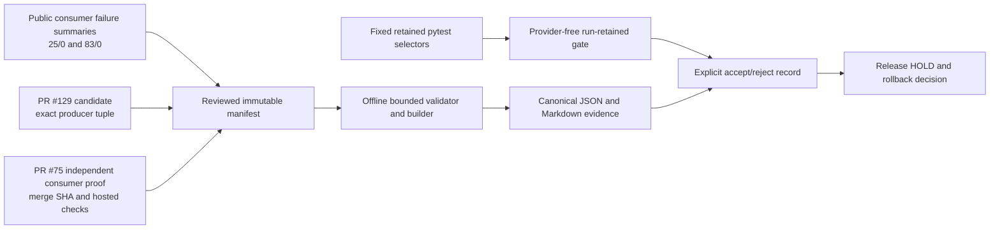

# Consumer-Derived Loop Proof v1

Status: Approved design; implementation is not authorized by this document landing task.

## 1. Audited baseline

- DRA baseline: `01ba21f2996769e68cbc88f4bb0596740df27f6b`.
- DRA PR #129:
  - reviewed HEAD: `3ddb8bafc`;
  - squash merge: `01ba21f2996769e68cbc88f4bb0596740df27f6b`;
  - reviewed/merge tree: `06e5282414d3801b11040bba735dd107105e8a30`;
  - exact merge-SHA CI succeeded.
- Latest release remains `v0.1.6@7d43324b469cb5e445c2e8be83af3be4d841cf1c`; strict citation is a post-v0.1.6 capability.
- Night Voyager consumer baseline: `19bd17ad35131435e7dbec4a33fe939c9976007c`.
- Night Voyager PR #75:
  - reviewed HEAD: `a7d6eee704537a0876396d56e483485ef77b291b`;
  - squash merge: `95cce4f28357150450c7f87105adcb47abf1a15d`;
  - reviewed/merge tree: `7e310124de9c7d081723eee5b42c152a258b0919`;
  - merge-SHA run `30257237706` reported successful `python`, `frontend`, and `compose` jobs.
- Two bounded consumer live-acceptance failures produced 25 and 83 same-run Evidence entries respectively, with zero cited entries. Both failed closed before candidate import, with no candidate, promotion, planning, review, or decision mutation.

## 2. Product decision

Add exactly one fixed offline proof:

```text
manifest_schema = dra.consumer-derived-loop-manifest.v1
report_schema   = dra.consumer-derived-loop-proof.v1
loop_id         = strict-citation-consumer-loop-v1
```

The design distinguishes two carrier decisions:

- Original consumer-failure candidate carrier: `program/Harness`, represented by the already merged `generic-strict-citation@1` candidate.
- Current closeout carrier: `evaluation/proof-only`; no further runtime change.

This is not a generic Loop platform, automated diagnosis engine, or self-modifying system.

## 3. Architecture



Authority boundaries:

- Online execution produces bounded evidence and does not modify rules.
- Offline proof organizes diagnosis, carrier selection, candidate verification, and disposition.
- DRA continues to own the producer runtime contract.
- The consumer repository, commit, and CI own independent consumer proof; DRA does not self-attest consumer results.
- The proof runner does not access network, providers, credentials, Docker, Night Voyager runtime, or the GitHub API.

## 4. Exact artifact scope

Planned additions:

- `benchmarks/consumer-derived-loop-v1/manifest.json`
- `scripts/consumer_derived_loop_proof.py`
- `docs/evidence/consumer-derived-loop-proof-v1.json`
- `docs/evidence/consumer-derived-loop-proof-v1.md`
- `docs/reference/consumer-derived-loop-proof.md`
- `tests/unit/test_consumer_derived_loop_proof.py`

Planned updates:

- `.github/workflows/ci.yml`
- `README.md`
- `README_CN.md`
- `docs/README.md`
- `docs/evidence/README.md`
- `CHANGELOG.md` under `[Unreleased]`

Forbidden changes:

- `agent/`
- `api/`
- database, migrations, profile registry, Prompt, or Skill behavior
- Night Voyager repository
- `VERSION`, release notes, tags, or existing Evidence
- dependency files

No ADR is required because runtime, identity, and business authority do not change.

## 5. Manifest contract

The manifest uses exact keys, bounded values, and canonical JSON. Its top-level keys are fixed:

```text
schema_version
loop_id
scope
producer_baseline
failure_receipts
diagnosis
carrier_decision
candidate
retained_regressions
independent_consumer_proof
decision
rollback
non_claims
```

Rules:

- `producer_baseline` records both:
  - `v0.1.6@7d43324b469cb5e445c2e8be83af3be4d841cf1c`;
  - strict candidate `01ba21f2996769e68cbc88f4bb0596740df27f6b`;
  - `generic-strict-citation@1`;
  - `profile_version=1`;
  - `proof_schema=dra.strict-citation-profile.v1`.
- `failure_receipts` contains exactly two public-safe summaries:
  - Evidence `25`, cited `0`;
  - Evidence `83`, cited `0`;
  - both set `stopped_before_candidate_import=true`;
  - candidate, promotion, planning, review, and decision mutation are all `false`.
- Do not retain queries, Markdown, Evidence URLs, provider payloads, credentials, private receipt IDs, or local paths.
- `diagnosis` is fixed as `generic delivery invariant < strict consumer delivery invariant`.
- `carrier_decision` records:
  - knowledge: reject;
  - Prompt/Skill: reject;
  - program/Harness: accept for the PR #129 candidate;
  - current runtime change: no-change;
  - current phase: evaluation/proof-only.
- External evidence identity permits only public HTTPS repository URLs, 40-hex commits, and exact PR/run IDs; branch names such as `main` or floating URLs cannot serve as identity.
- PR #75 is a consumer-owned reviewed reference. The DRA offline builder does not claim to re-run or re-certify external CI.

## 6. Retained regression

`run-retained` reads fixed pytest selectors only from a validated manifest and never accepts user-provided arbitrary test paths.

The retained set must cover:

| Case | Existing test authority |
|---|---|
| Generic zero-cited remains compatible and ready | `test_literal_generic_zero_citation_remains_ready_without_correction` |
| Strict initial exact citation requires zero correction | `test_strict_initial_success_uses_zero_correction_calls` |
| Strict correction runs exactly once and persists an exact URL | `test_strict_correction_success_calls_once_and_persists_exact_url` |
| Post-correction zero-cited fails closed without retry | `test_post_insertion_zero_citation_fails_once_without_retry` |
| Strict failure retains Evidence, creates no ready artifact, and preserves only safe state | `test_strict_failures_are_closed_and_retain_only_safe_state` |
| Exact profile, manifest, and proof identity | `test_strict_profile_uses_existing_identity_and_manifest_surfaces` |
| Non-exact profile version fails closed | `test_strict_resolver_rejects_nonexact_persisted_profile_version` |
| Frozen generic consumer fixture rejects a strict profile | `test_generic_v1_rejects_non_generic_profile_in_projector_and_fixture` |
| v0.1.6 identity remains frozen | `test_v0_1_6_version_identity_is_consistent` |

This does not add a new runtime replay Harness. It retains and orchestrates existing production-path tests.

## 7. CLI contract

Fixed commands:

```bash
PYTHON_DOTENV_DISABLED=1 \
python scripts/consumer_derived_loop_proof.py check

PYTHON_DOTENV_DISABLED=1 \
python scripts/consumer_derived_loop_proof.py run-retained

PYTHON_DOTENV_DISABLED=1 \
python scripts/consumer_derived_loop_proof.py build \
  --json-output /tmp/dra-consumer-loop-v1.json \
  --markdown-output /tmp/dra-consumer-loop-v1.md
```

Behavior:

- `build` validates the manifest and produces canonical JSON and Markdown.
- `check` rebuilds, validates committed artifacts, and performs byte comparison.
- `run-retained` uses `sys.executable -m pytest` with a fixed argument list.
- JSON uses sorted keys, two-space indentation, UTF-8, and one trailing newline.
- Markdown is generated only from validated JSON.
- Output uses bounded atomic writes and cannot overwrite the input manifest or committed baseline aliases.

Stable failure codes include:

```text
loop_manifest_invalid
loop_source_evidence_invalid
loop_diagnosis_invalid
loop_carrier_decision_invalid
loop_candidate_identity_invalid
loop_retained_regression_invalid
loop_consumer_proof_invalid
loop_decision_invalid
loop_artifact_drift
loop_retained_regression_failed
```

Failures do not print tracebacks, fixture contents, local paths, or external sensitive data.

## 8. Explicit decision record

After the proof passes, record:

- Accept candidate: `01ba21f2996769e68cbc88f4bb0596740df27f6b + generic-strict-citation@1 + version 1 + dra.strict-citation-profile.v1`, limited to opt-in, commit-pinned consumer contract acceptance.
- Accept consumer proof: PR #75 is independent, provider-free, immutable consumer proof.
- Reject live-success claim: both real-provider attempts remain zero-cited safe stops.
- Reject runtime expansion: no automated diagnosis, candidate generation, extra Agent role, generic EvalOps, or runtime self-modification.
- Reject automatic release: `v0.1.7` remains `HOLD`.
- Reject semantic overclaim: no proof of source truth, entailment, citation completeness, provider quality, production reliability, user adoption, or business value.

## 9. Release, identity, and rollback

- The proof-only commit does not replace strict producer commit `01ba21f2996769e68cbc88f4bb0596740df27f6b`.
- Night Voyager does not need to re-pin merely because DRA adds proof, documentation, or tests.
- `v0.1.6` cannot be rewritten as including the strict profile.
- This phase records the evidence/proof capability under `[Unreleased]` only.
- The proof can be reverted independently, without database or runtime migration.
- Consumer rollback means retaining the previous immutable pin or rejecting the strict candidate; it does not mutate a production Agent.
- Completing the proof does not authorize a release. A later release decision separately requires either:
  1. a coherent bounded release pack; or
  2. a real consumer need for a published artifact.

## 10. Acceptance criteria

Closeout requires all of the following:

- Two fresh builds of manifest, JSON, and Markdown are byte-identical.
- The fixed retained regression passes provider-free.
- The full non-Docker backend suite passes.
- Existing hosted container and frontend gates do not regress.
- Exact PR #129 and PR #75 identity, tree, and check evidence is recorded accurately.
- Consumer external proof and producer-local proof remain separate authorities.
- Explicit accept/reject/release-hold records exist.
- English and Chinese README commands, boundaries, and non-claims are equivalent.
- `git diff --check`, Markdown links, and a public-neutral marker scan pass.
- There are no runtime, dependency, provider, Docker, Night Voyager, or release changes.

## 11. Hard stops

Stop and return to the DRA authority if any of the following occurs:

- The work requires changing `agent/`, `api/`, the database, profiles, or a public runtime contract.
- Existing tests cannot express the real failure and a new runtime seam would be required.
- The retained gate cannot run provider-free.
- Consumer evidence cannot be expressed through a public immutable reference.
- New evidence conflicts with the `01ba21f2996769e68cbc88f4bb0596740df27f6b` producer tuple.
- Testing reveals a new exact runtime failure.

The last condition permits only one bounded RED case and its minimal fix. It does not authorize a third provider attempt.

## 12. Public claims boundary

This design follows an evidence-gated separation: online execution records bounded evidence; offline work may aggregate trajectories, diagnose root cause, select an update carrier, validate a candidate, and make an explicit release or rollback disposition.

After the proof is merged and hosted CI succeeds, public technical description may state that the repository demonstrates a consumer-driven, evidence-gated Loop Engineering proof using real downstream fail-closed trajectories, provider-free retained and safety regression, immutable producer identity, independent consumer proof, explicit accept/reject, and rollback control.

The description must retain personal open-source, provider-free, contract-level, and non-production boundaries. It must not claim autonomous evolution, runtime self-modification, live-provider success, automatic release, production reliability, user adoption, or business impact.
