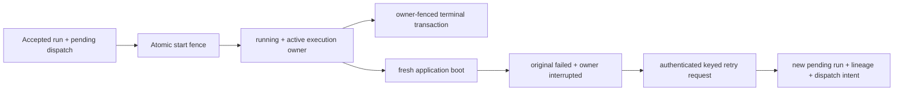

# Crash-Safe Startup Convergence And Explicit Replacement v1

**Status:** Approved design; implementation is not authorized by this document.

## Decision

Decision Research Agent will close one bounded Harness durability gap with two
separate mechanisms:

1. **boot-generation startup convergence** turns application-owned `running`
   state left by a previous process generation into an immutable failed source;
2. **explicit keyed replacement** lets an authorized caller create at most one
   new run from that failed source.

The design does not use a heartbeat, expiry threshold, periodic recovery scan,
automatic Agent retry, or transparent checkpoint resume. It recovers
application state, not uncommitted process memory or external side effects.

## Summary

The current application already persists accepted run creation, reconciles the
pre-execution dispatch gap, and fences terminal ResearchRun writes by state
version. The remaining gap starts after the dispatch start transaction. That
transaction changes dispatch to `started`, ResearchRun and its initial segment
to `running`, and then releases the only existing lease. If the process is
hard-killed after that commit, no durable application owner remains able to
finalize the run.

This design adds a private current-boot record and one private execution-owner
record for every run that crosses the new start fence. A fresh application
process atomically converges all exact active owners from the previous boot
before it starts any workers or accepts requests. The original run becomes
failed and immutable. A separate authenticated endpoint can then create one
new pending run with immutable one-hop lineage and a durable idempotency
binding.

The application database remains authoritative for ResearchRun state, segment
state, Evidence, artifacts, failure causes, execution ownership, and
replacement lineage. LangGraph state, traces, model output, virtual workspace
state, and external provider state do not acquire application authority.

## Goals

- Ensure every post-migration run that commits `running` has one exact durable
  execution owner.
- Ensure a fresh process converges exact previous-boot owners before workers or
  request handling begin.
- Fence an old process generation from starting new work or persisting phase
  and terminal writes after a new generation takes authority.
- Preserve the original failed run, failure cause, Evidence, packets, artifacts,
  and other committed business rows as immutable history.
- Provide one explicit, authenticated, idempotent, auditable replacement-run
  operation.
- Preserve existing run creation, status, result, failure-cause, profile, and
  downstream consumer contracts.
- Make recovery replay consume one producer-derived lifecycle authority that
  rejects every unrecognized or mixed state combination by default.
- Prove the process-loss boundary with provider-free real subprocess
  `SIGKILL` tests.
- Keep the feature single-node, SQLite-backed, rollbackable, and bounded enough
  to close in one coherent implementation phase.

## Non-goals

- No transparent resume of an interrupted model call, graph node, subagent, or
  tool call.
- No automatic creation or execution of a replacement run.
- No heartbeat, lease duration, periodic scanner, or claimed recovery-time SLA.
- No exactly-once Agent execution, provider billing, or external tool effect.
- No recovery of uncommitted messages, temporary workspace state, packets,
  Evidence, artifacts, or model output from the dead process.
- No detection of a lost in-process task while the same application process
  remains alive; existing exception, timeout, and cancellation paths retain
  that responsibility.
- No multi-instance active/active service, leader election, distributed
  consensus, hosted high availability, or production reliability claim.
- No new Agent role, runtime self-modification, dynamic tool discovery, generic
  EvalOps platform, or automatic release/rollback.
- No reusable workflow engine, generic finite-state-machine framework,
  transition DSL, code generation layer, or runtime-selected verifier.
- No change to the closed public `dra.run-failure-cause.v1` phase/code matrix.

## Live Gap And Evidence Boundary

The current `run_dispatches_v1` lease protects committed work only before Agent
invocation. `start_run_dispatch()` currently performs one transaction that
advances:

- dispatch `leased -> started`;
- ResearchRun `pending -> running`;
- initial segment `pending -> running`.

After that commit, `_run_dispatched_with_persistence()` invokes the Agent.
`finalize_run_transaction()` later fences terminal writes with run state
version, but it has no process-generation or execution-owner identity. A hard
process loss between these transactions can therefore leave a run permanently
`running`.

The current graph does not have a durable checkpointer. Adding one would not by
itself make replay safe: a node that did not durably finish may execute again,
and the registered tools do not share a uniform exactly-once or idempotency
contract. This design therefore separates:

- **convergence:** application-owned state from a previous process generation
  becomes terminal without Agent or tool invocation;
- **replacement:** a caller explicitly accepts the risk of a complete new
  execution under a new run identity.

The design may prove that the test process was killed with `SIGKILL`. Runtime
records use the neutral term `previous_boot_interrupted`; they do not infer an
operating-system crash from timestamps, logs, traces, or exceptions.

## Considered Alternatives

### A. Heartbeat lease and periodic expiry scanner

A per-run heartbeat can detect some same-process and process-loss cases without
waiting for restart. It also introduces an unproven lease duration, heartbeat
cadence, scanner cadence, scheduler-lag policy, clock behavior, and false-expiry
risk. The repository has no production trajectory evidence from which to set
those thresholds.

This option is rejected for v1. The verified gap is process-generation loss,
which startup convergence can close without timing guesses.

### B. Boot-generation startup convergence plus explicit replacement

A durable current-boot fence and per-run owner identity can atomically connect
the existing start transaction to every running-state write. A fresh process
can converge previous-boot owners before it serves traffic, while a caller
retains authority over any new execution.

This option is selected.

### C. Generic LangGraph checkpoint auto-resume

Checkpoint state could reduce repeated computation, but it cannot atomically
own the application database's ResearchRun, Evidence, artifacts, review,
publication, and failure-cause contracts. Replay can also repeat model or tool
effects whose completion is ambiguous.

This option is rejected for v1. It requires a separate design with explicit
per-tool idempotency and consumer evidence.

### D. Restart the original `run_id`

Reusing one run identity for multiple executions would conflate attempts,
weaken Evidence and artifact ownership, and invite an exactly-once
interpretation the system cannot support.

This option is rejected. A replacement always receives a new run and segment
identity.

### E. No change

Keeping the current fail-open `running` state avoids new code, but leaves a
known Harness durability gap and provides no deterministic operator path from
interrupted application state to an auditable new attempt.

This option is rejected because the gap is real, bounded, and provider-free
verifiable.

## Authority And State Model



The terms have exact meanings:

- **boot:** one application lifespan activation identified by a private random
  `boot_id`; it is not a host, container, or machine identity.
- **owner:** the private capability returned by the exact start transaction for
  one run and segment.
- **convergence:** a startup-only database transaction that terminalizes exact
  active owners from the previously recorded boot.
- **replacement:** a new run created from immutable source fields after
  explicit caller authorization.
- **accepted:** the replacement and its pending dispatch intent are durably
  committed; it does not mean `running`, completed, or successful.

## Lifecycle Verification Authority

The recovery verifier is a trusted application boundary. It must not infer
legality from a loose conjunction of individually plausible fields. It
normalizes the current database projection into one immutable internal
snapshot, assigns one closed role, and accepts the snapshot only when it
matches exactly one complete legal family for that role.

The internal roles are:

| Role | Meaning | Compatibility boundary |
| --- | --- | --- |
| `ordinary` | The run is neither a recovery source nor a recovery replacement. | Existing pre-010 and direct pending-terminal compatibility remains governed by existing run, dispatch, failure, review, and publication validators. It cannot authorize recovery replay. |
| `recovery_source` | The run is the immutable source of one lineage row. | It must satisfy the exact interrupted-source contract and cannot also be a replacement. |
| `recovery_replacement` | The run is the replacement of one lineage row. | Same-key replay requires one exact reachable replacement family. Ordinary legacy escapes do not apply. |

Role assignment is fail-closed:

- a run cannot be both a source and a replacement;
- duplicate, missing, or cross-linked lineage is invalid;
- a replacement cannot become the source of another recovery;
- an unknown role or more than one matching legal family is invalid.

### Producer-derived replacement families

Every positive replacement family must be created by a real production
transition sequence. Hand-written row construction cannot be the sole
positive evidence for a family.

| Family | Exact coupled authority |
| --- | --- |
| `initial_pending` | Run `pending/not_required/pending` at version `0`; exact initial segment `pending`; dispatch `pending` at attempt `0` with no error; no owner or terminal cause. |
| `retry_pending` | The same pending run and segment; dispatch `pending` after a real bounded release with attempt `1..MAX-1` and one bounded non-empty error; no owner or terminal cause. |
| `leased` | The same pending run and segment; dispatch `leased` with a real worker identity, aware expiry, bounded attempt, and no start timestamp; attempt `1` has no prior error, while a later reclaimed attempt may preserve either no error or one bounded prior error according to the production lease path. |
| `running_execution` | Dispatch `started`; run and segment `running` at version `1`; exact active current-boot owner in phase `execution`; no terminal cause. |
| `running_finalization` | The same started/running authority with the exact active owner advanced to phase `finalization`; no terminal cause. |
| `prestart_failed` | A producer-valid pending-state failure before execution ownership; terminal run and segment agree at version `1`; dispatch remains in one complete pre-start `pending` or `leased` family and never becomes `started`; the observed cause and terminal timestamps follow the pending finalization contract; no owner exists. A prestart success is not a legal replacement replay family. |
| `dispatch_exhausted` | Dispatch `failed` at the exact attempt limit; run and segment are failed at version `1`; the dispatch error and observed dispatch cause are identical; no owner exists. |
| `closed_terminal` | Dispatch `started`; run and segment share one terminal execution result; an exact closed owner exists; successful completion or fallback requires persisted phase `finalization`; failure uses the closed failure-code-to-phase rules already owned by the terminal transaction. |
| `later_boot_interrupted` | Dispatch remains `started`; run and segment are failed at version `2`; the owner is interrupted with cleared private identities; recovery reason, persisted phase, phase-derived cause, and all terminal timestamps are exact. |

The table describes authority relations, not a generic application workflow.
Review, verification, publication, and delivery transitions after execution
remain owned by their existing validators. The lifecycle verifier checks only
the run fields required to bind execution ownership, dispatch, cause, and
recovery lineage; it must not duplicate or weaken those adjacent authorities.

### Exact-match classifier

The implementation uses one project-internal, side-effect-free classifier:

```text
database projection
-> immutable normalized lifecycle snapshot
-> closed role assignment
-> complete family match
-> exactly one family or fail closed
```

The classifier has no database writes, network, model, provider, tool,
configuration, plugin, or dynamic registration surface. Legal families are
code-owned and closed. Callers cannot select a family, relax a field, provide
a predicate, or override the rejection result.

The connection verifier remains the only database entrypoint used by
migration, boot activation, execution-owner operations, and recovery replay.
Recovery replay may perform additional immutable source/request comparisons,
but it must not keep a second weaker lifecycle predicate.

### Independent verification root

Candidate-owned unit tests are necessary but not sufficient. Acceptance uses
two independent layers:

1. committed RED/GREEN tests exercise the pure classifier and real repository
   transitions;
2. an authority-owned black-box replay mutates database state through public
   tables and invokes the public recovery boundary without importing private
   family matchers or candidate fixture builders.

The black-box replay must retain the originally rejected cases and any new
review-derived case. A candidate cannot change that replay, lower its
threshold, remove a case, or reinterpret a rejection as success within the
same implementation scope.

### Mutation and cross-product coverage

The retained evaluation set is generated from production-created legal
snapshots and contains:

- every positive family above;
- one-field mutations for every authority-bearing field, with an explicit
  allowlist only when the mutation forms another complete legal family;
- pairwise cross-family substitutions across run, segment, dispatch, owner,
  cause, boot, timestamp, and lineage groups;
- exact lost-response replay after pending, lease, running, normal terminal,
  prestart failure, dispatch exhaustion, and later-boot interruption;
- the closed-owner/pending, incoherent replacement, pending-success
  replacement, wrong completion phase, and cause/timestamp drift regressions.

The suite must prove sensitivity, not merely case count: each negative control
must fail for the expected lifecycle-authority reason, and every required
family relation must have at least one retained control that changes that
relation and turns RED.

## Migration 010

Migration identity is:

```text
version: 010_run_execution_recovery
checksum: run-execution-recovery-v1
backup: <configured-application-db>.pre-run-execution-recovery.bak
```

It creates exactly three private authorities:

- `run_execution_boot_v1`;
- `run_execution_owners_v1`;
- `run_recovery_retries_v1`.

### `run_execution_boot_v1`

This table contains exactly one row after successful application startup:

| Field | Contract |
| --- | --- |
| `boot_scope` | primary key, exactly `application` |
| `boot_id` | private non-empty server-generated identity |
| `activated_at` | UTC timestamp |

The row identifies only the most recently activated application generation. It
does not prove that the process is still alive.

### `run_execution_owners_v1`

Every run that crosses the post-010 start fence has exactly one row:

| Field | Contract |
| --- | --- |
| `run_id` | primary key and foreign key to `research_runs_v2` |
| `segment_id` | unique foreign key to the exact initial segment |
| `status` | `active`, `closed`, or `interrupted` |
| `phase` | `execution` or `finalization` |
| `boot_id` | private current boot identity; present only while active |
| `owner_id` | private random owner identity; present only while active |
| `created_at` | UTC owner-row creation timestamp |
| `phase_updated_at` | UTC timestamp of the current persisted phase |
| `closed_at` | UTC terminal or convergence timestamp; absent while active |
| `recovery_reason` | absent except on an interrupted owner |

The closed recovery reasons are:

- `previous_boot_interrupted`;
- `pre_v1_running_without_owner`.

Database checks enforce:

- `active` has non-null `boot_id` and `owner_id`, null `closed_at`, and null
  `recovery_reason`;
- `closed` has null `boot_id`, null `owner_id`, non-null `closed_at`, and null
  `recovery_reason`;
- `interrupted` has null `boot_id`, null `owner_id`, non-null `closed_at`, and
  one exact recovery reason;
- `segment_id` belongs to `run_id`, has sequence `0`, and has kind `initial`;
- no active owner can be represented for a non-running run after a successful
  startup or terminal transaction.

For post-010 owners, `created_at` is the exact start-fence time. For a
`pre_v1_running_without_owner` backfill it is the migration observation time;
it is not presented as the unknown historical execution start time.
Every interrupted or closed owner uses the same exact terminal timestamp as
its ResearchRun, segment, and any observed public failure cause.

Private boot and owner identities are not returned by status, result, recovery,
telemetry, logs, or proof output.

### `run_recovery_retries_v1`

One explicit replacement has one immutable lineage row:

| Field | Contract |
| --- | --- |
| `key_hash` | primary key; namespaced SHA-256 of the raw recovery key |
| `request_schema_version` | exactly `dra.run-recovery-request.v1` |
| `request_hash` | hash of the canonical immutable source snapshot |
| `source_run_id` | unique foreign key to the interrupted source |
| `replacement_run_id` | unique foreign key to the new run |
| `recovery_reason` | exact reason copied from the source owner |
| `interrupted_phase` | exact persisted phase copied from the source owner |
| `recovery_attempt` | exactly `1` |
| `created_at` | UTC creation timestamp |

The raw key is never persisted, logged, traced, or returned by the server.
Recovery keys use a namespace different from ordinary run-creation keys.
Database and service verification enforce `source_run_id != replacement_run_id`
and prevent a replacement from becoming a new source.

The canonical request hash includes:

- source run and initial segment identity;
- immutable query and thread identity;
- exact profile ID and profile version;
- canonical scope;
- terminal execution, review, delivery, and state-version values;
- failure-cause phase and code;
- owner recovery reason and interrupted phase;
- request schema version and recovery attempt.

## Migration And Backfill Semantics

First application uses the existing full-database backup, verify, close, and
restore discipline with the dedicated backup path above.

Under the documented single-node stopped-writer upgrade requirement, every
pre-010 `running` row has lost its in-process owner. The migration atomically:

1. verifies the run is exactly `running/not_required/pending` at state version
   `1` and has the exact initial running segment;
2. inserts one `interrupted` owner with phase `execution` and reason
   `pre_v1_running_without_owner`;
3. advances ResearchRun to `failed/not_required/failed` at state version `2`
   and advances the initial segment to `failed`;
4. writes the existing `execution/execution_error` public failure cause at the
   exact new terminal state version;
5. leaves all other business rows unchanged.

The migration does not inspect logs, exceptions, traces, timestamps, model
output, or tool output to guess a finalization phase. Pending and terminal runs
are not backfilled with owner rows.

If a pre-010 running row, segment, state version, failure cause, schema marker,
checksum, index, foreign key, or cross-table invariant is not exact, migration
fails closed and restores the complete backup. An existing backup path is never
overwritten. Reapplying an already verified marker does not create a new
backup, rewrite history, or repeat the backfill.

Migration 010 may be applied only through the dedicated backup-protected
migration function. Application startup invokes it explicitly. Any ordinary
run, dispatch, review, verification, or publication initializer that can reach
a pre-010 database must either route through the same serialized
backup-protected function or verify the exact marker before writing. No path
may create the new authorities or backfill running rows without the dedicated
backup.

## Boot Activation And Startup Convergence

After the existing non-mutating configuration preflight, persistent
application lifespan order becomes:

1. resolve the application database;
2. apply and verify migration 010;
3. generate one private random `boot_id`;
4. run one `BEGIN IMMEDIATE` convergence-and-activation transaction;
5. start the run-dispatch worker and other existing workers;
6. begin accepting requests.

The convergence-and-activation transaction:

1. reads the previous singleton boot row, if any;
2. verifies every post-010 `running` run has exactly one active owner and every
   active owner belongs to the previous recorded boot;
3. for each exact active owner, atomically:
   - changes owner `active -> interrupted`;
   - clears private boot and owner identities;
   - records `previous_boot_interrupted`;
   - changes exact `running/not_required/pending` state version `1` to
     `failed/not_required/failed` state version `2`;
   - changes the initial segment to `failed`;
   - writes one existing public failure cause;
4. replaces the singleton boot row with the new `boot_id`;
5. commits all rows or none.

Failure-cause mapping is fixed:

| Persisted owner phase | Public failure cause |
| --- | --- |
| `execution` | `execution/execution_error` |
| `finalization` | `finalization/run_finalization_failed` |

The transaction writes no new Evidence, packet, artifact, review, verification,
publication, delivery payload, or replacement lineage. It invokes no Agent,
model, graph, subagent, tool, provider, or external service.

An owner whose boot does not equal the previous singleton, an ownerless
post-010 running row, an active owner attached to non-running state, an
incoherent segment, a duplicate cause, or any partial lineage is corruption.
Startup fails before workers and request handling; it does not guess or repair
the row.

There is no periodic convergence worker. Startup cost is bounded by the number
of persisted active owners. The design assumes a single application writer and
requires stopped writers for upgrade and rollback. It does not claim active
multi-instance support.

## Start Fence And Execution Owner

The existing dispatch start transaction is extended so one commit performs:

1. verification that the caller's `boot_id` is still the singleton current
   boot;
2. dispatch `leased -> started`;
3. ResearchRun `pending -> running` with the existing state-version fence;
4. initial segment `pending -> running`;
5. insertion of one active execution owner with phase `execution`.

The repository returns an immutable private owner handle only after commit:

```text
run_id + segment_id + boot_id + owner_id
```

A failed boot check, claim check, owner insert, run update, or segment update
rolls back the whole transaction and Agent invocation does not begin.

The run-dispatch worker carries its boot identity into claim/start operations.
A worker from an older boot cannot cross the new start fence. Existing
pre-start dispatch expiry and bounded retry semantics remain responsible for a
claim that never reaches `running`.

The scheduler creates one application-private, one-assignment owner box before
registering timeout and cancellation callbacks. The start path writes the
committed owner handle into that box exactly once. The main coroutine,
finalization path, timeout callback, cancellation callback, and fallback
failure path all read the same handle. No path may synthesize, replace, or
silently omit an owner after `running` has committed.

## Phase And Terminal Fencing

After the Harness returns an outcome, but before citation correction, artifact
construction, review construction, publication work, or terminal persistence,
the exact owner transaction changes:

```text
phase execution -> finalization
```

It succeeds only when:

- the singleton boot still matches the handle;
- owner status is `active`;
- run, segment, boot, and owner identities all match;
- ResearchRun and segment are still `running`.

Failure to win this phase fence stops the stale path without persisting
business data.

Every terminal transition from `running` must use the exact owner handle. The
same terminal transaction:

- verifies the singleton boot and active owner;
- verifies the persisted owner phase;
- applies the existing ResearchRun and segment state-version fence;
- persists the already-authorized Evidence, packet, artifact, review,
  publication, delivery, and failure-cause rows;
- changes the owner to `closed` and clears private boot/owner identities.

Normal completion, bounded execution failure, timeout, cancellation, and
finalization failure all use this contract. The persisted owner phase, not an
in-memory guess, selects the failure-cause phase for timeout, cancellation, and
startup convergence.

Existing pending-state dispatch failure may terminalize without an execution
owner because it never crossed the running fence. Repository APIs must reject:

- a transition into `running` outside the owner-creating start transaction;
- a transition out of `running` without an exact active owner;
- a running-state finalization fence check without the owner handle;
- a fallback finalizer that attempts to bypass a stale owner.

All live scripts, fixtures, repository helpers, and tests that currently create
or finalize `running` state directly must use the new protected helper or the
complete dispatch start path. No compatibility-only bypass remains in
production code.

If a previous process resumes after a new boot commits, its old owner no longer
matches the singleton or owner row. It cannot start new work, change phase,
write Evidence or artifacts, finalize the run, overwrite the winning cause, or
create a replacement. This fence cannot cancel an already-sent external
request or undo its side effects.

## Explicit Recovery API

The only new public mutation is:

```text
POST /api/runs/{source_run_id}/retries
Idempotency-Key: required
Request body: exactly zero bytes
```

The route inherits the existing `RuntimeAccessMiddleware`; it does not add a
second credential system. Under configured API-key mode, missing and wrong
keys are rejected by existing middleware before request-body inspection,
repository access, or worker wake. Correct credentials continue to the route.
Existing explicit loopback behavior remains unchanged.

### Zero-body guard

FastAPI's absence of a body model is not treated as body rejection. The route
uses an explicit bounded raw-body guard:

- positive or invalid `Content-Length` is rejected before repository access;
- for absent or zero `Content-Length`, the request stream is checked with a
  one-byte acceptance limit;
- any byte, including whitespace, `{}`, or `null`, is rejected;
- the body is never parsed, normalized, or passed to Pydantic.

The stable response is `422 run_recovery_body_not_allowed`.

### Idempotency key

The key uses the existing bounded public character and length policy: 8 to 128
allowed ASCII characters. The server hashes it in the recovery-specific
namespace. A missing or malformed key returns
`422 run_recovery_key_invalid`; recovery never falls back to ordinary unkeyed
`POST /api/runs`.

Request processing order is exact:

1. existing runtime access middleware;
2. zero-body guard;
3. idempotency-key validation;
4. current-boot, source, profile, owner, cause, and lineage validation;
5. atomic replacement commit;
6. best-effort targeted dispatch and wake.

### Eligibility

A new lineage can be created only when one transaction verifies:

- the route's application `boot_id` still equals the singleton current boot;
- the source exists;
- it is terminal `failed`;
- it has one exact `interrupted` execution owner with a v1 recovery reason;
- its failure cause, interrupted phase, terminal state version, initial
  segment, and owner row are coherent;
- it has no existing source lineage;
- it is not itself a replacement run;
- its exact profile ID and version remain available in the immutable current
  registry;
- its immutable query, thread, and canonical scope validate without repair or
  normalization.

State corruption maps to `503 run_recovery_unavailable`, not to eligibility.

### Atomic replacement transaction

For a first request, one transaction:

1. rechecks the route's exact current boot and verifies or creates the
   recovery-key binding;
2. creates a new run identity, initial segment, and pending dispatch intent;
3. copies the exact source query, thread, profile identity/version, and
   canonical scope;
4. inserts one immutable one-hop lineage row;
5. commits every identity or none.

For an existing key, the transaction verifies the complete canonical binding
before returning the original replacement. Replays are checked before ordinary
eligibility so the now-bound source remains replayable with its original key.

Conflict behavior is exact:

- same key + same canonical source -> same replacement, replay;
- same key + different source or changed canonical source -> conflict;
- different key + already-bound source -> conflict;
- replacement used as a new source -> exhausted;
- unbound but non-recoverable failed run -> not eligible.

### Dispatch wake after commit

After a durable replacement commit, the route asks the existing dispatch worker
to target the replacement and wakes the worker. This is an optimization, not
part of durable acceptance.

If targeted dispatch returns `False` or wake raises after commit:

- the server logs one bounded code without raw exception or identities;
- the route still returns the same `202` accepted payload;
- no lineage or run row is rolled back;
- replaying the same source and key returns the same replacement and may
  request wake again.

Repository failure before commit returns `503 run_recovery_unavailable`.
`accepted` never claims that dispatch has started.

## Success Contract

Both first acceptance and replay return HTTP `202` with exact schema
`dra.run-recovery.v1`:

```json
{
  "schema_version": "dra.run-recovery.v1",
  "status": "accepted",
  "reason": "previous_boot_interrupted",
  "interrupted_phase": "execution",
  "source_run_id": "run_source",
  "run_id": "run_replacement",
  "thread_id": "caller-thread",
  "segment_id": "run_replacement_seg_000",
  "recovery_attempt": 1,
  "idempotent_replay": false
}
```

`reason` is exactly `previous_boot_interrupted` or
`pre_v1_running_without_owner`. `interrupted_phase` is exactly `execution` or
`finalization`. A replay changes only `idempotent_replay` to `true`.

The server response never includes raw key, key hash, request hash, boot ID,
owner ID, database identity, local path, process ID, worker ID, trace ID, or raw
exception.

## Stable Error Contract

Recovery-route errors use exactly these fields:

```json
{
  "code": "run_recovery_not_eligible",
  "problem": "The source run is not eligible for explicit replacement.",
  "cause": "The source is not the exact interrupted terminal contract.",
  "fix": "Inspect the source status and failure cause before requesting replacement.",
  "retryable": false,
  "run_id": null,
  "request_id": "request_00000000000000000000000000000000"
}
```

The recovery-specific matrix is:

| HTTP | Code | Problem | Cause | Fix | Retryable |
| --- | --- | --- | --- | --- | --- |
| 404 | `run_recovery_source_not_found` | The recovery source run does not exist. | No ResearchRun matches the requested source identity. | Verify the source run ID before requesting a replacement. | `false` |
| 409 | `run_recovery_not_eligible` | The source run is not eligible for explicit replacement. | The source is not the exact interrupted terminal contract. | Inspect the source status and failure cause before requesting replacement. | `false` |
| 409 | `run_recovery_exhausted` | The recovery hop budget is exhausted. | The source is already a replacement run. | Inspect the existing replacement; v1 does not create a second hop. | `false` |
| 409 | `run_recovery_conflict` | The recovery request conflicts with an existing binding. | The key or source is bound to different canonical recovery content. | Retry the exact original source and key. | `false` |
| 422 | `run_recovery_key_invalid` | The recovery idempotency key is invalid. | Idempotency-Key failed the bounded public contract. | Use 8-128 allowed high-entropy ASCII characters. | `false` |
| 422 | `run_recovery_body_not_allowed` | The recovery request body is not allowed. | Explicit replacement accepts no request body bytes. | Remove the request body and retry with the same source and key. | `false` |
| 503 | `run_recovery_unavailable` | Durable run recovery is unavailable. | Recovery authority could not be read or committed safely. | Retry the exact source and key after service recovery. | `true` |

`request_id` is a new bounded opaque response identity and `run_id` is always
null on these errors. Its exact format is `request_` plus 32 lowercase
hexadecimal characters. Existing runtime-access middleware denials retain
their existing frozen error shape and occur before this matrix.

Raw SQLite errors, schema details, row values, local paths, hashes, boot IDs,
owner IDs, and exceptions never appear in public errors.

## Tool Client Contract

The first-party Tool Client adds:

```text
retry --run-id <source_failed_run> [--idempotency-key <key>]
      [--wait] [--result]
      [--poll-seconds <seconds>]
      [--wait-timeout-seconds <seconds>]
```

The command language is explicit:

- `--run-id` is the immutable failed source;
- the command creates a new run and does not resume the source;
- `--result` requires `--wait`;
- default behavior returns after `202` durable acceptance;
- automation should supply and retain its own high-entropy key;
- if omitted, the client generates `run-recovery-<uuid>` and includes it in
  successful output;
- on ambiguous connection failure, timeout, invalid JSON, or invalid success
  schema, the client returns the generated or supplied key and source run ID so
  the caller can repeat the same command;
- waiting and result retrieval use the replacement `run_id`, never the source.

The client validates the server success schema before waiting. A malformed
success response returns stable local
`run_recovery_response_invalid`, fails closed, and does not create another
request with a new key.

Documentation includes one copy-paste command from an already-running local
service. The provider-free DX acceptance test has a 90-second budget to reach
durable acceptance and a two-minute budget for optional wait/result. These are
test budgets for the documented local fixture, not service latency, completion,
or production SLA claims.

Existing `run`, `result`, status polling, and review/evidence commands never
invoke replacement automatically.

## Profile, Provider, And Tool Boundaries

Execution ownership applies to all registered profiles because they share the
application-owned run lifecycle. Explicit replacement additionally requires
the source's exact profile ID and version to remain registered. Profile drift
fails closed; the server never substitutes a newer profile.

A replacement is a complete new execution. It can repeat provider calls,
search cost, reads, or remote temporary-resource operations attempted by the
source. The recovery key deduplicates only creation of the replacement run. It
does not deduplicate model calls, tool calls, billing, or external side effects.

No existing tool is reclassified as replay-safe. No provider or credential is
required by migration, startup convergence, repository tests, API contract
tests, or the subprocess proof.

## Security, Privacy, And Observability

- Recovery inherits the current runtime access policy and CORS behavior.
- Authorization denial occurs before body inspection, repository access, or
  worker wake.
- Boot and owner identities are private capabilities and are compared with
  exact values only inside application database transactions.
- Query, scope, model output, Evidence, tool arguments, credentials, and raw
  exceptions are not copied into owner, boot, or operational event records.
- Logs use bounded event codes and counts. They do not include raw key, key
  hash, request hash, database path, process identity, or private owner values.
- Public status and result endpoints remain unchanged.
- The startup converger has no Agent, model, provider, tool, filesystem,
  review, verification, publication, release, or replacement authority.
- Client input cannot select boot, owner, phase, recovery reason, attempt
  budget, profile version, replacement identity, database path, or dispatch
  status.

Bounded diagnostic events may cover:

- boot activated;
- previous-boot owner converged;
- stale start rejected;
- stale phase update rejected;
- stale terminal writer rejected;
- replacement accepted;
- replacement replayed;
- replacement rejected;
- post-commit wake deferred;
- recovery authority unavailable.

These events are operational evidence, not reliability or business-impact
metrics.

## Implementation Boundary

Implementation may add focused models and repositories for boot ownership and
replacement lineage, one pure internal lifecycle-classification module, and
may update:

- run migration and schema verification;
- producer-derived lifecycle snapshot projection and classification;
- dispatch start/worker boot propagation;
- owner-aware run finalization and finalization fence;
- Task Tracker owner-box propagation to timeout and cancellation callbacks;
- application lifespan ordering;
- recovery API and Tool Client;
- focused provider-free proof, tests, CI, and public documentation.

Implementation must not change:

- Agent prompts, profile behavior, model selection, or tool registry;
- Evidence admission, strict citation, review, verification, publication, or
  result semantics except for owner fencing around their existing terminal
  transaction;
- external provider integrations;
- Docker runtime architecture unless a failing retained test proves a required
  compatibility adjustment;
- dependency pins without a separate evidence-backed decision;
- release, tag, deployment, or consumer version pins.

The implementation plan must enumerate and migrate every current direct caller
that can create `running` state or finalize from `running`. It must not add a
production-only bypass to preserve an old fixture. The lifecycle classifier
must stay project-specific and cannot become a framework, registry, DSL, or
runtime extension point.

## Verification Strategy

Implementation uses RED-first tests. Focused tests must retain exact negative
controls before the full non-Docker suite.

### Schema and migration

- Marker, checksum, table, index, column, foreign-key, unique, check, and
  cross-table constraints are exact.
- Pre-010 pending and terminal rows remain byte-semantically unchanged.
- Exact pre-010 running rows become interrupted/failed with one existing public
  cause and no invented business rows.
- Incoherent pre-010 running state fails, closes connections, and restores the
  complete backup.
- Backup collision fails without overwrite.
- Reapplication is repeat-safe and does not repeat backfill.
- Foreign-key and schema verification detect altered owner, boot, and lineage
  identities.

### Boot activation and owner fencing

- A post-010 `running` run cannot commit without one active owner.
- A stale boot cannot claim/start new protected work.
- Fresh boot activation converges execution-phase and finalization-phase owners
  with their exact public failure mappings.
- Startup convergence is all-or-nothing across multiple active owners.
- Ownerless running state, wrong boot, wrong segment, wrong state version,
  duplicate cause, or partial lineage fails startup before workers.
- Normal completion closes the exact owner in the terminal transaction.
- Execution exception, finalization exception, timeout, and cancellation close
  the exact owner with coherent phase and cause.
- Stale owner loses phase update, citation fence, normal finalizer, timeout
  finalizer, cancellation finalizer, and fallback finalizer.
- A stale path persists no Evidence, packet, artifact, review, verification,
  publication, delivery payload, or cause.
- Pending dispatch failures remain compatible without an execution owner.

### Explicit replacement

- Missing, wrong, and correct API keys prove middleware ordering before
  repository/wake access.
- Zero body succeeds; whitespace, `{}`, `null`, positive length, and chunked
  one-byte bodies return the exact `422` error without repository access.
- Missing and malformed idempotency keys fail before mutation.
- Same-key sequential and concurrent requests create exactly one replacement.
- Lost-response replay returns the same replacement and only flips
  `idempotent_replay`.
- Same key/different source, different key/bound source, changed source
  snapshot, ineligible source, replacement-as-source, profile drift, corrupt
  owner, and corrupt lineage fail with exact stable codes.
- The replacement copies exact immutable input and creates a fresh run,
  segment, and pending dispatch identity.
- Dispatch `False` and wake exception after commit still return `202`; replay
  can request wake again.
- Every legal replacement lifecycle is produced through real repository
  transitions and same-key replay preserves the exact replacement identity.
- A recovery replacement with pending or leased dispatch cannot replay as a
  successful terminal run.
- Normal successful completion requires the exact closed finalization owner.
- One-field mutations and pairwise cross-family substitutions reject mixed
  run, segment, dispatch, owner, cause, boot, timestamp, and lineage state.
- The authority-owned black-box regressions reject independently of private
  classifier helpers and candidate fixture builders.
- Every public error has exact keys, messages, retryability, and privacy-safe
  values.

### Tool Client and documentation

- Caller-supplied key is preserved.
- Generated key appears on success and every ambiguous transport/response
  failure.
- `--run-id` is always described and used as the failed source.
- `--wait` polls the replacement; `--result` requires `--wait`.
- Invalid JSON and malformed success payloads return the stable local error
  with source/key context and do not trigger a second replacement request.
- Help, README, README_CN, integration guide, API reference, data model,
  state machine, architecture, runtime-boundary decision, operations rollback,
  CHANGELOG, and CI truth agree.
- Public-neutral presentation and canonical identity audits remain clean.

### Retained compatibility

Retain at minimum:

- ordinary unkeyed and keyed run creation;
- lost-response run-creation replay;
- dispatch reconciliation and its three-attempt boundary;
- all existing failure-cause projections;
- generic, strict-citation, and Talent profile results;
- review, Evidence verification, publication, and downstream consumer
  contracts;
- Evaluation v1, Evaluation Sensitivity v2, Context Reliability, strict
  citation, and Evidence-Gated Loop Kernel checks;
- full `pytest -q -m "not docker"` and existing hosted Docker/CodeQL checks.

## Provider-Free Real Process Proof

Add one bounded command:

```bash
PYTHON_DOTENV_DISABLED=1 python scripts/run_execution_recovery_proof.py check
```

The command emits one deterministic JSON object with schema
`dra.run-execution-recovery-proof.v1`. It does not create a committed canonical
JSON/Markdown evidence pair in v1.

The proof uses parent/child synchronization rather than arbitrary wall-clock
sleeps:

1. child A commits the exact execution start fence and signals readiness;
2. parent sends real `SIGKILL`;
3. fresh child B runs migration verification and boot activation;
4. the proof verifies execution-phase convergence and stale-owner rejection;
5. a second isolated case persists finalization phase, signals readiness, and
   receives real `SIGKILL`;
6. another fresh process verifies finalization-phase convergence;
7. an authenticated provider-free request creates and replays one explicit
   replacement.

The report proves:

- real subprocess death at both persisted phase boundaries;
- fresh-process startup convergence before worker execution;
- immutable original failure and exact public cause;
- no Agent, model, graph, subagent, tool, or provider call during convergence;
- stale predecessor fencing;
- exact one-hop keyed lineage and replay;
- no duplicate canonical business rows;
- migration backup/restore and old-revision rollback compatibility;
- retained API and downstream fixtures;
- explicit non-claims.

The report contains no host path, process ID, raw key, database identity,
credential, query, tool argument, private boot/owner value, or coordination
identifier. Tests validate structure and invariants rather than freezing a
second evidence artifact.

Required CI runs the proof before:

```bash
python -m pytest -q -m "not docker"
```

## Documentation Impact

The implementation PR updates the current authorities in the same change:

- `docs/architecture.md`;
- `docs/decisions/framework-runtime-boundaries.md`;
- run identity, state machine, data model, and API references;
- Tool Client integration and getting-started documentation;
- operator migration and rollback guidance;
- README, README_CN, CHANGELOG, and required-CI truth.

Documentation must distinguish:

- pre-start dispatch reconciliation;
- startup-only application-state convergence;
- explicit creation of a new run;
- external side effects that cannot be recovered or deduplicated.

It must not describe the feature as exact resume, automatic retry, exactly-once
execution, live task monitoring, production HA, provider success, or business
impact.

## Rollback

Rollback is a source-and-data operation:

1. stop all application writers;
2. preserve a diagnostic copy of the post-010 database;
3. restore the complete pre-010 backup;
4. start the exact pre-feature revision
   `bfd744a5611c7673d9385a45bed0131d6cb47655` in a separate provider-disabled
   subprocess;
5. open and verify the restored database with that revision;
6. only then accept new writes.

The implementation verification must execute both migration directions:

- current revision opens, migrates, backfills, and verifies a pre-010 fixture;
- exact old revision opens and verifies the restored pre-010 database in a
  separate subprocess.

Operators must not drop only the new tables, delete the migration marker, edit
owner state, or transplant replacement rows into an old database. Restoring
the pre-010 backup intentionally discards all post-backup data, including
replacement runs, and therefore requires explicit operator approval.

## Release Boundary

Merging this feature does not create a tag, GitHub Release, deployment,
consumer re-pin, or production claim. Release disposition remains `hold`.

A separate authority decision may consider a release only after exact reviewed
HEAD, hosted checks, real process proof, migration/rollback proof, public
documentation, post-v0.1.6 release-pack coherence, and any required independent
consumer proof are all verified. No implementation step may publish
automatically.

## Acceptance Criteria

The design is implemented only when all of the following are true:

- every post-010 run that commits `running` atomically owns one exact active
  owner under the current boot;
- a fresh process converges exact previous-boot owners before workers or
  requests;
- no heartbeat, expiry threshold, or periodic recovery scanner exists;
- execution and finalization interruption use their exact existing public
  failure mappings;
- original run state and committed business rows remain immutable after
  convergence;
- stale process generations cannot start protected work or persist phase,
  business, or terminal writes;
- explicit recovery creates exactly one new run and immutable one-hop lineage;
- same source/key replay returns the same replacement and post-commit wake
  failure does not corrupt acceptance;
- every recovery-role snapshot matches exactly one producer-derived legal
  lifecycle family, while every unrecognized or mixed family fails closed;
- committed mutation/cross-product regressions and the independent black-box
  authority replay both detect lifecycle drift;
- authorization, zero-body, success, error, CLI, privacy, and observability
  contracts are exact and tested;
- no automatic Agent execution, checkpoint replay, or tool replay is added;
- existing consumer-facing creation, status, result, failure cause, review,
  verification, publication, and downstream contracts remain compatible;
- provider-free real `SIGKILL`, migration/rollback, retained regression, full
  non-Docker, hosted CI, presentation, and canonical-identity checks pass;
- public claims remain inside the non-goal and release boundaries.
